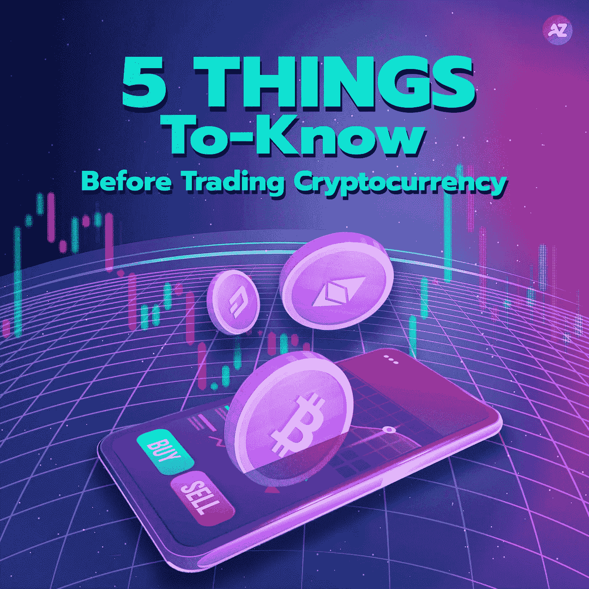

# 交易加密货币前要知道的 5 件事

> 原文：<https://medium.com/coinmonks/5-things-to-know-before-trading-cryptocurrency-77f578b72560?source=collection_archive---------62----------------------->

## 关于交易密码你应该知道的事情。

# 最近，你可以观察到，这不是购买加密货币的正确时间，因为市场风险很高。

我们可以从月神币上看到，价格从三位数跌到只有一位数。此外，UST 的价值从应有的位置上跌落。

在进入加密货币市场之前研究信息至关重要。如前所述，市场风险高，市场每天 24 小时开放。短期交易者和中期交易者可能无法整夜休息。今天，在开始为你交易密码之前，我们有 5 件事要知道。

1.  **1。投资计划和风险控制**

在开始的时候，你必须知道你会做短线还是长线交易。你应该学习如何阅读图表，这样你就会知道什么时候准确地买卖。而且，在开始投资之前，你要了解每一枚硬币的基本信息。你也应该有一个计划，以防面对市场的下跌，在真实的情况下不要过于恐慌。

**2。不要太相信别人**

这一点在你认识的人建议你买这个或那个币的时候经常可以看到。如果我们像他们说的那样买了，却输了，你什么也做不了。他们不对你的损失负责。因此，你应该在得到任何建议后研究硬币的信息。

**3。坚持新闻**

对于加密货币市场，几乎每分钟都有消息要观察。你应该试着更新消息，因为每条消息都会影响你手中硬币的价值。如果可能，建议提供可靠的来源。更重要的是，你必须仔细感知任何消息。

**4。阅读白皮书获取信息**

要开始了解每枚硬币的基础，你可以研究该硬币的白皮书中的信息。有关于它的创建目的和未来目标的信息。这部分信息对投资决策至关重要。

**5。选择一个可靠的交易板**

泰国和海外有不同的交易平台。对于在泰国的交易，建议只从证券交易委员会认证的交易委员会开始交易。如果选择大的交易板，在市场上加密货币的变异和市场交易量大方面可以更好。

即使你可能知道这些事情，你在交易中仍然不确定。我们为你提供了一个很好的选择。您可以使用 Azira Finance 来帮助您进行投资。我们有基金经理帮助您管理您的资产，让您获得最稳定的回报。而且，你也不必因为有些人没有太多时间，就一直呆在图表或者新闻前。Azira Finance 可以为您提供最佳收益和安全交易的解决方案。

*数字资产投资包含风险。建议投资者在投资前仔细研究相关信息。

如果投资者对分散资产管理投资感兴趣，您可以向我们咨询更多信息。

您可以在
推特:[https://twitter.com/azirafinance](https://twitter.com/azirafinance)媒体:[https://medium.com/@azirafinance](/@azirafinance)脸书:[https://www.facebook.com/azirafinance](https://www.facebook.com/azirafinance)Reddit:[https://www.reddit.com/user/azirafinance](https://www.reddit.com/user/azirafinance)白皮书:[https://azira-finance.gitbook.io/product-docs/](https://azira-finance.gitbook.io/product-docs/)

> 加入 Coinmonks [电报频道](https://t.me/coincodecap)和 [Youtube 频道](https://www.youtube.com/c/coinmonks/videos)了解加密交易和投资

# 另外，阅读

*   [瓦济里克斯 NFT 评论](https://coincodecap.com/wazirx-nft-review) | [比茨盖普 vs 皮奥克斯](https://coincodecap.com/bitsgap-vs-pionex) | [坦吉姆评论](https://coincodecap.com/tangem-wallet-review)
*   [如何使用 Solidity 在以太坊上创建 DApp？](https://coincodecap.com/create-a-dapp-on-ethereum-using-solidity)
*   [币安 vs FTX](https://coincodecap.com/binance-vs-ftx) | [最佳(SOL)索拉纳钱包](https://coincodecap.com/solana-wallets)
*   [如何在 Uniswap 上交换加密？](https://coincodecap.com/swap-crypto-on-uniswap) | [A-Ads 评论](https://coincodecap.com/a-ads-review)
*   [加密货币储蓄账户](/coinmonks/cryptocurrency-savings-accounts-be3bc0feffbf) | [YoBit 审核](/coinmonks/yobit-review-175464162c62)
*   [Botsfolio vs nap bots vs Mudrex](/coinmonks/botsfolio-vs-napbots-vs-mudrex-c81344970c02)|[gate . io 交流回顾](/coinmonks/gate-io-exchange-review-61bf87b7078f)