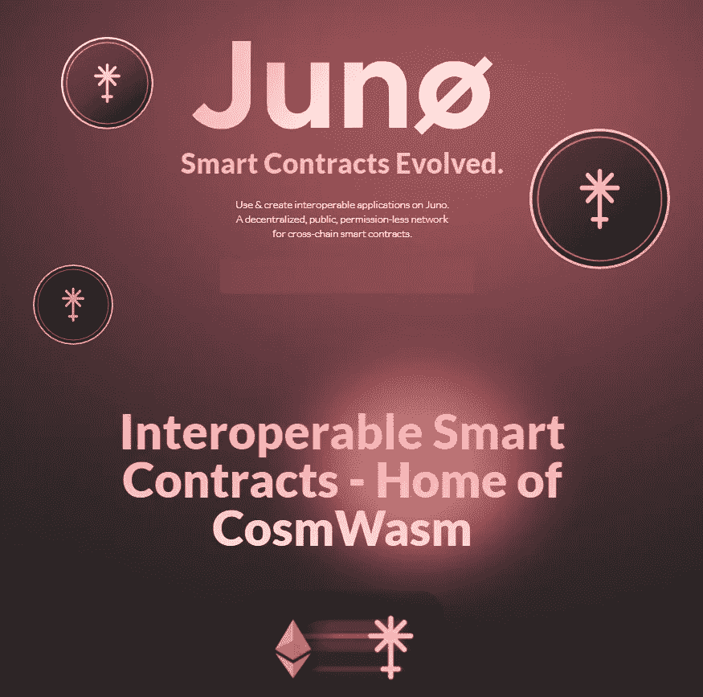

# 关于 Juno(朱诺)你需要知道的 5 件事

> 原文：<https://medium.com/coinmonks/5-things-you-need-to-know-about-juno-juno-935ddf639845?source=collection_archive---------2----------------------->

## Tendermint、Cosmos SDK、CosmWasm、Rust、JUNO Token、Tokenomics 等等！

Juno 是一款基于智能合约的区块链，由 Cosmos 生态系统提供支持。开发人员可以在 JUNO 中使用不同的语言设计和部署可互操作的跨链智能合约。