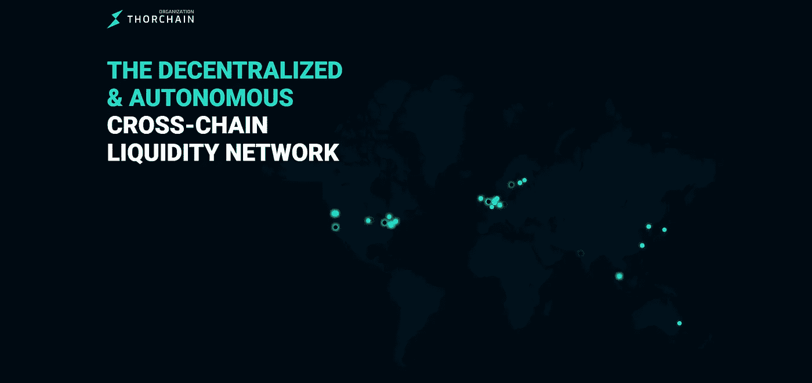

# 关于荆棘链(符文)你需要知道的 5 件事

> 原文：<https://medium.com/coinmonks/5-things-you-need-to-know-about-thorchain-rune-9b095a2069ac?source=collection_archive---------13----------------------->

## 符文令牌，非永久性损失保护，连续流动性池，等等！

THORChain 是一个建立在 Tendermint 和 Cosmos SDK 之上的流动性网络。使用 THORChain，用户可以在不同的区块链之间交换代币。符文令牌主要用作流动性池中的抵押品。