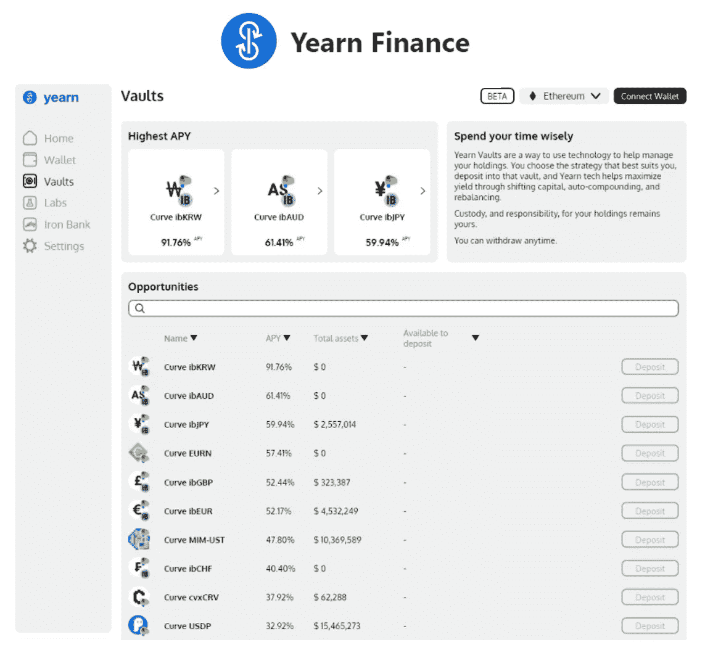

# 你需要知道的 5 件事

> 原文：<https://medium.com/coinmonks/5-things-you-need-to-know-about-yearn-finance-yfi-56017b2bcccd?source=collection_archive---------9----------------------->

YFI 治理令牌，金库，铁银行，合作伙伴计划，等等。

yearn.finance 是 2020 年推出的收益率聚合器 DeFi 协议。为了优化收益农业流程的利润，yearn.finance 通过不同的协议(如 Curve、Aave、Compound)进行导航，并自动重新分配投资。因此，投资者不需要担心…