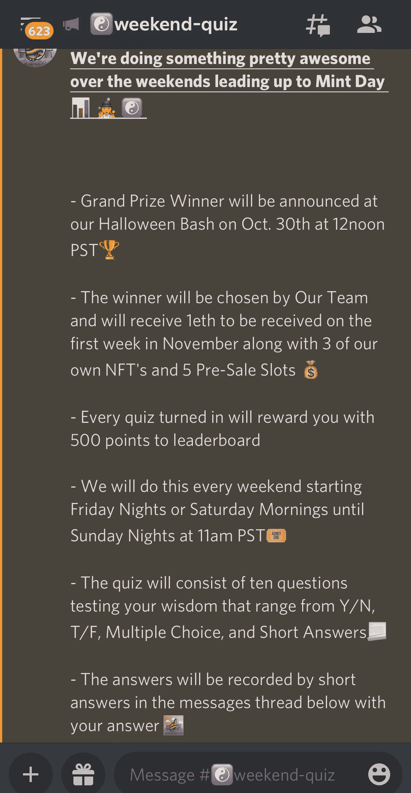
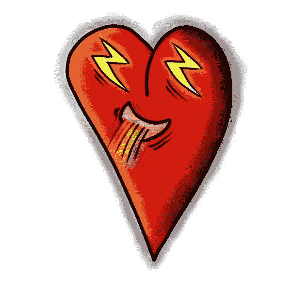
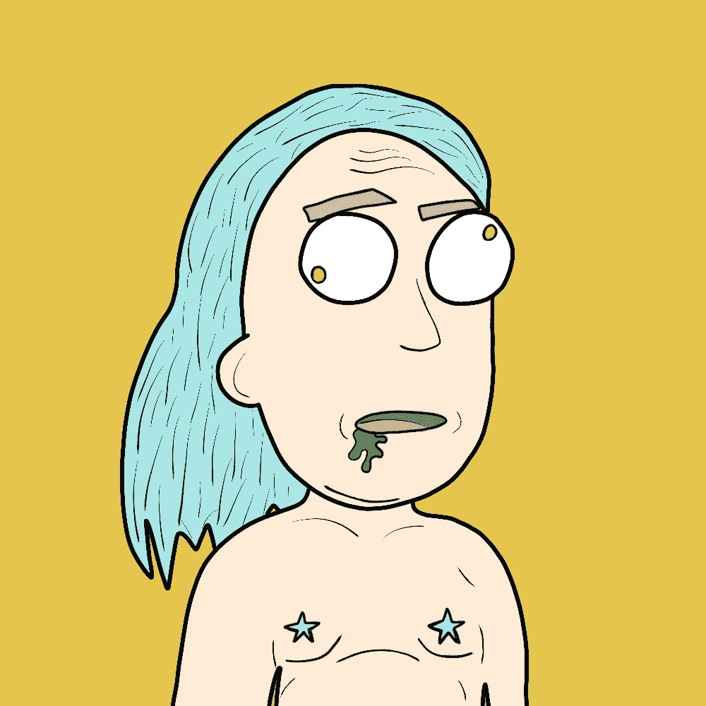

# 改善不和谐的 5 个技巧(NFT/加密版)👾

> 原文：<https://medium.com/coinmonks/5-tips-for-a-better-discord-nft-crypto-edition-ff9b039d0359?source=collection_archive---------16----------------------->

Discord 似乎是所有 web3、crypto、NFT 和元宇宙项目的“首选”。这是(也应该是)社区所有成员聚集在一起，讨论想法，分享信息，分享关于即将到来的项目的讨论的中心。

在我的第一个 NFT 项目从 0 开始的 3 个月内，我的 discord 发展到 7.5k 成员，我有一些独特的 Discord 战术，可以帮助你发展你的社区。

# 1.赠品机器人

这是我用来不断让用户参与到我们的不和谐中来的最好的策略之一，是互动的，并且与项目保持同步。

和任何有价值的东西一样，它确实需要一些工作…

我们将使用赠品机器人赠送“点”,收集 3 个点，你会收到一个免费的 NFT(或 WL 点，因为你喜欢…

你真的可以随便送人！加密，硬件钱包，商业，不和谐的角色…无论什么！

但是，如果你选择赠送“点数”，你就必须记录所有赠送者以及每个人的点数。

我一天要做 3-5 份赠品，所有的用户要做的就是对🎉帖子下方表情符号进入赠品。

您可以设置获奖者的数量、不和谐部分、赠品的时间范围和奖励。

需要 1-2 分钟。设置每个赠品，并可与命令一起使用！赠品或其他来自机器人的命令。

# 2.消息/邀请竞赛

在我的经历中，邀请赛似乎是一个更好的用例，因为它成倍地增加了不和谐。邀请赛的问题是用户完全可以引入假账户、机器人或幽灵账户。这意味着，他们会很快加入(你的不和谐会增加)，但他们通常不会在不和谐中互动，通常会在很短的时间内离开。

参加这些邀请赛的用户通常只是为了免费赠品，所以要注意。

在发布(NFT、伊多、ICO……)的前一周，信息竞赛可以很好地向那些刚刚加入你的 Discord 的新手展示你的社区有多投入。

如果可能的话，试着给出日常话题，这样讨论才会流畅，聊天室不会简单地充满“GM”和有趣的 GIF。

任何好的竞赛，用户都不会参与，除非奖励/回报值得努力。许多人会为一个自由的 NFT 而工作，有些人甚至会为一个 WL 的位置而工作。

这些消息和邀请的数量通常可以被大多数主要的机器人(MEE6，Carl bot……)跟踪

如果你正在做一个大的赠品，比如一个免费的收藏，你可以设置一个障碍，邀请至少 5 个朋友加入我们的不和谐，给他们一个特殊的角色和部分，就在薄荷之前，你可以发布薄荷页面的链接(独立于主网站)。只是邀请用例的一个例子。

# 3.不和/推特袭击

我利用不和谐突袭取得了很好的效果。

突袭是指我们较大社区中的一个小组花 15 分钟到 1 小时进入其他不和谐的群体，并通过添加我们的社区“广告”在他们的不和谐群体中“发送”他们的 shill 部分。你能同时做的越多，我们在他们的区域占据的空间就越大，被路人注意到的机会就越大。

我喜欢突袭，因为这是一个所有人都可以参与的在线活动。社区就是这样建立起来的。

我们为所有参与突袭的成员安排了一个特殊的角色，还有一个特殊的部门。许多袭击者会在袭击前发布有趣的 GIF 和 memes，并为冒险做一点宣传。

当进行突袭时，要小心让参与者知道不要在除了 shill 部分之外的任何地方张贴你的社区“广告”。如果他们在普通聊天中发帖，会让人们对我们的社区产生不好的印象。

我们也可以在推特上这样做。袭击者可以对影响者的帖子发表评论，同时对我们的项目发表独特的评论，并同时在我们自己的 Twitter 上发表帖子…

# 4.公告

这应该不用说…

关于我们项目的整体健康和福利、新闻和即将举行的活动的公告、更新应每周至少向我们的社区发布 3 次。我几乎每天都在公告中写 3-5 个段落，可能有点太多了…

发布公告的人自然会被视为项目的“社区领袖”,对社区/项目的文化有很大的权力和责任。

激励人们参与我们的公告以确保(无论如何尽可能多的)用户理解帖子的一个好方法是要求他们用帖子下面的某些表情符号做出反应。这只是用户的一次点击，帖子得到的反应越多，对潜在的社区成员就越有利。

# 5.派别

将我们不和谐的成员分成不同的派别(如果他们选择加入其中一个)可能是通过我们成员之间的竞争来制造紧张和参与的最佳策略。

我们有游侠，法师和战士。

每周我们都会举行派系挑战，比如派系间的邀请…

我会宣布一个领导人(他会得到一个特殊的角色)作为派系领导人，并且每周更换领导人，给每个人一个领导的机会。领导人的选择是基于我对谁是我们社区最有用的成员的认识。

最简单的方法是“招聘人数”。要让成员进入指定的派系(他们只能选择一个)，他们必须进入指定的部分，然后点击他们想要选择的派系的表情符号，以获得角色并访问他们的派系部分。在赛季末/周末/月末等拥有最多成员的派系。将获得奖励。我们奖励给他们一个 NFT 奖杯，这是一个手绘的艺术作品，描绘了获胜派别的象征(弓/箭，杖，剑)，并免费送给我们所有的 NFT 持有者一个。

这些派系的划分带来了社区内通过 GIF 和消息来来回回的激烈竞争。

## 额外服务:

## 6.创建一个转基因区，用户可以说“转基因”并分享他们的早晨饮料(这是大多数人都能理解的)

## 7.给提升你不和谐服务器的用户奖励，也许还有特殊角色。推广用户来提升你的服务器。

## 8.与其他类似的项目建立伙伴关系，这些项目可能拥有相同的目标受众。通常，合作伙伴需要你给一个免费的 NFT，或者至少一个白名单点或 5…他们的项目通常会做同样的事情

## 9.小测验！我们有周末测验。每个参加我们测验的人(没有评分)都获得了 WL 奖。为了参与和更好地了解你的社区。

## 10.关于我的部分。社交部分。允许用户与您的社区共享他们自己。

___________________________________________________________________

务必小心！！！

*我怎么强调都不为过！保持高度警惕，注意你点击的每一个链接，你做的每一笔交易，和你交往的每一个人，因为骗子在这个领域是大量存在的，最好的项目也会被取消。*

*在点击所有链接之前，要再三检查，确保它们是你要找的官方链接。在把任何有价值的东西寄给别人之前，也要仔细检查所有的钱包地址。*

**跟随我们的加密/NFT/区块链/元宇宙之旅**

[*推特*](https://www.twitter.com/metadadsxyz)[*不和*](https://discord.gg/Cv8v2Ert8m)[*YouTube*](https://www.youtube.com/channel/UC7pbtSBs9nRJHK6coMhCR8g)*[*抖音*](https://www.tiktok.com/@thedudescrypto)[*insta gram*](https://www.instagram.com/thedudescrypto/)[*Spotify 播客*](https://open.spotify.com/episode/5U8vXE9HDAsGbSbebw9p62?si=2rZIigw-Tw2pCxjxmkbYzQ)*

**请将 Polygon Matic 发送到这个 Eth 地址或 Eth 令牌:
0xb 53b 3978333 e 11 c 382 ab 619 f 02 f 469 A8 c 70750 af**

**___________________________________________________________________**

****

**感谢阅读:]**

**干杯，
泰又名“纨绔子弟”**