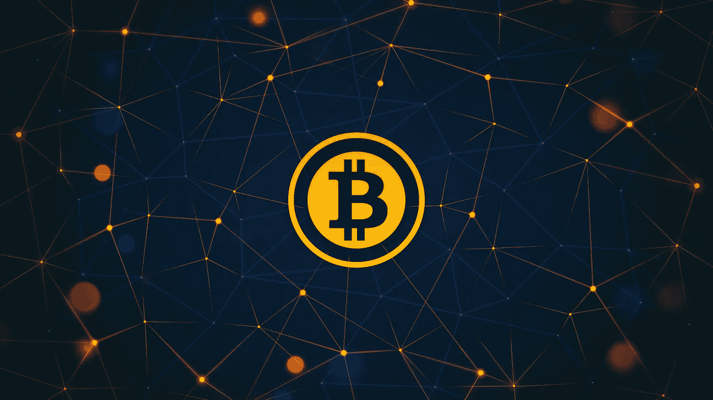

# 开始投资加密货币的 5 个窍门

> 原文：<https://medium.com/coinmonks/5-tricks-to-start-investing-in-cryptocurrencies-aa38ea1e6d4a?source=collection_archive---------60----------------------->

随着对**加密货币的兴趣上升**，拥有关于这些货币的适当知识变得越来越重要。这个故事将为你提供基础知识。

**1。学会做基本面分析**

在投资之前，像任何其他金融决策一样，进行彻底的研究是至关重要的。你需要分析你想投资哪种货币。这叫做**【基本面分析】**。例如，如果你想买一枚 X 硬币，你应该尽可能多地了解这枚硬币。

**2。学会做技术分析**

正如学习如何做基本面分析很重要一样，掌握技术细节也很重要。这些包括价格行为、指标、从图表中理解趋势等。一旦你掌握并结合这些，你将能够创造自己的战略，而不需要任何外部影响。

**3。熟悉钱包**

加密货币实际上可以保存在在线和离线钱包选项中。也可以放在冷热钱包里。钱包是保护你钱财安全的朋友。然而，如果你不够小心，这个朋友可能会突然变成你的敌人，你的钱可能会落入别人的口袋。

**4。避免把所有的钱都放在一个桶里**

多元化对于投资来说至关重要。有时你赢了，有时你输了；但是不管结果如何，你都在学习。创建一个多样化的投资组合可以帮助你收获未来可能的硬币收益。要记住的一件事是，创造一个世界需要各种各样的物种。

**5。永远耐心耐心耐心！**

密码市场是出了名的不稳定。因此，尽管有起有落，保持耐心是至关重要的。始终保持冷静，因为这将有助于你做出明智的选择。一分钟的耐心，一生的财富。

**总结……**

在一天结束的时候，要想在加密市场投资成功，需要五个以上的技巧。要了解更多关于加密投资的知识，你可以参加专门教授加密世界基本知识的课程。

> "大多数人在致富的欲望驱使下，试图在 6 英寸厚的楼板上建造一座帝国大厦。"
> 
> 罗伯特·清崎

> 加入 Coinmonks [电报频道](https://t.me/coincodecap)和 [Youtube 频道](https://www.youtube.com/c/coinmonks/videos)了解加密交易和投资

# 另外，阅读

*   [Botsfolio vs nap bots vs Mudrex](/coinmonks/botsfolio-vs-napbots-vs-mudrex-c81344970c02)|[gate . io 交流回顾](/coinmonks/gate-io-exchange-review-61bf87b7078f)
*   [CoinFLEX 评论](https://coincodecap.com/coinflex-review) | [AEX 交易所评论](https://coincodecap.com/aex-exchange-review) | [UPbit 评论](https://coincodecap.com/upbit-review)
*   [AscendEx 保证金交易](https://coincodecap.com/ascendex-margin-trading) | [Bitfinex 赌注](https://coincodecap.com/bitfinex-staking) | [bitFlyer 审核](https://coincodecap.com/bitflyer-review)
*   [Bitget 回顾](https://coincodecap.com/bitget-review)|[Gemini vs block fi](https://coincodecap.com/gemini-vs-blockfi)cmd |[OKEx 期货交易](https://coincodecap.com/okex-futures-trading)
*   [AscendEx Staking](https://coincodecap.com/ascendex-staking)|[Bot Ocean Review](https://coincodecap.com/bot-ocean-review)|[最佳比特币钱包](https://coincodecap.com/bitcoin-wallets-india)