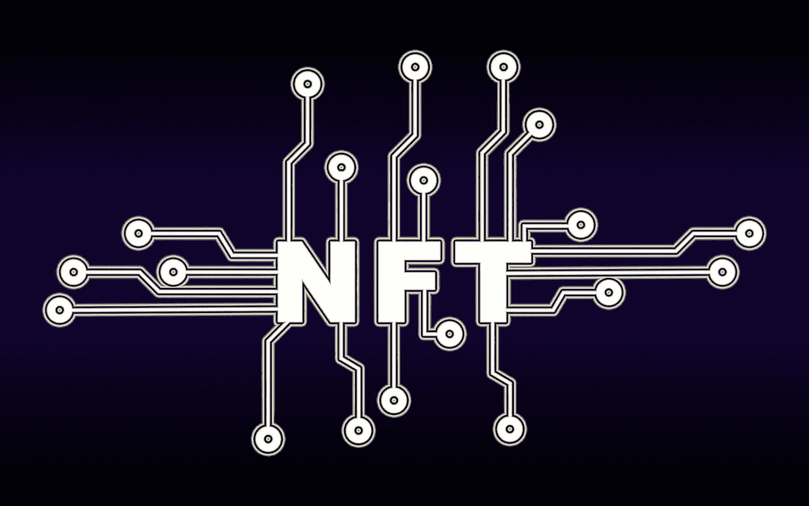

# NFTs 将影响未来互联网的 5 种方式

> 原文：<https://medium.com/coinmonks/5-ways-nfts-will-impact-the-internet-of-the-future-12f2d43d9081?source=collection_archive---------20----------------------->

NFT 不是骗局。它们也不是一种时尚。

人们认为非功能性测试的广泛采用是不可避免的。

在他的 Ted 演讲中，Kayvon Tehranian 断言“NFT 是未来互联网的基石。”

在过去的几年里，我们已经看到了 NFTs 的兴起，也见证了这项新技术的一些独特的用例。

例如，2021 年，[一对夫妇在以太坊区块链用象征性的戒指结婚，让他们的誓言永垂不朽。](https://cointelegraph.com/news/couple-gets-married-on-ethereum-blockchain-for-587-in-transaction-fees)

> NFT 是未来互联网的基石。

在本文中，我们将看看 NFTs 的未来。

但是，在此之前，让我们先来定义一下什么是 NFT。

# 什么是 NFT？

NFT 是不可替换的令牌。

我肯定你正在挠头，想知道什么是不可替代的令牌？

[柯林斯字典](https://edition.cnn.com/style/article/nft-word-of-the-year-collins-scli-intl-gbr/index.html)将短语“NFT”选为 2021 年的年度词汇，将 NFT 定义为“在区块链注册的*唯一数字证书，用于记录资产的所有权，如艺术品或收藏品。*

为了进一步简化上述定义，NFT 是在区块链上注册的所有权证书，每个人都可以看到。

> 从上面的定义我们可以看出，NFT 是**唯一的&不可替代的。**它们是一种与数字或物理资产相关联的加密令牌。

没有两个 NFT 是相同的，也没有相同的值。

这意味着 NFT 是一种验证区块链上谁拥有什么的方法。

现在我们知道了什么是 NFT，它们做什么，让我们快速地看看它们是如何使用的。

# 现在如何使用 NFT

因为 NFT 存储数据，所以它们可以与特定的物理或数字资产相关联。

由于其独特性，NFT 可用作证明数字资产所有权的一种方式。

嗯，这是 NFTs 的理想用例，也是一些项目试图完成的。

但现在，NFT 最常见的用途是作为数字艺术收藏品进行交易。

A futuristic NFT art

作为这个用例的一个突出例子，我们只需要看看 Mike Winkelmann，他也被称为[**beepel**](https://www.nytimes.com/2021/03/11/arts/design/nft-auction-christies-beeple.html)，，他以 NFTs 的形式出售了他的一系列作品，价值超过 6900 万美元。

NFTs 的另一个用例是创建像交易卡这样的收藏品——比如体育符号化的时刻、游戏中的物品，甚至数字猫。

这些收藏品的一个例子是 NBA 的热门单曲。NBA 的 TopShot 是与 Dabber Labs 合作创建的，是一个 NFT 收藏，其中有球员的数字照片，特定的时刻，甚至是可回放的集锦。

> 去年，勒布朗·詹姆斯的《T2》中的一个精彩片段《T3》以 20 万美元的天价售出。

NFT 有许多用例。

但是，我们几乎没有涉及其中的一些。

# NFTs 的未来

铸造、销售和交易 NFT 是有趣且有价值的 NFT 用例。但是，这就是我们对 NFT 所能做的一切吗？这就是我们想要用 NFTs 完成的全部吗？

不要。

我们可以并且应该利用 NFTs 完成很多事情，在本节中，我们将深入探讨 NFTs 的未来。

但在此之前，让我们思考一下约翰·佩里·巴洛 30 年前说过的话。

互联网的先驱之一约翰·佩里·巴洛看到了我们新的数字世界固有的机遇和陷阱。

1992 年，他提出了一个至今仍未解开的预言。

套用他的话:

> *如果我们的财产可以被无限复制，并在全球范围内免费即时传播，我们将如何保护它？我们用头脑做的工作怎么能得到报酬呢！如果我们得不到报酬，又有什么能保证这类作品的持续创作和发行呢？*

自 1992 年以来，互联网发生了很大变化。

它已经极大地演变成我们今天所拥有的。

尽管我们在数字世界取得了进步，但像财产和所有权这样的概念仍然远离我们。我们仍然没有想出归属数字资产所有权的方法。

我们试图通过将版权、DMCA、DRM 和水印等概念从物理世界借用到互联网的数字世界来解决数字资产的所有权问题。

但遗憾的是，都还没起作用！

直到 NFTs。

NFT 是一项技术突破。它们为我们提供了一种证明数字资产所有权的方式。

不像版权和水印那样是植根于过去时代的古老技术，NFT 之所以酷，是因为它是互联网固有的。

他们为互联网而生，为互联网而生！

有了 NFTs，我们不仅能够证明我们的数字资产的所有权，还能改进它们。

# NFTs 将影响互联网的 5 种方式

既然我们已经触及了非功能性网络技术未来的表面，是时候深入探讨非功能性网络技术影响互联网的 5 种方式了。

## 非功能性票据

票务行业是 NFTs 可以彻底革命的行业之一。

你可能想知道 NFTs 将在票务行业扮演什么角色。

嗯，体育赛事、音乐会甚至航班售票的一个问题往往是黄牛和伪钞的问题。

大约 12%在网上购票的人会被骗。

如果门票是 NFTs 的话，在网上买票的人就不用担心门票是不是原创了。

有了票证作为 NFT，就可以很容易地验证谁拥有票证及其真实性，从而使人们很难被诈骗。

此外，体育和音乐会的组织者也可以使门票不可转让，防止它们被出售，并消除他们的能力。

## 游戏中的 NFTs

目前可以购买不同的游戏物品，如武器、角色穿的衣服和虚拟宠物。

但是当你购买这些物品时，你只能在你购买它们的游戏中使用它们。

玩了游戏之后，你买的所有物品都变得多余，几乎没用。

但是想象一下，当你可以将你在游戏中购买的物品转移到任何你想去的地方，并且能够在你购买它们的游戏之外进行交易的时候，这是一个充满可能性的世界。

这个用例仍然是遥远的未来。老实说，我不确定这是否会成为现实，因为这需要游戏公司之间一定程度的合作，而这在目前是不可行的。

**元宇宙的 NFTs**

元宇宙是更加身临其境的互联网版本，有了[虚拟和增强现实](https://www.splunk.com/en_us/data-insider/what-are-augmented-reality-and-virtual-reality.html#:~:text=Augmented%20reality%20(AR)%20augments%20your,environment%20with%20a%20simulated%20one.)技术，这将成为可能。

在元宇宙，我们可以买卖(数字)商品。

NFTs 将成为我们在元宇宙买卖数字资产的工具。

有了 NFTs，我们可以创造和拥有独特的物品，从数字服装和运动鞋到元宇宙的数字土地。

**NFTs &物联网**

有了物联网，我们拥有了智能和互联的一切。

物品、机械、汽车和日常设备都与互联网相连。

这些设备将传输和收集数据。

我们开始看到机器对机器的交流。

NFTs 将在认证这些连接设备之间的通信方面发挥重要作用。

**NFTs 转变医疗保健**

目前，我们对我们的医疗保健数据没有所有权。有了 NFTs，我们就可以将医疗保健数据转移到区块链。当我们开始拥有关于我们的 DNA 和个性化健康信息的有价值的数据时，拥有我们的数据将特别有用。

我们必须控制我们的个人和脆弱的健康数据。我们需要尽我们所能来保护我们的健康数据，因为在错误的人手中，它可能会被用来对付我们。

有了 NFTs，我们将最终能够保存我们的健康记录，并让我们授权访问的人能够访问它们。

# NFTs 的问题

既然我们已经看到了非功能性测试的未来，那么是时候讨论一下在我们看到我们设想的未来之前我们需要解决的问题了。

虽然 NFT 是一项在未来会彻底改变互联网的技术，但这项技术的当前形式存在一些问题。

在我们能够实现到目前为止我们已经讨论过的一些用例之前，有一些问题我们需要首先解决。

## 创建 NFT 的成本

许多人很想进入 NFTs，但是不能，因为制造一个 NFT 太贵了。

现在，大多数非战斗堡垒是在以太坊区块链铸造的，由于以太坊的采矿过程和相关费用，这使得它们的制造非常昂贵。

## 使用难度

制作 NFT 是一个复杂的过程。

您需要以很高的学习曲线来学习和实现不同的技术。

为了让 NFTs 得到广泛采用，该技术必须变得易于使用。

## 链路退化

对于大多数 NFT 项目，图像并不嵌入在区块链上，而是存储在区块链上的图像链接。

因此，如果链接发生问题，不再处于活动状态，您的 NFT 将(可能)永远丢失。

# 那么，NFTs 的前进方向是什么？

NFT 很有意思！他们很有潜力。

随着加密空间、元宇宙和虚拟现实的发展和成熟，NFTs 的采用也将随之发展。

当然可以！NFT 技术还不完善，在 NFTs 发展成我们在本文中讨论的那种技术之前，我们还需要解决一些棘手的问题。

但随着大品牌和行业的不断推动，非功能性测试将不可避免地被更广泛地采用。

在未来几十年，NFTs 将重塑我们所知的互联网，将产权和所有权融入其代码中。

未来的互联网将是一个经济控制权掌握在创造者而非平台手中的互联网。

这将是一个我们的想法和创造力得到直接支持的互联网，我们用我们的头脑所做的工作获得报酬。

所以，现在你有了一个关于 NFTs 将如何影响未来互联网的简要介绍。

请在下面留言，告诉我你认为未来的互联网会是什么样子。