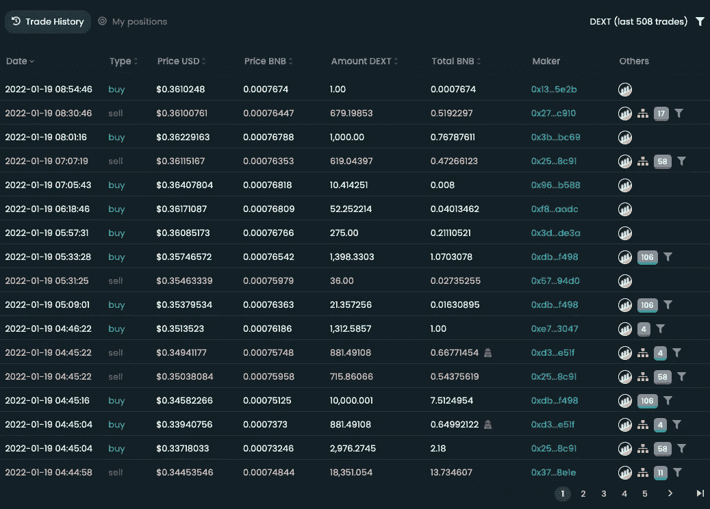
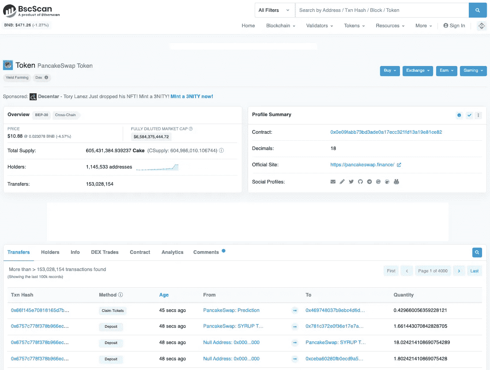

# 识别合法 DeFi 项目和避免诈骗的 5 种方法

> 原文：<https://medium.com/coinmonks/5-ways-to-identify-legitimate-defi-projects-and-avoid-scams-4ee914415cbd?source=collection_archive---------3----------------------->

Photo by [FLY:D](https://unsplash.com/@flyd2069?utm_source=unsplash&utm_medium=referral&utm_content=creditCopyText) on [Unsplash](https://unsplash.com/s/photos/scam?utm_source=unsplash&utm_medium=referral&utm_content=creditCopyText)

啊是的…困扰每个 DeFi 交易者的问题:*我怎么知道这个项目是不是骗局？*

2021 年 11 月，DeFi 锁定的总价值达到了[的历史新高，超过 2 . 74 亿美元](https://www.statista.com/statistics/1272181/defi-tvl-in-multiple-blockchains/#:~:text=The%20decentralized%20finance%20(DeFi)%20market,support%20DeFi%20applications%20(Dapps).)。DeFi 正在蓬勃发展，每周都有许多项目涌现出来。所有加密货币投资者都知道，尽早进入游戏可以为你赢得极高的收益。但是你应该用什么参数来评估一个项目呢？

请继续阅读 5 条建议(还有额外的建议！)识别合法项目，避免诈骗项目。

# **1。查看他们的网站和社交媒体**

你可以从小事做起——访问项目的官方渠道。诈骗项目可能会建立一个网站，以显得合法，但他们往往是'低努力'。他们可能有多页说明“工作进行中”或页面上有不正确的元素。检查他们是否有一个活跃的支持中心，定期更新项目的教程、常见问题和公告。

他们的社交媒体也是如此。如果帖子只是呼吁加油，而没有努力让社区参与进来，例如教育内容、社区功能、投票和反馈，你应该好奇这是为什么。

额外提示:警惕在 Telegram 这样的社区团体中冒充项目管理员的人。不要放松警惕。

# **2。腾出时间研究项目**

一些 DeFi 项目确实希望解决现有的问题，例如帮助 CeFi 更广泛地过渡到 DeFi，管理可伸缩性问题，促进跨链等等。其他的没有这么大的效用。

花时间研究项目和团队。参考 [CoinMarketCap](https://coinmarketcap.com/) 和 [CoinGecko](https://www.coingecko.com/en) 等已建立的上市网站，查看项目是否上市。问问你自己:他们想解决什么问题？他们在 crypto 中引入了哪些新的创新？他们独特的价值主张是什么？他们在项目背后有强大的技术吗？

许多人考虑的另一个因素是创始团队的出身。是否投资一个创始人不诚实的项目，取决于你自己的判断。

额外提示:随着向 DEX 的转移，更多的产品可以分散使用。这意味着没有中介，你拥有自己的钥匙。如果你想有更多的自主权，我建议开始分散投资。

# **3。看看谁在持有和交易**

每一个有自己令牌的 DeFi 项目都应该发布令牌组学。在投资之前，您应该了解令牌的分布和使用情况。

考虑跟踪代币持有者和交易活动。您可以使用类似于 [Dextools](https://www.dextools.io/) 的工具(可用于币安智能链和以太坊)。如果你看不到卖出活动或卖出活动非常低，这很可能是一个骗局。小心来自相同地址的高交易频率。项目所有者可能已经操纵了代码，使您无法在购买后出售令牌。他们也可能只将某些地址列入白名单，以便令牌看起来交易正常。

*Example screenshot of trading activity on Dextools*

另一个有用的工具是像 [BscScan](https://bscscan.com/) 或 [EtherScan](https://etherscan.io/) 这样的块浏览器。请注意，这些是区块链特有的。块资源管理器包含关于令牌合同、令牌创建者地址、关于令牌的所有交易等所有信息。你甚至可以检查资金池中的流动性是否已经被抽走。

*Example screenshot of token information on BscScan*

# **4。如果好得难以置信…**

俗话说:“天下没有免费的午餐”。骗局通常会向你承诺双倍或三倍的收益。他们可能会要求你发送加密到一个地址，并引导你到一个不熟悉的域名(红旗！).一些诈骗事件也可能声称来自一个已建立的项目，甚至可能设置“客户服务”聊天机器人。我能说什么呢，他们*正*变得越来越老练？

根据经验，总是检查事件页面是否使用相同的域名。你还应该访问该项目的渠道，以双重确认正在进行的活动。

额外提示:有没有注意到免费空投交易进入你的钱包？做一个简单的谷歌搜索来检查你是否被诈骗项目盯上了(很可能是这样)。不要和他们互动。

# **5。审计有所帮助……但是代码仍然可能受到损害**

许多 DeFi 项目使用智能合同与区块链或资产进行交互。智能合约审计会仔细检查智能合约代码中的错误和漏洞。他们还提出了增强代码的改进和解决方案。

一般来说，诈骗项目不会投入时间和金钱来进行审计。他们专注于抽水，并会隐藏对合同的故意操纵。但是让我们现实一点:以上只在完美的世界中成立。随着骗局的演变，谁说他们不会通过基本的审计来获得投资者的信任呢？无论如何，绝大多数投资者可能会接受审计索赔的表面价值。

更重要的是，无论是大项目还是小项目，经过安全审计的项目仍然可能遭遇黑客攻击。一些突出的例子包括跨链 DeFi 平台 [Poly Network 的 6 亿美元黑客攻击](https://www.coindesk.com/markets/2021/08/10/cross-chain-defi-site-poly-network-hacked-hundreds-of-millions-potentially-lost/)、 [DeFi yield protocol BadgerDAO 的 1 . 2 亿美元黑客攻击](https://www.theverge.com/2021/12/2/22814849/badgerdao-defi-120-million-hack-bitcoin-ethereum)以及最近[在 DeFi yield 平台 Grim Finance 的又一次 3000 万美元黑客攻击](https://cryptonews.com/news/hacked-grim-finances-auditors-blame-new-analyst-for-missing-issue.htm)。

总的来说，智能合同审计是好的，但不能保证资金的安全。项目应该接受定期审计以更新它们的代码，你应该保持警惕，并利用本文中提到的其他技巧。

> 加入 Coinmonks [电报频道](https://t.me/coincodecap)和 [Youtube 频道](https://www.youtube.com/c/coinmonks/videos)了解加密交易和投资

## 另外，阅读

*   [网格交易机器人](https://blog.coincodecap.com/grid-trading) | [Cryptohopper 审查](/coinmonks/cryptohopper-review-a388ff5bae88) | [Bexplus 审查](https://blog.coincodecap.com/bexplus-review)
*   [7 个最佳零费用加密交易平台](https://blog.coincodecap.com/zero-fee-crypto-exchanges)
*   [氹欞侊贸易评论](https://blog.coincodecap.com/anny-trade-review) | [火币保证金交易](/coinmonks/huobi-margin-trading-b3b06cdc1519)
*   [分散交易所](https://blog.coincodecap.com/what-are-decentralized-exchanges) | [比特 FIP](https://blog.coincodecap.com/bitbns-fip) | [Pionex 评论](https://blog.coincodecap.com/pionex-review-exchange-with-crypto-trading-bot)
*   [用信用卡购买密码的 10 个最佳地点](https://blog.coincodecap.com/buy-crypto-with-credit-card)
*   [最好的卡达诺钱包](https://blog.coincodecap.com/best-cardano-wallets) | [Bingbon 副本交易](https://blog.coincodecap.com/bingbon-copy-trading)
*   [印度最佳 P2P 加密交易所](https://blog.coincodecap.com/p2p-crypto-exchanges-in-india) | [柴犬钱包](https://blog.coincodecap.com/baby-shiba-inu-wallets)
*   [8 大加密附属计划](https://blog.coincodecap.com/crypto-affiliate-programs) | [eToro vs 比特币基地](https://blog.coincodecap.com/etoro-vs-coinbase)
*   [最佳以太坊钱包](https://blog.coincodecap.com/best-ethereum-wallets) | [电报上的加密货币机器人](https://blog.coincodecap.com/telegram-crypto-bots)
*   [交易杠杆代币的最佳交易所](https://blog.coincodecap.com/leveraged-token-exchanges) | [购买 Floki](https://blog.coincodecap.com/buy-floki-inu-token)
*   [3Commas 对 Pionex 对 Cryptohopper](https://blog.coincodecap.com/3commas-vs-pionex-vs-cryptohopper) | [Bingbon 评论](https://blog.coincodecap.com/bingbon-review)
*   [加密复制交易平台](/coinmonks/top-10-crypto-copy-trading-platforms-for-beginners-d0c37c7d698c) | [如何在 WazirX 上购买比特币](/coinmonks/buy-bitcoin-on-wazirx-2d12b7989af1)