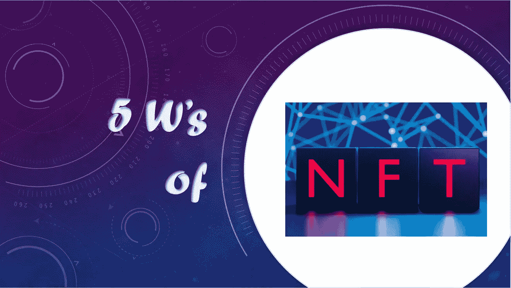
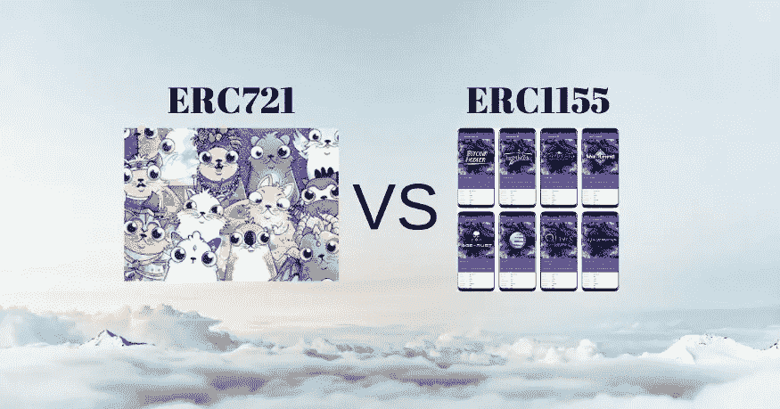
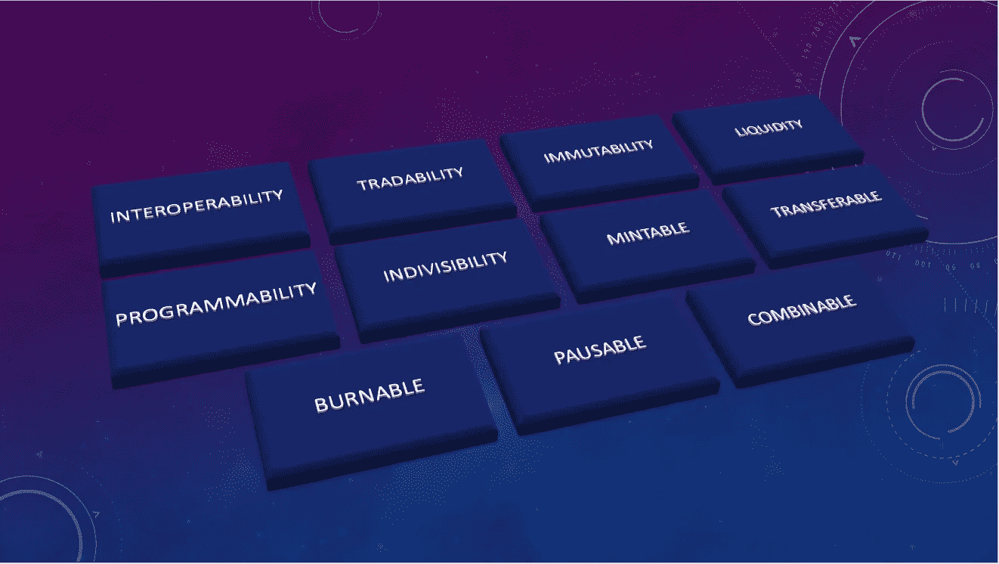

# 5 W 的不可替换令牌(NFT)

> 原文：<https://medium.com/coinmonks/5-ws-of-non-fungible-token-nft-cf921241edb0?source=collection_archive---------28----------------------->

## NFT 系列

## NFT 5w 一瞥

这篇文章回答了以下五个方面的问题:

1.  *什么是 NFT*
2.  *NFTs*的目的是什么
3.  *NFTs 的标准是什么*
4.  *NFTs 的属性是什么*
5.  *NFTs 的特点是什么*

## *什么是 NFT？*

NFT 是代表一件艺术品的数字资产。让 NFT 独一无二的是它由区块链技术公司创造的数字签名。它定义了可以用真实货币或加密货币买卖的资产的所有权。NFT 不可互换，因为它代表特定人员拥有的独特资产。它保护图像附带的元数据，而不是我们用眼睛看到的视觉数据，以及实际价值所在的位置。[crypto punk](https://www.larvalabs.com/cryptopunks)和 [CryptoKitties](https://www.cryptokitties.co/) 是一些受欢迎的 NFT 系列。

image credit: NFT [Cryptokitties](https://nft-shop.net/what-is-nft/)

## *非功能性测试的目的是什么？*

NFT 为艺术家和艺术平台创造了新的机会，激励人们从 NFT 市场购买艺术品，促进数字资产的版权或原创性。除了艺术价值，NFT 还可以作为增加价值的活动门票

## NFTs 的标准是什么？

*   **ERC-721**

NFT 的一组规则，以独特的方式定义它们来标识某些东西。它基于为每个令牌类型或集合部署单独的智能合约。

*   **ERC-1155**

支持不可替换和可替换的令牌。它可以使用一个合同来制作各种类型的非功能性测试。

image credit: [Altcoin Buzz](https://www.altcoinbuzz.io/bitcoin-and-crypto-guide/the-difference-between-erc721-vs-erc1155/)

## *NFTs 的属性是什么？*

*   **创建者**

创造者是创造和铸造 NFT 的人。NFTs 保存其创建者的钱包地址。

*   **业主**

所有者是在特定时间点拥有 NFT 的人。NFTs 还保存所有所有者的钱包地址。

## *NFTs 有什么特点？*

*   **互操作性**

NFT 的所有者可以在不同的市场交易他们的资产，如 OpenSea 和 Rarible，在那里他们的资产具有价值。

*   **可交易性**

NFT 可以在市场上买卖。非森林交易的拍卖和投标也可以以交易设施的形式进行。

*   **不变性**

NFT 的属性一旦发布就无法修改。

*   **流动性**

NFT 的创建者可以定义可以铸造的资产数量。因此，他们可以限制他们的非功能性食物的供应，以增加它们在市场上的价值。

*   **可编程性**

NFT 可以被编程为对某些外部和内部事件做出反应，这种 NFT 被称为智能 NFT。

*   **不可分割性**

NFT 不能被分成更小的令牌。当有人购买 NFT 时，他/她应该整体购买，而不能拥有部分物品。

*   **可铸造**

一旦资产被创造出来，就有能力增加资产的供给。

*   **可转让**

NFT 的所有权可以在用户之间转移。

*   **可燃**

我们可以从市场上拿下一部分或全部 NFT 供应。

*   **暂停**

可以暂停 NFT 的批准和转移等功能。

*   **可组合**

我们可以将多个 NFT 组合起来，并从中创建一个新的 NFT。

