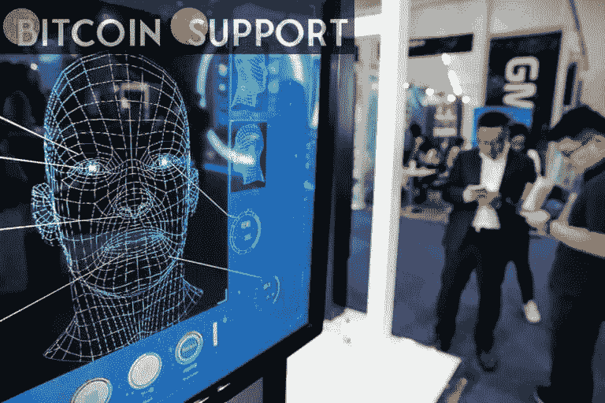

# 50，000 名津巴布韦患者现在可以使用一家区块链初创公司的数字身份解决方案

> 原文：<https://medium.com/coinmonks/50-000-zimbabwean-patients-now-have-access-to-a-blockchain-startups-digital-identity-solution-cd7eb0653971?source=collection_archive---------48----------------------->

**Visit our website:-** [**https://bitcoinsupports.com/**](https://bitcoinsupports.com/)

鼓励使用数字身份的区块链公司 Flexid Technologies 宣布，其解决方案已被数千个参与当地健康调查研究的津巴布韦家庭和患者使用。

**利用技术降低医疗成本**

区块链公司 Flexid Technologies 宣布，它已将其数字身份解决方案提供给参与津巴布韦基线调查的 15，000 个家庭和 50，000 名患者。当地医疗机构 Ubuntu Clinic 在 2021 年至 2022 年初进行了这项民意调查。

Flexid Technologies 首席执行官兼联合创始人 Victor Mapunga 在 Techzim 发布的声明中阐述了他的公司选择参与投票的原因。他详细阐述道:

**我们认为，利用医疗保健领域的技术潜力对于降低成本至关重要，更重要的是，对于改善患者的治疗效果至关重要。**

Mapunga 还表示，调查结果将有助于他的公司开发基于区块链的数字身份解决方案，不仅适用于津巴布韦，还适用于整个非洲大陆的患者和医务人员。

在新加坡注册的 Flexid Technologies 的数字识别系统基于阿尔格兰德区块链，用户可以即时验证患者的医疗数据。另一方面，Mapunga 指出，在区块链上存储数据可以防止身份盗窃或数据损坏等常见问题。Ubuntu Clinics 的创始人兼首席执行官 Munyaradzi Chakonda 表示，调查数据将用于开发一种解决方案，帮助贫困社区避免与缺乏医疗服务相关的风险。

**访问我们的网站:-**[**https://bitcoinsupports.com/**](https://bitcoinsupports.com/)

**免责声明:这些是作者的观点，不应被视为投资建议。读者应该自己做研究。**

> 加入 Coinmonks [电报频道](https://t.me/coincodecap)和 [Youtube 频道](https://www.youtube.com/c/coinmonks/videos)了解加密交易和投资

# 另外，阅读

*   [7 大副本交易平台](https://coincodecap.com/copy-trading-platforms) | [BuyCoins 点评](https://coincodecap.com/buycoins-review)
*   XT.COM 评论 | [币安评论](https://coincodecap.com/xt-com-review)
*   [SmithBot 评论](https://coincodecap.com/smithbot-review) | [4 款最佳免费开源交易机器人](https://coincodecap.com/free-open-source-trading-bots)
*   [杠杆令牌](/coinmonks/leveraged-token-3f5257808b22) | [最佳密码交易所](/coinmonks/crypto-exchange-dd2f9d6f3769) | [Paxful 点评](/coinmonks/paxful-review-4daf2354ab70)
*   [加密套利](/coinmonks/crypto-arbitrage-guide-how-to-make-money-as-a-beginner-62bfe5c868f6)指南| [如何做空比特币](/coinmonks/how-to-short-bitcoin-568a2d0b4ae5)
*   [币安期货交易](https://coincodecap.com/binance-futures-trading)|[3 comas vs Mudrex vs eToro](https://coincodecap.com/mudrex-3commas-etoro)