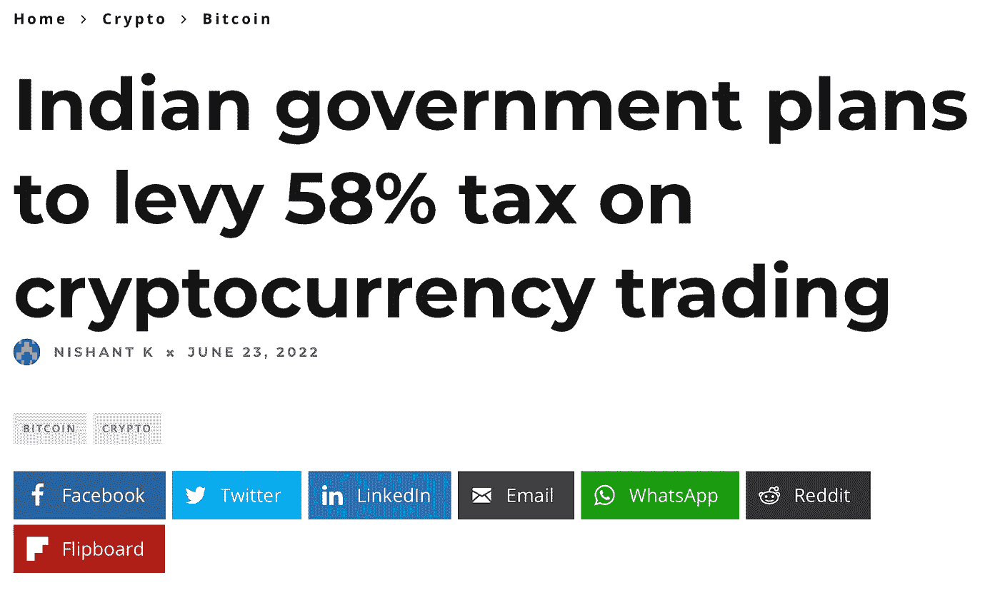
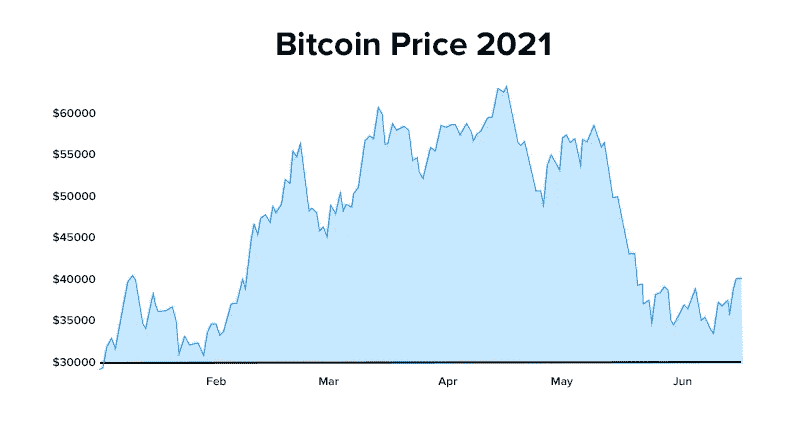

# 58%的加密税？！你一定是在开玩笑…

> 原文：<https://medium.com/coinmonks/58-tax-on-crypto-you-gotta-be-kidding-me-bd8e2b61fd70?source=collection_archive---------33----------------------->

我知道从分数的角度来看这个数字看起来很小，但从税收的角度来看，这个数字却高得惊人。你可能会认为这是政府的一个荒谬的决定。但是我们不要这么快下结论。我们先来分析一下场景中到底发生了什么……

我们将把分析分成几个主要部分，我保证尽量简短:)

好吧…那我们开始吧…

# 📌这一切是如何开始的…？

**联盟预算**临近，**财政部**拼命想办法增加**年度税收**。他们显然不能增加基本必需品的税收，在疫情中部也是如此。结果会是一场灾难。**他们必须对一些大的东西征税……一些在**之前没有被征税的东西……当你想到它时，第一个出现的名字是**加密货币**。

如果你还不知道的话，印度的加密技术非常庞大。**据报道，仅 WazirX 一家在 2021 年的交易额就达到了 430 亿美元**。这太疯狂了。

# 📌为什么这么高？

30%真的很高。我是说高得吓人。但是为什么呢？为什么政府？决定征收这么高的税。这背后一定有非常坚实和真实的原因，除非你有一群笨蛋坐在议会里(我们肯定有 xD)。

**我要说，30%的加密税是 101%合理的。这就是为什么…**

让我们站在政府的角度来分析一下这种情况…

> 虚拟数字资产的交易有了显著的增长。这些交易的规模和频率使得有必要规定一个具体的税收制度。
> ——印度财政部长 Nirmala Sitharaman。

**印度的加密技术非常庞大**，而且还不用缴税。事实上，看看**crypto 有多不可预测**就知道了。不像股票，它没有任何上限或下限。**它疯狂地波动。与其说是投资，不如说是赌博。所以为了简单起见，他们只是把密码归类为赌博。就像其他赌博行为一样，如赌博、赛马等。，crypto 也正在…** [阅读更多](https://raihankhan.substack.com/p/58-tax-on-crypto-you-gotta-be-kidding)

> 加入 Coinmonks [电报频道](https://t.me/coincodecap)和 [Youtube 频道](https://www.youtube.com/c/coinmonks/videos)了解加密交易和投资

# 另外，阅读

*   [密码复制交易平台](/coinmonks/top-10-crypto-copy-trading-platforms-for-beginners-d0c37c7d698c) | [造币评论](/coinmonks/coinmama-review-ace5641bde6e)
*   [印度密码交易所](/coinmonks/bitcoin-exchange-in-india-7f1fe79715c9) | [比特币储蓄账户](/coinmonks/bitcoin-savings-account-e65b13f92451)
*   [OKEx vs KuCoin](https://coincodecap.com/okex-kucoin) | [摄氏度替代品](https://coincodecap.com/celsius-alternatives) | [如何购买 VeChain](https://coincodecap.com/buy-vechain)
*   [币安期货交易](https://coincodecap.com/binance-futures-trading)|[3 期货对 Mudrex 对 eToro](https://coincodecap.com/mudrex-3commas-etoro)
*   [如何购买 Monero](https://coincodecap.com/buy-monero) | [IDEX 点评](https://coincodecap.com/idex-review) | [BitKan 交易机器人](https://coincodecap.com/bitkan-trading-bot)
*   [CoinDCX Review](/coinmonks/coindcx-review-8444db3621a2) | [加密融资融券交易所](https://coincodecap.com/crypto-margin-trading-exchanges)