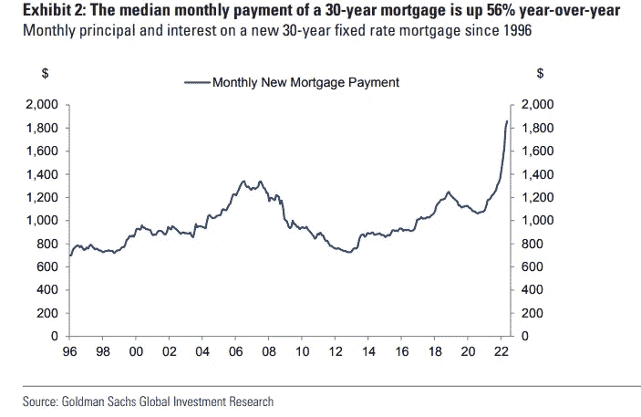

# 5MF:苹果进军 BNPL，CITADEL APES 进军加密领域，PFOF 不复存在？

> 原文：<https://medium.com/coinmonks/5mf-apple-jumps-into-bnpl-citadel-apes-into-crypto-no-more-pfof-aaeeea6297bb?source=collection_archive---------38----------------------->

# 5 分钟的金融时事通讯——解释发生了什么，为什么。

# 让我们看看这周发生了什么:

*   苹果进军 BNPL:完美的时机？
*   不再是 PFOF 了？SEC 提议用透明拍卖取代路由
*   Citadel Securities 将推出加密市场:好还是坏？
*   澄清加密作为货币、证券或商品的地位的新法案
*   以太坊 2.0:慢慢接近 Crypto 的最大合并

# 苹果:从大科技，到大金融科技

*   苹果以“先买后付”推进金融科技(BNPL):加密会是下一个吗？ **(** [**)链接**](https://tokenist.com/apple-pushes-into-fintech-with-bnpl-could-crypto-be-next/) **)**
*   苹果的“以后再付”是对你忠诚的最新恳求 **(** [**链接**](https://www.wired.com/story/apple-pay-later-plea-for-your-loyalty/) **)**

# 苹果将“Fin”添加到其已经庞大的技术足迹中

苹果公司推出苹果卡三年后，这个科技巨头正转向“现在购买，以后支付”(BNPL)，推出“以后苹果支付”(Apple Pay Later)。BNPL 市场今年达到 1795 亿美元，预计到 2030 年将增长到 3.2 万亿美元。

但是——如果你可以提前买东西而不用付钱，这难道不是信用吗，苹果已经有信用卡了。虽然新的 Apple Pay 后期服务是一种信用类型，但有几个关键差异需要考虑:

*   要获得信用卡，需要一些审查，包括你的收入和信用评分。BNPL 的情况并非如此，尽管可能会对特定的商家购买施加限制。
*   信用卡债务可以结转到随后的几个月。相比之下，BNPL 的还款分为四期。
*   信用卡收取各种费用，而 BNPL 只收取滞纳金。

苹果版的 BNPL 甚至比苹果卡更有意义，因为这是该公司首次涉足直接金融事务。迄今为止，苹果的苹果卡依赖于第三方信用处理机构，如高盛。相反，当新的 iOS 16 将 *Pay Later* 整合到 *Apple Pay* 中时，该公司将同时过渡到大科技和大金融科技。

可以说，试图搭上 BNPL 潮流的金融科技初创公司对这种发展感到恐惧。拥有超过 10 亿的 iPhone 用户和极其忠诚的客户群，苹果公司甚至有望盖过贝宝这样的公司。

苹果的顾客忠诚度远远高于所有其他竞争对手。图片鸣谢: [*苹果内幕*](https://appleinsider.com/articles/21/10/29/apple-has-most-loyal-smartphone-customers-in-us-study-finds#:~:text=According%20to%20a%20report%20from,for%20the%20past%20three%20years.)

苹果今年利用这种忠诚度也不是巧合。尽管美国人的储蓄账户利率略有上升，但个人储蓄率——人们储蓄的平均可支配收入——仍保持在 4.4%，为 2008 年大衰退以来的最低水平。

换句话说，疯狂的通货膨胀和生活成本的飙升正在吞噬人们的储蓄。这一次，没有刺激措施即将出台。消费者会把 BNPL 作为获得信贷的更便捷途径吗？苹果似乎认为答案很明确*是的*。

# PFOF 在美国(实际上)要结束了吗？

*   证券交易委员会提议的 PFOF 规则变化会如何影响无佣金证券经纪人 **(** [**链接**](https://tokenist.com/no-commission-brokers-could-be-affected-by-secs-proposed-pfof-rule/) **)**
*   罗宾汉高管抨击 SEC 计划动摇股票交易规则 **(** [**链接**](https://www.wsj.com/articles/robinhood-executive-attacks-secs-plans-to-shake-up-stock-trading-rules-11654701401) **)**

# 金融民主化的先驱们不喜欢透明的交易拍卖

首创零佣金交易是 Robinhood 成为最受欢迎的散户股票交易应用的主要原因。然而，当一大群追逐石头的猿猴发现 Robinhood 向做市商出售客户订单流时，robin hood 的“金融民主化”使命就泡汤了。这种不那么秘密的成分——被称为订单流支付(PFOF)——首先使零佣金交易成为可能。

问题是，有时，Citadel Securities 等做市商可能有既得利益，这与罗宾汉的客户(散户投资者)的利益相反(罗宾汉账户的平均规模为 3500 美元)。GameStop 的资金短缺是备受争议的 PFOF 商业模式的最大副作用，顺便说一下，这种商业模式在英国、澳大利亚和加拿大是非法的。

看起来美国将会效仿。美国证券交易委员会(SEC)正提议改革零售交易。新提议包括将交易订单发送至透明拍卖，这样做市商就可以竞争最佳价格。

仅此一项对 Robinhood 来说就是毁灭性的打击，该公司年初至今收入的 72%来自将订单发送给签约做市商。仅股票交易这一项，就会受到 SEC 新规的影响，Robinhood 的收入可能会下降约 12%。

可以预见的是，改革的暗示已经对罗宾汉(Robinhood)的股票产生了毁灭性的影响，在过去五天里股价下跌了 17.53%。

*Hood 跌至自该经纪公司上市以来的最低点，在 2021 年 8 月达到 70.32 美元的峰值。图片来源:* [*交易查看*](https://www.tradingview.com/)

罗宾汉公司的首席法律官丹·加拉格尔并不支持这项新提议。根据加拉格尔的说法:

“对零售业来说，这是一个非常好的环境，所以对我来说，现在进入并利用它有点令人担忧。”

[**享受 5MF？点击转发给三个朋友。**](mailto:info@tokenist.com?subject=Check+this+out+&body=I%E2%80%99ve+been+reading+Five+Minute+Finance,+and+I+know+you%E2%80%99d+enjoy+it+too.+It%E2%80%99s+a+weekly+email+that+covers+the+most+important+trends+in+finance.+I+learn+something+new+every+time+I+read+it!+Check+it+out+here:+https://tokenist.com/newsletter/?utm_source=email_gr_btn)

# 双刃剑:金融业巨头将推出加密交易平台

*   Citadel、查尔斯·施瓦布、富达联手打造加密货币交易平台 **(** [**链接**](https://news.bitcoin.com/citadel-charles-schwab-fidelity-join-forces-to-build-cryptocurrency-trading-platform/) **)**
*   Citadel Securities 正在与 Virtu Financial 建立一个加密交易市场:来源 [**(链接)**](https://www.coindesk.com/business/2022/06/07/citadel-is-building-a-crypto-trading-marketplace-with-virtu-financial-sources/)

# 遗产包含数字资产

还记得去年 10 月肯格里芬(Ken Griffen)将加密货币称为针对美元的“圣战号召”吗？嗯，现在看来都是过去的事了。作为 Citadel(对冲基金)和 Citadel Securities(做市商)的创始人，格里芬正在与其他金融权力经纪人合作进入加密领域。

Citadel Securities 与 Virtu Financial、Fidelity Investments 和查尔斯·施瓦布一起宣布了推出加密交易平台的计划。此外，风险投资公司红杉资本(Sequoia Capital)和 Paradigm 也将伸出援手。这些经验丰富的做市商和交易经纪商加在一起，可以带来数十亿美元的资金。

仅富达投资公司去年就创造了 240 亿美元的收入。相比之下，两个最大的加密交易所，比特币基地和币安，总收入为 270 亿美元。换句话说，我们正看到传统巨头进入金融与新兴技术相结合的阶段。

金融业权力四重奏将专注于严格的法规遵守、深度流动性和加密安全。传统公司往往会打破新奇数字资产的剩余心理障碍，这表明这一举措对数字资产领域的发展总体而言是积极的。

然而，这些传统公司能够完成这一重大转变吗？这一举措需要获得优秀的人才和建筑商。然而，这个领域的人才想去哪里工作——为 Citadel Securities 工作？

我们正处在一个有趣的十字路口。传统华尔街想要进入加密领域。他们的口袋很深。但是，密码领域的真正人才仅仅是为了钱吗？大概不会。传统华尔街有足够的资源来执行这项任务吗？大概吧。

这一举措的后果可能是巨大的。如果 Citadel Securities 实现了这一点，加密货币可能会完全嵌入传统金融系统。这是否意味着数字资产将失去一些吸引力？当然可以。但是，对于数字资产的主流验证来说，这种“牺牲”是不可避免的。

# 货币、证券还是商品？

*   美国加密货币法案提出将比特币视为商品 **(** [**链接**](https://tokenist.com/us-cryptocurrency-bill-proposes-treating-bitcoin-as-a-commodity/) **)**
*   随着市场持续低迷，比特币与黄金和美国债券的相关性激增 **(** [**链接**](https://tokenist.com/bitcoins-correlation-with-gold-us-bonds-surges-as-downturn-continues/) **)**

# 比特币——具有货币潜力的商品

比特币一开始是一种替代货币。一个对等电子现金系统来对抗美联储的货币供应。多年来，随着它吸引投资者，它开始与股票市场密切相关。最近，一个高增长科技股的价格活动，类似于纳斯达克 100 指数。

然而，在 2015 年，CFTC 没有将比特币归类为股票或货币，而是一种商品。就像黄金、谷物或石油一样，商品最好理解为可互换商品。但是等等——货币不也是一种可以互换的商品吗？

是的，如果货币被用来根据价格波动与其他资产进行交易。这就是问题所在。比特币要想超越大宗商品，其价格必须稳定下来，才能成为一种有效的交易媒介——货币。但在这种情况下，它将不再是一种能带来巨额收益的令人兴奋的大宗商品。

*这张表上两位数和三位数的涨幅多还是亏损多？图片来源:* [*展开*](https://telegram.org/)

因此，在 CFTC 的监管下，将所有数字货币视为商品是有意义的。至少，这是最新的两党秘密立法提案的意图。

与 SEC 将大多数数字资产视为证券的观点相比，这将是一个巨大的进步。这种处理既昂贵又麻烦，会扼杀 DeFi 生态系统。然而，即使该法案不会获得通过，我们也可能会在以后的其他法案中使用其中的一部分。

与此同时，比特币仍与科技股密切相关，同时也与黄金存在短期相关性。

这很有趣，因为在当前的市场抛售环境下，黄金是一种避险资产。

*根据市场状况，投资者的行为在风险承担和风险规避之间摇摆不定。图片来源:* [*北海巨妖*](https://kraken.docsend.com/view/scyxnqnb9tf8wqpf?utm_source=content+announcement&utm_medium=email&utm_campaign=ki+may+market+outlook+report&utm_content=content+link)

换句话说，随着机构投资者退出比特币(其活动首先在很大程度上促成了比特币与科技的相关性)，比特币回到了其默认的避险资产行为——数字黄金。

# 东拼西凑的以太坊很快就要达到一个终生分叉

*   年初至今，以太坊基金净流出 3.57 亿美元:投资者更喜欢 BTC **(** [**链接**](https://tokenist.com/ethereum-based-funds-hit-357m-in-net-outflows-ytd-investors-prefer-btc/) **)**
*   以太坊，《合并》:开发者在说什么 [**(链接)**](https://www.forbes.com/sites/kenrapoza/2022/06/09/ethereum-the-merge-what-developers-are-saying/?sh=1bab5ab1622b)

# 以太坊将 Web3 背在背上

未来几个月是以太坊成败的关键。通过从工作证明(PoW)到利益证明(PoS)共识，市值第二大的区块链有望将其能耗降低 [99.98%](https://tokenist.com/if-ethereum-2-0-consumes-99-98-less-energy-will-institutions-jump-in/) 。仅此一点就将受到注重环境、社会和治理的投资者的热烈欢迎。

尽管 ETH 2.0 推迟了多年，以太坊还是成功地将自己定位为 dApps 之王。如果出现更严重的延迟，现在有很多替代方案——Fantom、Avalanche、Solana、Near 等等。

这些替代品从一开始就以 PoS 的形式推出，提供可以忽略不计的费用和快速的交易。然而，另一方面，以太坊有巨大的先发优势，因为大多数 NFT 市场和区块链游戏都是在以太坊或其侧链(如 Polygon)上运行的。

正因为如此，Web 3.0 目前的状态是依靠以太坊来茁壮成长的。然而，由于预期会有更多的延迟，投资者的活动表明有点担心，因为价值 3.57 亿美元的 ETH 数字基金已经从以太坊生态系统中撤出。

当然，其他事件也是造成这种结果的原因。除了经济气候，Terra 还让整个 DeFi 生态系统陷入尴尬。因此，年初至今比特币流入量增加了 5 亿是可以理解的。

*形象功劳:* [*造币股份*](https://coinshares.com/research/digital-asset-fund-flows)

Ropsten testnet 与 Beacon Chain(新以太坊 PoS)对接后，这将是整个网络与 PoS 主对接前的最后一站。根据以太坊古怪的联合创始人 Vitalik Buterin 的说法，这应该在八月的某个时候发生。如果成功，没有重大的代码利用尴尬，我们可能会看到一个充满活力的加密市场。

# 本周推特

> 30 年期抵押贷款的月供中值同比增长了 56%

【T8**@ MikeZaccardi**

> 明日 CPI 报告的潜在结果:
> 
> 1.通胀高于预期，美元 SPX 下跌更鹰派美联储
> 
> 2.通货膨胀如预期，SPX 下跌，8%以上的利率上调
> 
> 3.通货膨胀低于预期，由于担心经济衰退，SPX 下跌
> 
> 美联储摧毁了市场。

[**@ kobeisisletter**](https://twitter.com/KobeissiLetter/status/1535014513354891282)

> 就下层阶级而言，美国落后于其他国家，他们一生都在从事低薪工作，很少积累储蓄……将近 1/4 的美国工人被归为低薪阶层(比⁦@OECD⁩和欧洲 averages)⁦高出 10%)

@彭博

[**@LizAnnSonders**](https://twitter.com/LizAnnSonders/status/1534849001568223232)

> 当粮食以非石油出口国和粮食进口国的贫穷国家的当地货币定价时，价格的上涨幅度远远超过我们看到的美元价格。
> 
> 引发阿拉伯之春的不是 2011 年的食品价格上涨。

【T4**@ biancore search**

> 公平地说，他们甚至已经不再问…

[**@ coin bureau**](https://twitter.com/coinbureau/status/1535169156106047488)

# 加入五分钟金融时事通讯。

[Sign up here — it’s free.](https://tokenist.com/newsletter/?utm_source=getresponse&utm_medium=email&utm_campaign=thetokenist&utm_content=%E2%9C%8B%20FMF%3A%20BoA%20Readying%20for%20BTC%2C%20Pot%20Goes%20Federal%2C%20More%20Inflation)

[t.me/thetokenist](http://t.me/thetokenist?utm_source=getresponse&utm_medium=email&utm_campaign=thetokenist&utm_content=%E2%9C%8B%20FMF%3A%20BoA%20Readying%20for%20BTC%2C%20Pot%20Goes%20Federal%2C%20More%20Inflation)

[twitter.com/thetokenist](https://twitter.com/thetokenist)

> 加入 Coinmonks [电报频道](https://t.me/coincodecap)和 [Youtube 频道](https://www.youtube.com/c/coinmonks/videos)了解加密交易和投资

# 另外，阅读

*   [霍比评论](https://coincodecap.com/huobi-review) | [OKEx 保证金交易](https://coincodecap.com/okex-margin-trading) | [期货交易](https://coincodecap.com/futures-trading)
*   [麻雀交换评论](https://coincodecap.com/sparrow-exchange-review) | [纳什交换评论](https://coincodecap.com/nash-exchange-review)
*   最好的[加密税务软件](/coinmonks/best-crypto-tax-tool-for-my-money-72d4b430816b) | [硬币追踪评论](/coinmonks/cointracking-review-a-reliable-cryptocurrency-tax-software-5114e3eb5737)
*   [Stackedinvest 评论](https://coincodecap.com/stackedinvest-review) | [北海巨妖评论](/coinmonks/kraken-review-6165fc1056ac) | [bitFlyer 评论](https://coincodecap.com/bitflyer-review)
*   最佳[加密借贷平台](/coinmonks/top-5-crypto-lending-platforms-in-2020-that-you-need-to-know-a1b675cec3fa) | [杠杆令牌](/coinmonks/leveraged-token-3f5257808b22)
*   最佳[加密制图工具](/coinmonks/what-are-the-best-charting-platforms-for-cryptocurrency-trading-85aade584d80) | [最佳加密交易所](/coinmonks/crypto-exchange-dd2f9d6f3769)