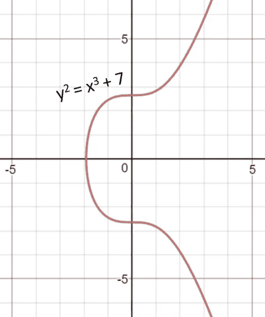
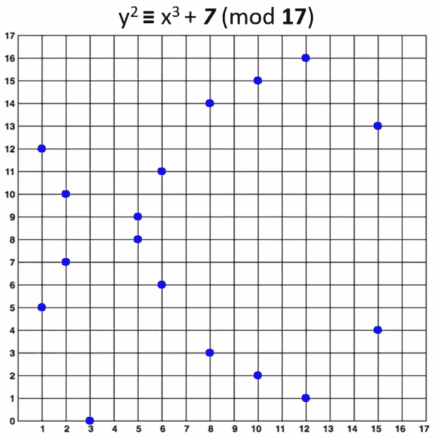

# 5P；1R —比特币的椭圆曲线加密

> 原文：<https://medium.com/coinmonks/5p-1r-bitcoins-elliptic-curve-cryptography-196fc74a1bf1?source=collection_archive---------13----------------------->

这是我想称为“ *5 点& 1 资源*”的潜在系列文章的第一篇(想想 TL；dr but 5p1r)在这里，我总结了一系列可以帮助我开始学习新主题的要点。它故意远离完整的数据来源。

1.  这是一条**椭圆曲线**:`y^2 = x^3 + ax + b`；参见连续功能图 1。
2.  **椭圆曲线密码**定义在一个**有限域**(极大素数) **p** 以及一个**生成点** ((x，y)坐标) **G 上，如下**:`y^2 ≡ (x^3 + ax + b) mod p`；参见散点图图像 2。
3.  比特币使用的是一条 **secp256k1** ，这是一条经过精心选择参数的椭圆曲线，可以实现一定的安全保障:
    `a=0` `b = 7` `p = 2^256 - 2^32 - 2^9 - 2^8 - 2^7 - 2^6 - 2^4 - 1` `G = 04 79BE667E F9DCBBAC 55A06295 CE870B07 029BFCDB 2DCE28D9 59F2815B 16F81798 483ADA77 26A3C465 5DA4FBFC 0E1108A8 FD17B448 A6855419 9C47D08F FB10D4B8`
4.  一个公钥 **P** (曲线上的一个点)就是一个私钥 **pk** (一个随机整数)乘以**生成器点(**曲线上的预选点):`P = pk * G.`
5.  **椭圆曲线离散对数问题**使得在已知 **P** 和 **G** 的(x，y)坐标的情况下，使用(3)中的参数或其他椭圆曲线拟合(2)中的方程，很难找到整数 **pk** 。

如果我必须在我浏览的所有参考资料中推荐一个资源，它将是:[https://crypto book . nakov . com/asymmetric-key-ciphers/elliptic-curve-cryptography-ECC # the-generator-point-in-ECC](https://cryptobook.nakov.com/asymmetric-key-ciphers/elliptic-curve-cryptography-ecc#the-generator-point-in-ecc)

Image 1: Elliptic curve over real numbers

Image 2: Elliptic curve over a finite field

> 加入 Coinmonks [电报频道](https://t.me/coincodecap)和 [Youtube 频道](https://www.youtube.com/c/coinmonks/videos)了解加密交易和投资

# 另外，阅读

*   [最佳比特币保证金交易](/coinmonks/bitcoin-margin-trading-exchange-bcbfcbf7b8e3) | [萝莉点评](/coinmonks/lolli-review-e6ddc7895ad8) | [比特币保证金交易](https://coincodecap.com/bityard-margin-trading)
*   创造并出售你的第一个 NFT | [密码交易机器人](https://coincodecap.com/best-crypto-trading-bots)
*   [如何在 CoinDCX 上购买柴犬(SHIB)币？](https://coincodecap.com/buy-shiba-coindcx)
*   [CBET 评论](https://coincodecap.com/cbet-casino-review) | [库科恩 vs 比特币基地](https://coincodecap.com/kucoin-vs-coinbase) | [拜比特 vs 比特币基地](https://coincodecap.com/bybit-vs-coinbase)
*   [折叠 App 回顾](https://coincodecap.com/fold-app-review) | [LocalBitcoins 回顾](/coinmonks/localbitcoins-review-6cc001c6ed56) | [Bybit vs 币安](https://coincodecap.com/bybit-binance-moonxbt)
*   [加密保证金交易交易所](/coinmonks/crypto-margin-trading-exchanges-428b1f7ad108) | [赚取比特币](/coinmonks/earn-bitcoin-6e8bd3c592d9) | [Mudrex 投资](https://coincodecap.com/mudrex-invest-review-the-best-way-to-invest-in-crypto)