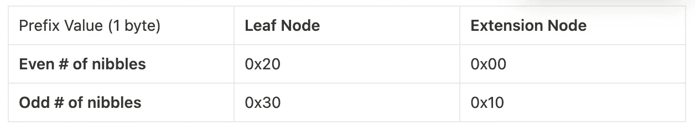
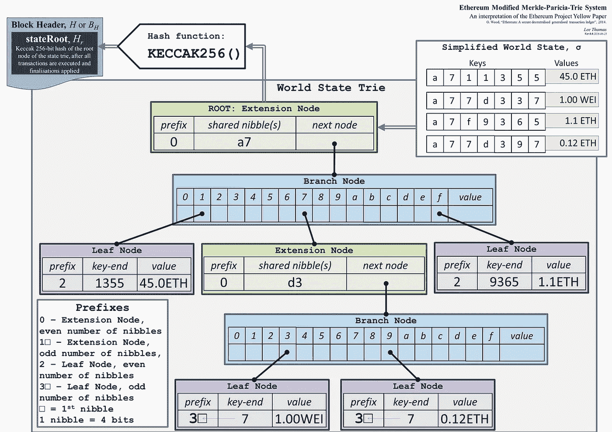

# 5P；1R —以太坊的改良版 Merkle Patricia Trie

> 原文：<https://medium.com/coinmonks/5p-1r-ethereums-modified-merkle-patricia-trie-6956f5888398?source=collection_archive---------14----------------------->

这是我正在尝试的系列文章的第二篇，名为“ *5 点& 1 资源*”(想想 TL；dr but 5p1r)在这里，我总结了一系列可以帮助我开始学习新主题的要点。它故意远离完整的数据来源。这里可以找到第一个:[5P；1R —比特币的椭圆曲线密码](https://olshansky.medium.com/5p-1r-bitcoins-elliptic-curve-cryptography-196fc74a1bf1)。

1.  Patricia Trie 是一个前缀树，当你沿着树向下导航时，边值被连接起来形成一个与节点值相关的键。所有叶节点都必须有一个值，但它对父节点是可选的。
2.  Merkle 树是一种散列树，其中每个非叶节点的值是其所有子节点的散列总和的散列。
3.  一个 **Merkle Patricia 树(MPT)** 用于使用**叶节点**(包含一个**&**值*)和**分支节点**(包含*指向其他节点的指针&可选值*)存储**键**(值**(序列化数据结构)。***
4.  *假设**关键字的大小为 N 位**(例如`N = 256 bits`)并且选择的**编码为 M 位**(例如`M = 2^4 => hex / base 16)`)，则分支节点最多可以有 **M + 1 个元素**(例如`1 optional value + 16 hex digits / nibbles`)，并且树可以有 N / M (例如`256 / 4 = 64`)的**最大深度。***
5.  *以太坊的**修改版 MPT** 还包含**扩展节点**，这是对只有一个子节点的分支节点的优化，方法是将它们压缩到一个类似*叶节点的结构*，同时用共享半字节替换**键端**并用子路径/散列替换**节点值，并使用一个特殊的**十六进制前缀**值来区分扩展节点和叶节点:***

**

*如果我只能在我浏览的所有参考资料中推荐一个资源，那将是:[https://medium . com/@ chiqing/merkle-Patricia-trie-explained-AE 3 AC 6 a 7 e 123](/@chiqing/merkle-patricia-trie-explained-ae3ac6a7e123)*

**

*[https://ethereum.stackexchange.com/questions/6415/eli5-how-does-a-merkle-patricia-trie-tree-work](https://ethereum.stackexchange.com/questions/6415/eli5-how-does-a-merkle-patricia-trie-tree-work)*

> *加入 Coinmonks [电报频道](https://t.me/coincodecap)和 [Youtube 频道](https://www.youtube.com/c/coinmonks/videos)了解加密交易和投资*

# *另外，阅读*

*   *[SmithBot 评论](https://coincodecap.com/smithbot-review) | [4 款最佳免费开源交易机器人](https://coincodecap.com/free-open-source-trading-bots)*
*   *[杠杆令牌](/coinmonks/leveraged-token-3f5257808b22) | [最佳密码交易所](/coinmonks/crypto-exchange-dd2f9d6f3769) | [Paxful 点评](/coinmonks/paxful-review-4daf2354ab70)*
*   *[加密套利](/coinmonks/crypto-arbitrage-guide-how-to-make-money-as-a-beginner-62bfe5c868f6)指南| [如何做空比特币](/coinmonks/how-to-short-bitcoin-568a2d0b4ae5)*
*   *[币安期货交易](https://coincodecap.com/binance-futures-trading)|[3 comas vs Mudrex vs eToro](https://coincodecap.com/mudrex-3commas-etoro)*
*   *[如何购买 Monero](https://coincodecap.com/buy-monero) | [IDEX 评论](https://coincodecap.com/idex-review) | [BitKan 交易机器人](https://coincodecap.com/bitkan-trading-bot)*