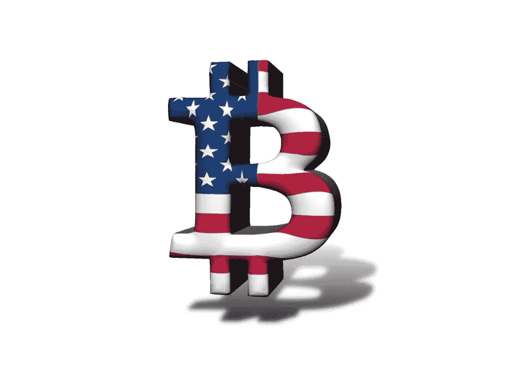
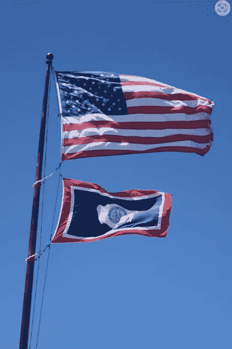
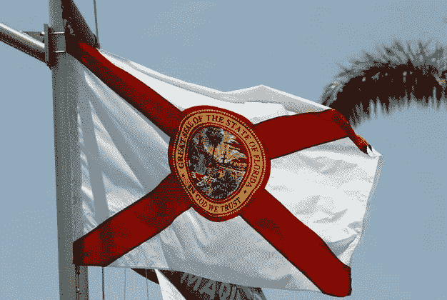
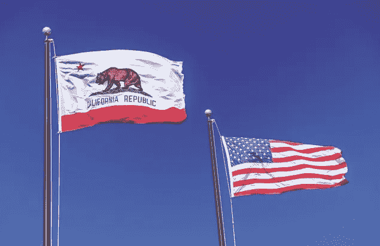
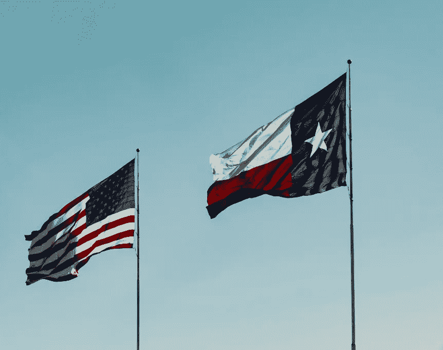
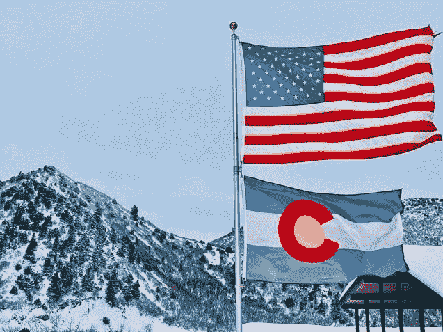
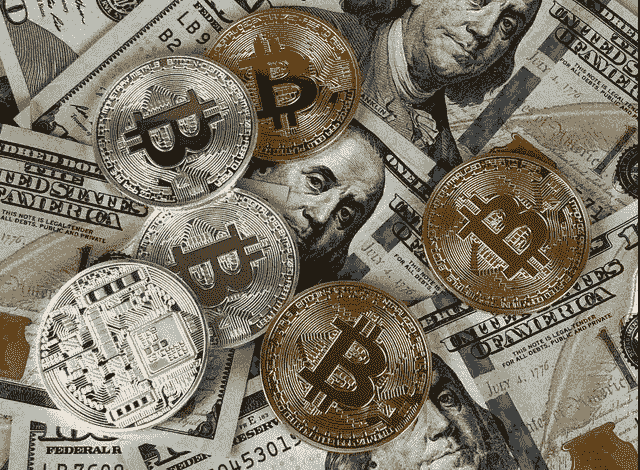

# 美国 6 个对加密最友好的州

> 原文：<https://medium.com/coinmonks/6-most-crypto-friendly-states-in-america-6ffd93482d29?source=collection_archive---------47----------------------->

你有没有想过哪些州对加密最友好，这将如何导致消费者驱动的创新和财务独立？或者你有没有想过，德克萨斯州或其他任何一个可能接受不受制于单一货币发行者的金融自由的州，是否可以考虑脱离联邦，创造自己的货币？我将探讨这些关于资金分散化的问题，并确定一些似乎走在加密曲线前面的州。

通货膨胀处于 40 年来的最高水平，尽管加密有起有落，但它给了人们更多的财务自由选择。各州之间正在进行一场大规模的加密战，以获得加密馅饼的份额，所以准备好战斗吧！

# 规则、法律、机会和其他有趣的事实

现在我已经引起了你们的注意，尽管有相反的神话，德克萨斯不能脱离联邦。然而，它确实有一些其他州没有的选项。尽管这不太可能，但是通过一些模糊的法律，德克萨斯州可以合法地划分成五个不同的州。虽然德克萨斯“英国退出欧盟”的想法是一个值得思考的有趣概念，但我更想关注关于加密的其他“有趣事实”:

**货币、密码和税收:**当地或州的货币可以补充国家货币，这鼓励了当地经济中的消费。然而，与法定货币(被视为法定货币)不同，crypto 可能不受联邦政府支持。美国政府可以要求税收以法定货币支付，这增强了法定货币的可信度。一些州正在向人们提供更多的选择，让加密技术有更大的影响力，比如用它来缴税。

**加密的价值和增长:**虽然承认加密是不稳定的，但加密资产和区块链技术代表了一个巨大的机会。去年 11 月，它的市值超过了 3 万亿美元，而仅仅五年前它的市值为 140 亿美元。尽管目前已从峰值水平大幅下跌，但没有理由认为当美国经济前景改善时，加密货币不会反弹。事实上，大约 16%的成年人投资、交易或使用过加密货币——这在十年前是不可想象的。

加密储蓄立法:最近强调加密增长的最重要的转变之一是新推出的由汤米·特伯维尔(共和党)提出的[金融自由法案](https://financialregnews.com/sen-tuberville-introduces-bill-that-would-prohibit-dol-from-limiting-401k-options/?ref=hackernoon.com)，他声称该法案保护了投资自由。它将禁止美国劳工部发布限制 401(k)计划投资类型的法规或指南。“退休储蓄投资的选择应该是你自己的，而不是政府的。现任政府推行的“最了解政府”的方法与让我们的国家成为历史上最繁荣国家的价值观背道而驰。”

一些支持该法案的[组织](https://financialregnews.com/sen-tuberville-introduces-bill-that-would-prohibit-dol-from-limiting-401k-options/?ref=hackernoon.com)包括美国税收改革协会、传统基金会、数字商会、区块链协会和数字资产市场协会。

# 看看一些关键的加密友好状态

# 怀俄明州——这一切都始于牛仔之州

许多人认为怀俄明州是加密的先驱州，它用加密来支撑它的经济。怀俄明州的北海巨妖银行成为第一家获得美国州银行执照的数字货币企业。此外，怀俄明州已经批准了 20 多项法律，使加密业务更容易运作，加密交易也免交州税。

怀俄明州也有一个宪章，允许专注于数字资产的银行进行现金存款，存储或转移可以在北海巨妖交易所交易的比特币。银行客户甚至可以将任何奖金兑换成现金后存入银行。这使他们能够在不使用中间人的情况下将兑换的比特币存入账户。

# 佛罗里达州——开拓者和加密中心

佛罗里达正积极地试图将迈阿密打造成一个加密中心，并成为加密产业的硅谷。该市举办了比特币 2022 大会，数千名加密爱好者聚集在这里。例如，在房地产交易中，迈阿密的新建筑接受[数字代币作为公寓的押金](https://www.ndtv.com/business/no-down-payment-for-crypto-based-home-mortgages-deepening-digital-coins-role-in-us-real-estate-2927364?ref=hackernoon.com)。

[今年 5 月，佛罗里达州州长 Ron DeSantis](https://www.winston.com/en/crypto-law-corner/florida-governor-signs-legislation-easing-cryptocurrency-regulation.html?ref=hackernoon.com) 签署了一项立法， [CS/HB 273](https://www.myfloridahouse.gov/Sections/Bills/billsdetail.aspx?BillId=73432&SessionId=93&ref=hackernoon.com) ，为该州定义并解除对加密货币的管制，并将于 2023 年 1 月生效。该法律修改了货币服务企业的金融法规，定义了“虚拟货币”，并减少了对佛罗里达州密码产业的限制。

# 加利福尼亚——钱在哪里

根据 Crypto Head 的研究，拥有 [2，473 台加密自动取款机和对加密的高度在线兴趣的加州](https://www.fool.com/the-ascent/cryptocurrency/articles/these-5-us-states-are-the-best-for-crypto-investors/?ref=hackernoon.com)赢得了加密准备最充分的州的称号，这并不奇怪。最近通过了一项立法，旨在探索部署区块链技术的机会，以解决公共服务和新兴需求，并确定创造研究和劳动力环境的机会，以推动区块链技术公司的创新。当然，与名单上的其他一些州不同，加州的州所得税目前是全国最高的，但它的家庭收入中值也排在第五位。

# 德克萨斯州——自治政府

德克萨斯州的国旗上有一颗星，代表着独立自主的精神，这种精神仍然是德克萨斯州文化的一部分。德克萨斯州没有州所得税，这使得高收入的加密交易者可以减少他们的加密税单。它也正在成为一个秘密采矿中心，而且电费低廉。德克萨斯州为在该州开店的主要矿业公司提供各种财政激励和劳动力培训。

两项关键法案获得通过，并由[州长 Greg Abbott 签署成为法律，他在 2022 年 2 月发推文](https://www.dallasnews.com/business/banking/2022/05/20/texas-quietly-tries-to-steal-silicon-valleys-thunder-as-the-go-to-state-for-crypto/?ref=hackernoon.com)“孤星之州准备成为区块链&加密货币的世界领导者。”此外，得克萨斯州的州立特许银行有权[为虚拟货币提供托管服务。](https://www.dallasnews.com/business/banking/2021/06/10/cryptocurrency-wins-votes-of-confidence-from-gov-abbott-texas-department-of-banking/?ref=hackernoon.com)

# 科罗拉多州——加密海报的孩子

__ [科罗拉多州](https://www.fool.com/the-ascent/cryptocurrency/articles/these-5-us-states-are-the-best-for-crypto-investors/?ref=hackernoon.com)_ _ 通过了各种类似怀俄明州区块链规则的立法，并且没有回头路可走。事实上，当科罗拉多州成为第一个接受加密货币支付州税和费用的州时，它就被定位为加密的典范。crypto 中的每一笔税款都会立即转换成现金。根据科罗拉多州税务局执行董事 Mark Ferrandino 的说法，“想要通过加密货币纳税的人会去一个交易所，通过交易所促进支付，然后交易所会将加密货币转换成现金，然后现金会进入该州。”

# 内华达州——创新者的天堂

内华达州是加密技术的早期采用者，并在 2017 年通过了一项法律，“在承认区块链验证记录的有效性的同时，不对区块链或智能合同征税。”

像其他一些对加密友好的州一样，内华达州没有州所得税，该州正在努力吸引更多的加密企业和投资者。

加密也是赌场和酒店的热门话题，许多赌场和酒店都在其设施中增加了 __ [比特币亭](https://www.buybitcoinworldwide.com/nevada/?ref=hackernoon.com)。有趣的是，也有几乎相同数量的交易用于将现金变成比特币。因此，密码就像现金一样被使用。

# 国家决定自己的命运

通货膨胀率很高，加密变得越来越主流，一些州开始采用加密并制定自己的数字资产规则。事实上，一些法案正在各州进行中，以使[成为解决公共和私人债务的加密法定货币。这可能包括支付税款、车管所费用、许可证、证书、执照等等。“到目前为止，联邦政府还没有直接回应，因为各州自行决定是否宣布加密货币为法定货币，”npr.org 最近的一篇文章称。](https://www.npr.org/2022/03/10/1084166077/with-federal-rules-unclear-some-states-carve-their-own-path-on-cryptocurrencies%20March%2010?ref=hackernoon.com)

尽管联邦政府已经认识到了加密的力量，并于最近发布了一项[行政命令](https://www.whitehouse.gov/briefing-room/presidential-actions/2022/03/09/executive-order-on-ensuring-responsible-development-of-digital-assets/?ref=hackernoon.com)来应对风险和利用收益，但许多州已经积极制定政策或采取行动，为进一步的加密创新和发展铺平道路。随着各州以今天的热情和多年前推动淘金热的同样的愤怒建设这条通往金融自由的道路，他们可以为公众提供更多的灵活性、选择、独立性和机会。

*原载于 2022 年 6 月 13 日 https://hackernoon.com**[*。*](https://hackernoon.com/6-most-crypto-friendly-states-in-america)*

> *加入 Coinmonks [电报频道](https://t.me/coincodecap)和 [Youtube 频道](https://www.youtube.com/c/coinmonks/videos)了解加密交易和投资*

# *另外，阅读*

*   *[Pionex 双投](https://coincodecap.com/pionex-dual-investment) | [AdvCash 审核](https://coincodecap.com/advcash-review) | [秉持审核](https://coincodecap.com/uphold-review)*
*   *[面向开发者的 8 个最佳加密货币 APIs】](https://coincodecap.com/best-cryptocurrency-apis)*
*   *[7 个最佳零费用加密交易平台](https://coincodecap.com/zero-fee-crypto-exchanges)*
*   *[最佳网上赌场](https://coincodecap.com/best-online-casinos) | [期货交易机器人](/coinmonks/futures-trading-bots-5a282ccee3f5)*
*   *[分散交易所](https://coincodecap.com/what-are-decentralized-exchanges) | [比特 FIP](https://coincodecap.com/bitbns-fip) | [宾邦评论](https://coincodecap.com/bingbon-review)*