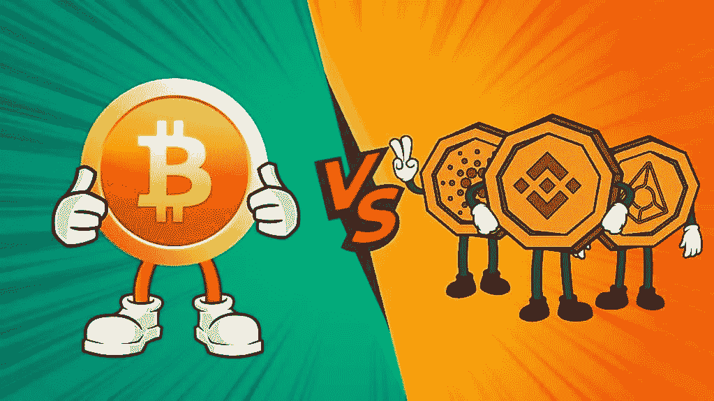

# 比特币是比 Alts 更好的长期投资的 6 个理由。

> 原文：<https://medium.com/coinmonks/6-reasons-why-bitcoin-is-a-better-long-term-investment-than-alts-a399f5db298?source=collection_archive---------91----------------------->

保持事情的直接性。比特币是比 altcoins 更好的长期投资。让我用一个具体的解释来证明这一点。

1.到目前为止，所有的大玩家和政府都主要关注于监管比特币。说到替代币有很多，包括像 ETH，ADA，DOT 等大玩家。但比特币是唯一的。此外，BTC 的主要用例是不涉及任何第三方银行系统的分散交易。而所有的 alt 都有不同的用例。

2.比特币现在逐渐成为主流。萨尔瓦多是首个接受比特币作为法定货币的国家，并将有许多国家效仿。俄国最近提议监管 BTC。一份报告称，截至 2021 年 12 月 30 日，全球安装了约 34，000 台比特币自动取款机。比特币在全球接受率较高。

3.当比特币上涨时，替代币也倾向于上涨，当比特币下跌时，替代币也倾向于下跌。但替代币的涨跌往往比比特币波动性大得多。在任何牛市周期中，都很难挑选出那些能带来指数回报的特定硬币。但当市场变得熊市时，如果你投资了 BTC 而不是 alts，你会处于更安全的位置，因为正如前面提到的那样，当比特币下跌时，alts 会失去更多价值。

4.alt 下降后，并不总是很快回到他们的 ATH。XRP 是这方面最大的例子。

5.在经济学方面，所有法定货币的价值以每年 5%的平均速度膨胀。也就是说，如果我今年可以买 100 美元的任何商品，那么明年我必须有 105 美元才能买同样的商品。这是因为法定货币的供应是无限的，并且是由政府控制的。任何无限的东西都会随着时间的推移而失去价值。而比特币总共才 2100 万。这在投资角度和真实世界用例角度都很突出。

6.我们仍处于比特币的早期阶段。这个阶段是早期采用阶段。就像 1997 年的互联网一样。我们越早进入这个领域，我们就越能融入这个社区。

> *加入 Coinmonks* [*电报频道*](https://t.me/coincodecap) *和* [*Youtube 频道*](https://www.youtube.com/c/coinmonks/videos) *了解加密交易和投资*

# 另外，阅读

*   [Bookmap 评论](https://coincodecap.com/bookmap-review-2021-best-trading-software) | [美国 5 大最佳加密交易所](https://coincodecap.com/crypto-exchange-usa)
*   最佳加密[硬件钱包](/coinmonks/hardware-wallets-dfa1211730c6) | [Bitbns 评论](/coinmonks/bitbns-review-38256a07e161)
*   [新加坡十大最佳密码交易所](https://coincodecap.com/crypto-exchange-in-singapore) | [收购 AXS](https://coincodecap.com/buy-axs-token)
*   [红狗赌场评论](https://coincodecap.com/red-dog-casino-review) | [Swyftx 评论](https://coincodecap.com/swyftx-review) | [CoinGate 评论](https://coincodecap.com/coingate-review)
*   [投资印度的最佳加密软件](https://coincodecap.com/best-crypto-to-invest-in-india-in-2021)|[WazirX P2P](https://coincodecap.com/wazirx-p2p)|[Hi Dollar Review](https://coincodecap.com/hi-dollar-review)
*   [加拿大最好的加密交易机器人](https://coincodecap.com/5-best-crypto-trading-bots-in-canada) | [库币评论](https://coincodecap.com/kucoin-review)