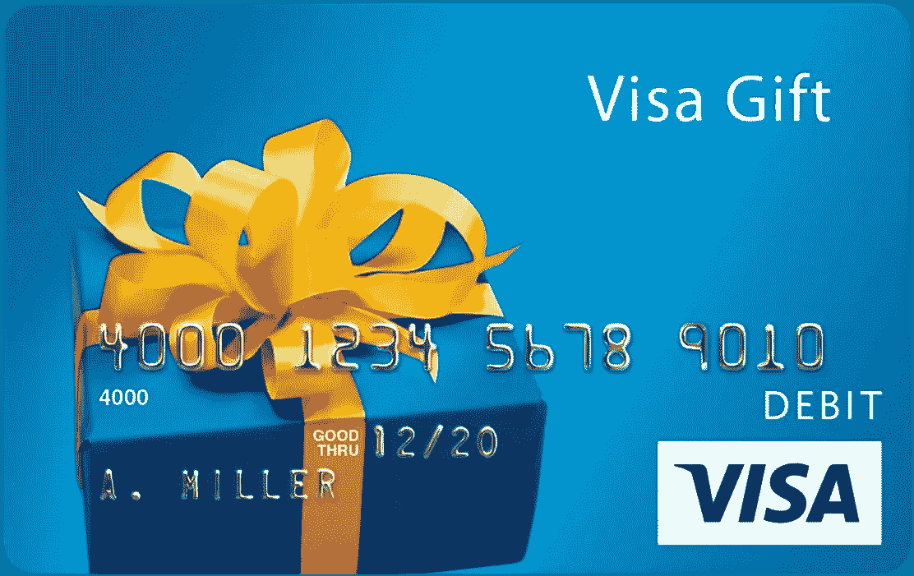
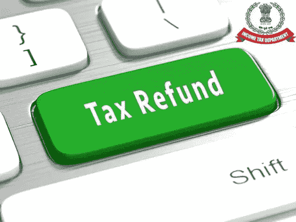
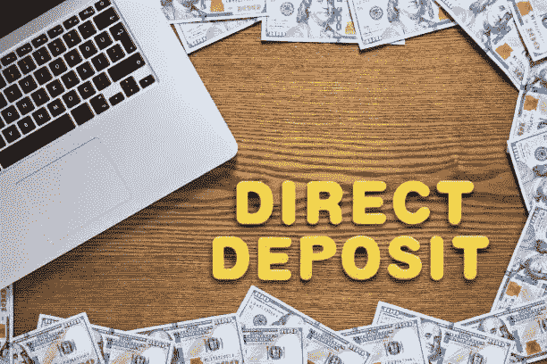
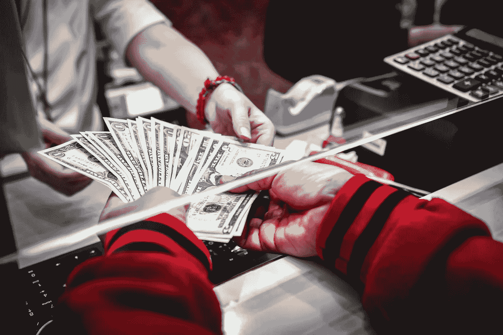
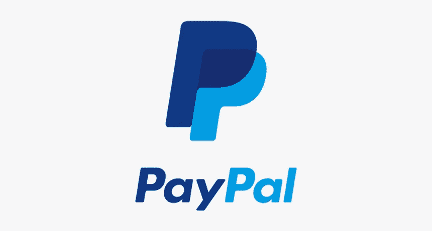
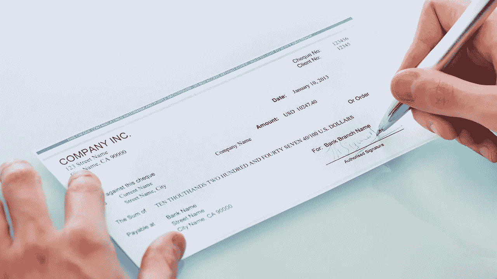
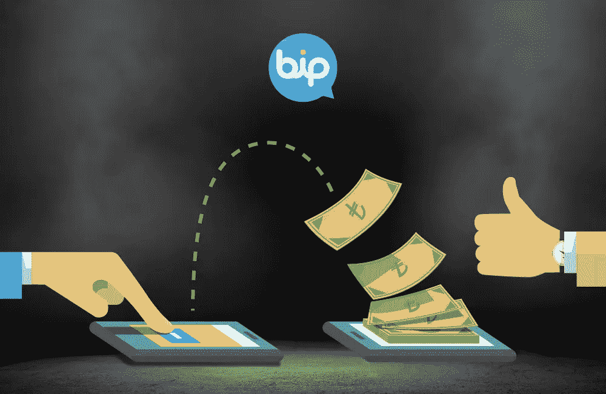
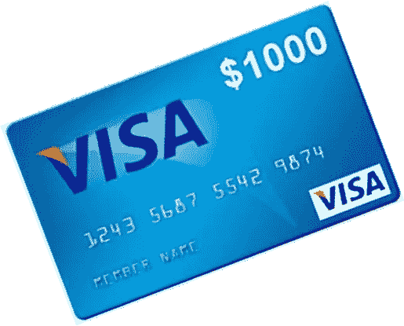

# 给你的 Visa 礼品卡充值的 6 种简单方法

> 原文：<https://medium.com/coinmonks/6-simple-ways-to-reload-your-visa-gift-card-e63651c71e61?source=collection_archive---------36----------------------->

**Visa Gift Card**

Visa 礼品卡因其灵活性和易用性而成为当今较为流行的礼品卡。它们可以在任何接受借记卡**的地方使用，这意味着它们可以在各种零售点、网上购物，甚至支付账单。**

然而，只有当账户中还有一笔**美元**时，它们才是可用的。幸运的是，在您购买并激活它之后，您可以通过多种方式为它充值更高的现金价值。

当你**“购买”一张 Visa 礼品卡时，会发生两件事:你得到一张有账号的卡，你在卡上为你**“购买”的金额充值。****

**如果你购买一张 **$50 的礼品卡**，它会附带一张$50 的余额，你可以在激活后使用(这可能需要付费)。如果您希望在余额**耗尽**后继续使用该卡，您必须为其充值或为卡充值。**

**作为服务提供商，我们可以允许您通过以下方式向您的账户余额添加资金**

## **退税**

****

****Tax Refund****

**你的州和联邦退税可以直接计入你的礼品卡余额。你可以告诉国税局把钱送到服务提供商的直接存款服务。**

**这种方法也适用于大多数**政府援助检查**。要做到这一点，你需要填写一份申请表，就像申请银行账户一样。**

## **直接存款**

****

****Direct Deposit****

**你可以将你的工资支票直接存入你的礼品卡账户。这类似于你的退税存款。**

**您需要填写一份申请，并且必须在自动存款发生之前被接受(通常是这样)。**

## **保证金**

****

****Cash Deposit****

**几家不同的汇款服务提供商允许你将现金直接存入你的 Visa 账户。**

**Money Gram 和 Money Pak 是两个最广为人知的充值余额服务。然而，如果你这样做，可能会有服务费。**

## **贝宝**

****

****PayPal****

**是的，您可以使用 PayPal 向您的帐户充值。您需要设置您的 PayPal 帐户，以添加一个新的“**银行帐户**”。“银行账户”是您的礼品卡服务提供商和您的卡的个人账号。**

**一旦 PayPal 对这个新帐户进行了验证，您就可以随时从您的 PayPal 帐户向其添加资金。**

## **支票或汇票**

****

****Check Or Money Order****

**要向您的帐户添加资金，请将您的**支票或**汇票提交到您的签证服务提供商提供的地址。**

**尽管许多提供商将免费提供这种服务，但是现金存入账户需要更长的时间，因为它必须通过邮件传送。**

## **银行汇款**

****

****Bank Transfer****

**这种转账方式与您使用 PayPal 向任何允许**电子资金转账**的金融机构的 Visa 礼品卡账户转账的方式非常相似。**

**您需要登录到您的金融机构的账户，设置一个新的**【在线收款人】**，并填写您的卡服务提供商在这种情况下会提供给您的信息。一旦你的机构验证了账户，你就可以开始了。**

## **最后的话**

****

****Visa Gift Card****

**用 Visa 礼品卡很简单，往账户里加钱也很简单。这对于使用信用卡有问题的人来说是理想的选择，因为礼品卡只能用来购买卡上的剩余金额。**

**他们还可以帮助父母抚养离家在外的孩子。尽你所能了解他们的应用程序是一个好主意，这样你就能理解他们如何让你的生活变得更轻松。**

**查看以下链接，发现更多免费礼品卡。只需注册即可获得高达**1000 美元的免费礼品卡**。找出在你的国家有哪些礼品卡，最能满足你的需求。**

## **[获得免费礼品卡赠品](https://sites.google.com/view/free-gift-cards-list/home)**

> **加入 Coinmonks [电报频道](https://t.me/coincodecap)和 [Youtube 频道](https://www.youtube.com/c/coinmonks/videos)了解加密交易和投资**

# **另外，阅读**

*   **[加密货币储蓄账户](/coinmonks/cryptocurrency-savings-accounts-be3bc0feffbf) | [加密交易机器人](https://coincodecap.com/best-crypto-trading-bots)**
*   **[BigONE 交易所评论](/coinmonks/bigone-exchange-review-64705d85a1d4) | [CEX。IO 审查](https://coincodecap.com/cex-io-review) | [交换区审查](/coinmonks/swapzone-review-crypto-exchange-data-aggregator-e0ad78e55ed7)**
*   **[最佳比特币保证金交易](/coinmonks/bitcoin-margin-trading-exchange-bcbfcbf7b8e3) | [比特币保证金交易](https://coincodecap.com/bityard-margin-trading)**
*   **[加密保证金交易交易所](/coinmonks/crypto-margin-trading-exchanges-428b1f7ad108) | [赚取比特币](/coinmonks/earn-bitcoin-6e8bd3c592d9)**
*   **[WazirX vs coin dcx vs bit bns](/coinmonks/wazirx-vs-coindcx-vs-bitbns-149f4f19a2f1)|[block fi vs coin loan vs Nexo](/coinmonks/blockfi-vs-coinloan-vs-nexo-cb624635230d)**