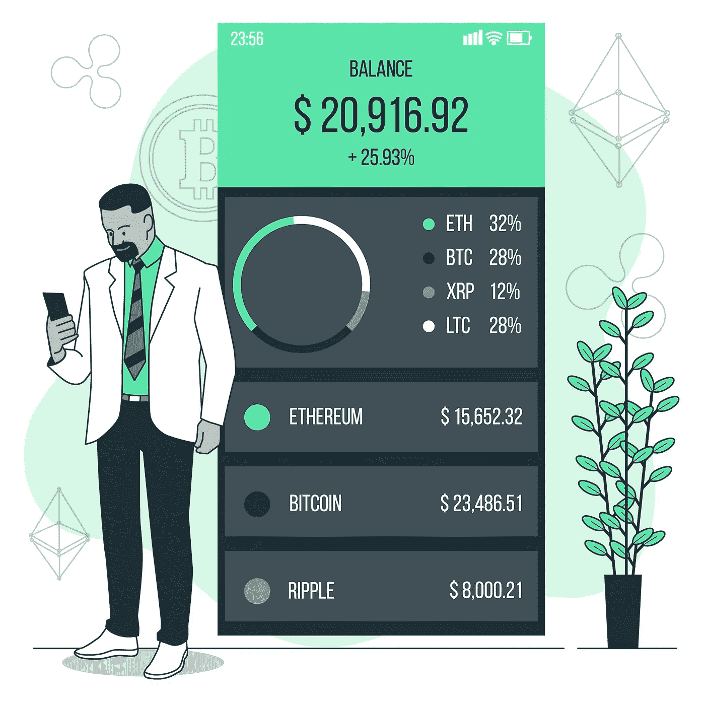

# 建立有利可图的加密交易组合的 6 个步骤

> 原文：<https://medium.com/coinmonks/6-steps-to-building-a-profitable-crypto-trading-portfolio-aa56ffd7aaa4?source=collection_archive---------42----------------------->

如果你担心当前的市场形势，这是你的加密交易组合不平衡的一个迹象。可能你投资的比你能承受的损失要多，或者你的投资组合并不均衡。

交易加密货币不仅仅是在交易中跳来跳去。如果你想建立一个有利可图的加密交易组合，你应该遵循一些一般规则。

在这篇文章中，我解释了当你建立一个有利可图的加密交易组合时应该遵循的六个步骤。

**什么是加密交易组合:**

加密交易组合是投资者或交易者拥有的加密货币的集合。加密投资组合通常包含各种不同的资产，包括替代硬币和加密金融产品。

加密投资组合的目的是分散投资和降低风险。

**1。考虑你的投资目标:**

明确你的投资目标也很重要，即使你是在寻求快速盈利或者你的目标是长期盈利，也要坚持下去。

你的投资目标将决定你如何建立你的投资组合。例如，如果你想快速获利，你应该考虑具有短期增长潜力的投资机会。

另一方面，如果你想长期投资，你应该专注于增长率稳定和基础强大的硬币。

**2。决定你的投资策略:**

一旦你知道了你的目标，就开始策划你的投资策略。一些人选择只投资一两个硬币，而另一些人则将投资组合分散到多个加密资产类别。

有些人一看到价值有小幅上涨就卖掉资产，而另一些人则等待更长时间，希望获得更大的收益。

请记住，投资加密货币没有对错之分。最好的是和你的目标和风险承受能力相匹配的。

**3。了解所涉及的风险:**

是时候了解相关的风险了。加密货币是一个波动性很大的市场，这意味着价格随时可能上涨或下跌。波动性使其成为一种高风险投资，但伴随着这种风险而来的是高利润的潜力。

在你投资之前，你应该意识到你可能会失去你所投资的一切。加密货币相对较新，因此总有可能出错。

请记住，投资加密货币不同于投资股票和其他传统资产。市场随时都在变化，对欺诈的保护也越来越少。明智的做法是投资你能承受的损失。

**4。分散投资:**

降低风险的最好方法是分散投资，不要把所有的鸡蛋放在一个篮子里。

如果你投资的任何资产下跌，投资多个硬币可以帮助你减轻损失。它可以让你有更大的机会长期盈利，以抵消其他投资的损失或缓慢增长。

评估每项资产的市值非常重要。规则是将你的资产分为高、中、低风险资产。

*   高风险资产:它们的市值不到 10 亿美元。这些都是高风险的投资，但有可能获得最大的回报。
*   中等风险资产:它们的市值在 10 亿到 100 亿美元之间。这些硬币不如低风险资产成熟，但它们有增长的机会。
*   低风险资产:它们的市值超过 100 亿美元。这些通常是历史记录最悠久的硬币。

**5。定期审查您的投资组合并重新平衡:**

密切监控你的投资组合以确保它不偏离轨道是很重要的。它意味着卖出已经增值的硬币，并重新买入那些贬值的硬币。

定期审查将有助于你的投资组合保持多样化，并继续增长。

**6。设定现实的期望:**

最后，你需要为你的投资设定现实的预期。不要指望一夜之间成为百万富翁。相反，随着时间的推移，专注于缓慢而稳定地建立你的投资组合。

**结论:**

如果你刚刚开始你的加密交易之旅，如果你没有看到立竿见影的效果，不要气馁。

*密码交易是一个长期游戏。要有耐心，保持纪律性。如果你遵循这些步骤，你最终会建立一个有利可图的加密交易组合。*

如果你在这篇文章中发现了价值，为它鼓掌👏，关注我这里和上 [*推特*](https://twitter.com/bukzofwakanda) *。我为你计划了很多。*

> 加入 Coinmonks [电报频道](https://t.me/coincodecap)和 [Youtube 频道](https://www.youtube.com/c/coinmonks/videos)了解加密交易和投资

# 另外，阅读

*   [美国最佳加密交易机器人](https://coincodecap.com/crypto-trading-bots-in-the-us) | [经常性回顾](https://coincodecap.com/changelly-review)
*   [在印度利用加密套利赚取被动收入](https://coincodecap.com/crypto-arbitrage-in-india)
*   [Godex.io 审核](/coinmonks/godex-io-review-7366086519fb) | [邀请审核](/coinmonks/invity-review-70f3030c0502) | [BitForex 审核](https://coincodecap.com/bitforex-review)
*   [5 款最佳免费加密货币制图工具](https://coincodecap.com/crypto-charting-tools)
*   [最佳比特币保证金交易](/coinmonks/bitcoin-margin-trading-exchange-bcbfcbf7b8e3) | [萝莉点评](/coinmonks/lolli-review-e6ddc7895ad8) | [比特币保证金交易](https://coincodecap.com/bityard-margin-trading)
*   [创造并出售你的第一个 NFT](https://coincodecap.com/create-nft) | [密码交易机器人](https://coincodecap.com/best-crypto-trading-bots)