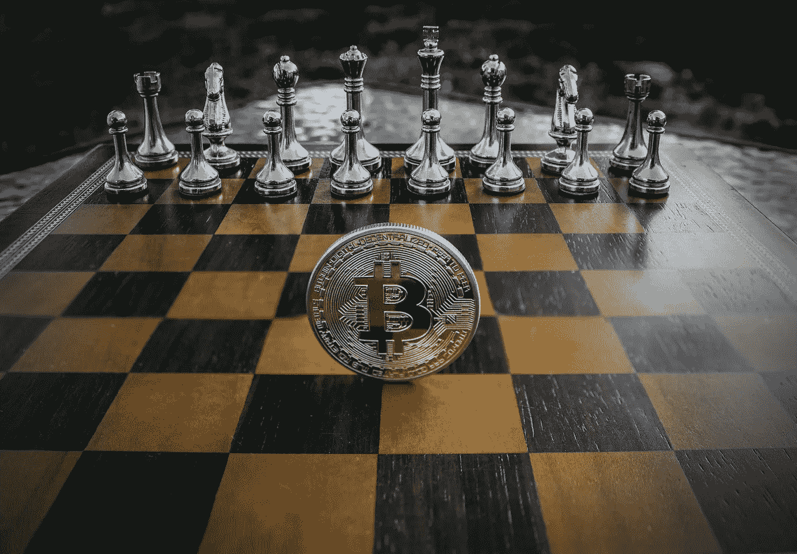

# 如果你是加密货币交易者或投资者，你可以遵循的 6 个成功秘诀 2022。

> 原文：<https://medium.com/coinmonks/6-success-tips-you-can-follow-if-you-are-a-cryptocurrency-trader-or-investor-2022-45bb10480799?source=collection_archive---------23----------------------->

今天，大多数人类了解加密货币的能力。这个企业经历了全球商业内部的一场革命。这就是越来越多的商人成为这个企业的一员的目的。虽然成为这个企业的一部分很简单，但实现目标可能不是每个人都能一帆风顺的。因此，在这篇文章中，我们将与你分享一些实践技巧。直接阅读了解更多信息。

**1。研究并增加你的知识**

如果你没有某样东西的主要信息，你就不能把你的现金投入其中。同样，如果你不熟悉加密货币交易，确保你先掌握一些基本知识。

在开始时，你必须借助于获得基本术语的知识开始，包括个人密钥、虚拟硬币、钱包和公共密钥，仅举几个例子。

**2。考虑分散投资**

关键是要考虑到加密货币设备的成本将会波动。你不能指望一枚硬币的价格会上涨或下跌。因此，如果你需要安全，你可以回忆分散投资。

这将有助于你减少威胁，增加你创造利润的可能性。所以，你可能需要贴上这个策略，特别是在你开始的时候。

**3。稳健投资&避免过度交易**

你需要在每天的基础上投资超过一个小时，以了解加密货币买卖的方式。你需要发现市场是如何运作的。这将有助于你获得一个相当高的特定货币的识别概念。因此，你可以跨越伟大的融资战略。

**4。精通技术**

此外，你还想找到利用尖端时代的方法。由于加密货币是虚拟货币的一种形式，您可以使用 era 购买和推广它们。因此，你想学习如何使用加密自动取款机，以及在这个过程中可能涉及的所有不同的问题。

**5。警惕骗局**

不管你打算投资哪种企业，你都应该关注骗子。因此，如果你知道如何使用互联网，你就可以毫无困难地识别出骗局。如果你消息灵通，没人能利用你。

**6。咨询值得信赖的专业人士**

向这个领域的专家寻求建议是一个极好的概念。如果你遵从他们建议，采纳他们有益的建议，你可能会更上一层楼。在这种情况下，你可以额外观看 YouTube 上的电影，并成为脸书适用机构的一员。

如果你的朋友和自己的亲戚喜欢买卖和投资加密货币，你也可以向他们寻求建议。

最后的想法
长话短说，如果你需要在投资现金和加密货币后获得成就，我们建议你遵守这 6 条成就建议。希望你能够通过遵循本文中给出的要点来获得成就。

注册本交易平台，立即获得奖励:[https://tinyurl.com/4st3wkty](https://tinyurl.com/4st3wkty)

⚠️:这个博客的描述包含附属链接，这意味着如果你点击产品链接。我会收到一小笔佣金。它不会以任何方式影响你所支付的费用。这有助于支持我的博客，并允许我继续这样写作。♥️♥️谢谢你的支持！

> *👉【https://EzineArticles.com/expert/Shalini_M/2609777】最初发表:*

> *加入 Coinmonks [电报频道](https://t.me/coincodecap)和 [Youtube 频道](https://www.youtube.com/c/coinmonks/videos)了解加密交易和投资*

# *另外，阅读*

*   *[Fold App 审核](https://coincodecap.com/fold-app-review) | [Kucoin 交易机器人](/coinmonks/kucoin-trading-bot-automate-your-trades-8cf0ca2138e0) | [Probit 审核](https://coincodecap.com/probit-review)*
*   *[如何匿名购买比特币](https://coincodecap.com/buy-bitcoin-anonymously) | [比特币现金钱包](https://coincodecap.com/bitcoin-cash-wallets)*
*   *[币安 vs FTX](https://coincodecap.com/binance-vs-ftx) | [最佳(索尔)索拉纳钱包](https://coincodecap.com/solana-wallets)*
*   *[比诺莫评论](https://coincodecap.com/binomo-review) | [斯多葛派 vs 3Commas vs TradeSanta](https://coincodecap.com/stoic-vs-3commas-vs-tradesanta)*
*   *【Capital.com】|[港加密借贷平台](https://coincodecap.com/crypto-lending-hong-kong)*