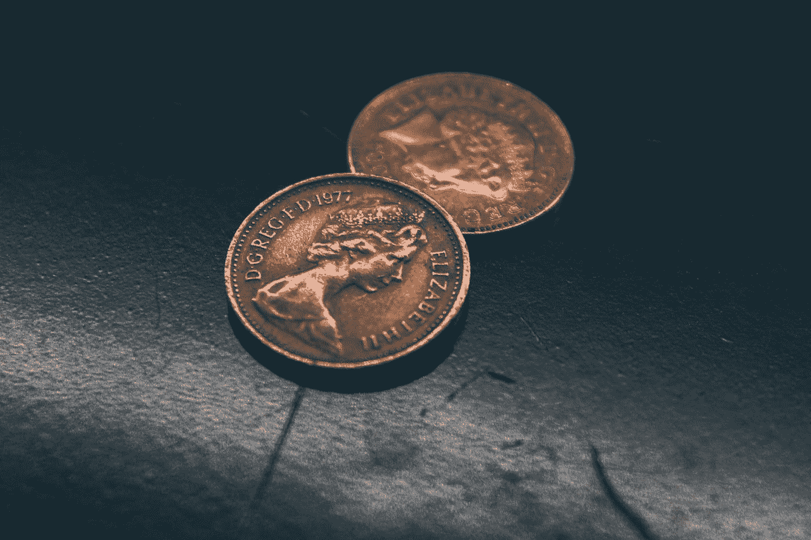

# 区块链技术的 6 个惊人用途

> 原文：<https://medium.com/coinmonks/6-surprising-uses-of-blockchain-technology-2bddb459306f?source=collection_archive---------26----------------------->

## 区块链技术

# 不涉及加密货币的区块链的 6 种令人惊讶的用途

Photo by [Shubham Dhage](https://unsplash.com/@theshubhamdhage?utm_source=medium&utm_medium=referral) on [Unsplash](https://unsplash.com?utm_source=medium&utm_medium=referral)

区块链技术是数字、分布式和去中心化的分类账，是大多数虚拟货币的基础，负责记录所有交易，而不需要依赖银行等中间人。区块链技术的用途远远超出了加密货币的范畴。以下是区块链技术不涉及加密货币的六个令人惊讶的应用。

1.  **)支付处理**

Photo by [Austin Distel](https://unsplash.com/@austindistel?utm_source=medium&utm_medium=referral) on [Unsplash](https://unsplash.com?utm_source=medium&utm_medium=referral)

区块链技术最合理的用途是加速资金从一个人到另一个人的转移。当银行被排除在等式之外，P2P 交易发生时，它们可以每周 7 天、每天 24 小时完成，在几秒钟内完成交易，而不是几天。

**2。)零售忠诚度奖励计划**

Photo by [Siora Photography](https://unsplash.com/@siora18?utm_source=medium&utm_medium=referral) on [Unsplash](https://unsplash.com?utm_source=medium&utm_medium=referral)

区块链技术可以进一步革新零售体验。区块链可能成为忠诚度奖励计划的首选数据库。通过创建一个基于代币的系统来奖励消费者并将代币存储在区块链中，它可能会激励消费者返回商店进行购物。区块链还将能够消除通常与零售忠诚度奖励计划相关的欺诈和浪费。

**3。)数字身份证**

Photo by [Christopher Gower](https://unsplash.com/@cgower?utm_source=medium&utm_medium=referral) on [Unsplash](https://unsplash.com?utm_source=medium&utm_medium=referral)

全世界有超过 10 亿人面临身份挑战。微软试图通过在其 Authenticator 应用程序中创建一个数字 ID 来改变这种情况。首先，这将为用户提供一种控制其数字身份的方法，并允许生活在贫困地区的人们获得金融服务，或者开办自己的企业。

**4。)数字投票**

Photo by [Arnaud Jaegers](https://unsplash.com/@ajaegers?utm_source=medium&utm_medium=referral) on [Unsplash](https://unsplash.com?utm_source=medium&utm_medium=referral)

世界各国都担心选民舞弊。有了区块链技术，各州可以提供数字投票的能力，并且足够透明，监管者能够迅速发现网络中的任何变化。它将把数字投票的便捷性与区块链不变的本性结合起来，让你的投票变得有价值。

**5。)食品安全**

Photo by [Bon Vivant](https://unsplash.com/@bonvivant?utm_source=medium&utm_medium=referral) on [Unsplash](https://unsplash.com?utm_source=medium&utm_medium=referral)

区块链的另一个令人惊讶的用途是追踪食物从源头到你的盘子。因为区块链的数据是不可变的，所以您可以追踪食品从最初到杂货店的运输过程。此外，如果出现食源性疾病，区块链将能够比现在更快地追踪污染源。

**6。)医疗记录保存**

Photo by [Daniel Frank](https://unsplash.com/@fr3nks?utm_source=medium&utm_medium=referral) on [Unsplash](https://unsplash.com?utm_source=medium&utm_medium=referral)

医疗部门已经开始从纸质记录转向数字记录。然而，区块链提供了更多的安全和便利。除了存储患者记录，如果患者拥有密钥，他们将能够访问他们的文件，并能够控制谁可以看到他们的信息。

虽然区块链远非完美，仍需开发，但它肯定有大量的实际应用可以利用。

> 如果你想从区块链技术的基础到深度了解更多，我强烈推荐你阅读下面的电子书:

> 在过去的十年里，围绕加密货币的讨论变得异常热烈。越来越多的人希望投资比特币和其他加密货币，希望借此致富。虽然围绕加密货币的喧嚣和炒作似乎不会很快平息，但比特币的基础开始占据中心舞台。随着越来越多关于区块链(比特币赖以运行的技术)的信息出现，人们对区块链技术的疑问也越来越多。
> 
> 我写了一本名为“区块链秘密”的指南，分享了区块链、加密货币和互联网未来的最终指南。
> 
> 以下是您将在本课程中发现的内容:
> 
> 区块链技术、加密货币和货币背后的历史。
> 
> 了解区块链的基础知识以及该技术的工作原理。
> 
> 了解区块链的业务以及哪些行业将受益于该技术。
> 
> 了解工作证明与利益证明，以及哪一种更适合区块链技术。
> 
> 发现区块链技术的所有优势，以及它将如何改变我们所知的互联网和生活的未来。
> 
> 深入了解区块链技术带来的风险和挑战，并发现其成为主流的主要障碍。
> 
> 了解区块链技术是否适合您和您的企业。
> 
> 发现区块链实施中的错误以及如何避免这些错误。
> 
> 还有更多！

如果你想得到这本电子书，请点击下面的链接:

 [## 区块链秘密销售页面

### 区块链秘密会教你到底什么是区块链，以及技术背后的秘密。这是…

mqaq.gr8.com](https://mqaq.gr8.com/offer_page.html) 

这是一个有限的提议。它在有限的时间里以高折扣价出售。如果你真的渴望了解区块链技术，那么这本电子书就是为你准备的。

> 加入 Coinmonks [电报频道](https://t.me/coincodecap)和 [Youtube 频道](https://www.youtube.com/c/coinmonks/videos)了解加密交易和投资

# 另外，阅读

*   [BlockFi vs Celsius](/coinmonks/blockfi-vs-celsius-vs-hodlnaut-8a1cc8c26630)|[Hodlnaut 点评](/coinmonks/hodlnaut-review-best-way-to-hodl-is-to-earn-interest-on-your-bitcoin-6658a8c19edf) | [KuCoin 点评](https://coincodecap.com/kucoin-review)
*   [Bitsgap 审查](/coinmonks/bitsgap-review-a-crypto-trading-bot-that-makes-easy-money-a5d88a336df2) | [Quadency 审查](/coinmonks/quadency-review-a-crypto-trading-automation-platform-3068eaa374e1) | [Bitbns 审查](/coinmonks/bitbns-review-38256a07e161)
*   [密码本交易平台](/coinmonks/top-10-crypto-copy-trading-platforms-for-beginners-d0c37c7d698c) | [Coinmama 审核](/coinmonks/coinmama-review-ace5641bde6e)
*   [印度的加密交易所](/coinmonks/bitcoin-exchange-in-india-7f1fe79715c9) | [比特币储蓄账户](/coinmonks/bitcoin-savings-account-e65b13f92451)
*   [OKEx vs KuCoin](https://coincodecap.com/okex-kucoin) | [摄氏替代品](https://coincodecap.com/celsius-alternatives) | [如何购买 VeChain](https://coincodecap.com/buy-vechain)