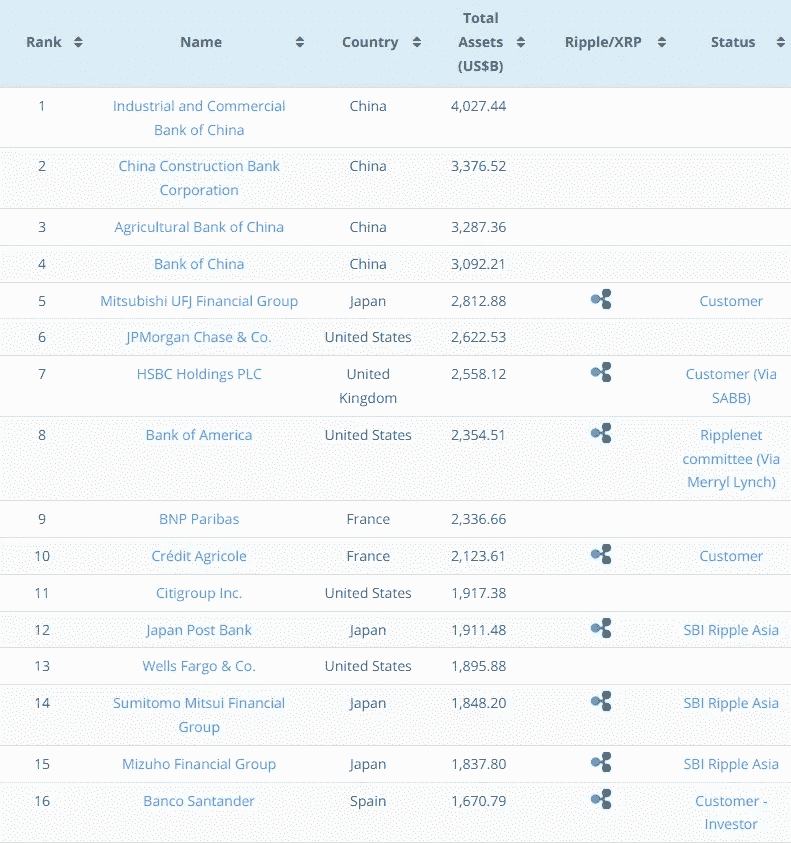
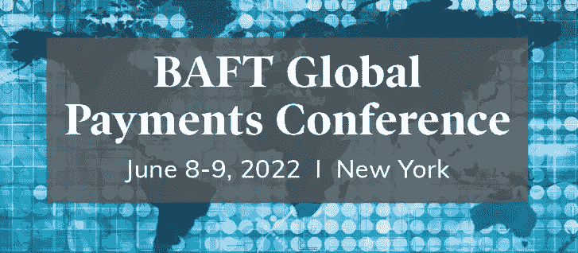

# # 6:2022 年全球支付大会&跨境支付的未来

> 原文：<https://medium.com/coinmonks/6-the-2022-global-payments-conference-whats-ahead-for-cross-border-payments-2bc8ea79a103?source=collection_archive---------16----------------------->

本周，全球支付大会将由纽约梅隆银行在其位于纽约市的总部举办。会议将进一步关注支付领域，从 ISO 9362 开始，支付领域一直处于银行业技术进步的最前沿。更广泛的主题将包括:CBDCs、Stablecoins、实时快速支付、ISO 20022、BaaS(银行即服务)。当然，我们将从零售和跨境角度听到更多关于 ISO 实施时间表和数字支付的最新消息。

该会议由金融与贸易银行家协会(BAFT)部分主办，该协会以作为国际交易银行的领先全球金融服务协会而自豪。BAFT 为国际金融机构、行业供应商和监管机构提供了一个分析、讨论和宣传的论坛，涉及交易银行业的广泛主题，包括贸易、支付、金融犯罪、创新和监管变化。BAFT 的一个主要目标是帮助*跨越金融机构、服务提供商和监管机构之间的*信息桥梁，从而促进稳健的金融实践、实现创新和效率，并促进商业增长。

强调单词*桥*，因为许多 ISO20022 兼容的“密码”识别为*桥资产。*

全球支付大会的部分特邀演讲人包括:

-凯伦·韦伯斯特:PYMNTS.com

-布鲁诺·梅拉多:法国巴黎银行全球支付主管

——凯文·巴尔:BNY 梅隆大学战略和数字现金主管

-Paula de Silva:P27 北欧支付公司首席执行官

-格雷格·默里:桑坦德银行的应付款和应收款主管

-kaly ani bhat ia:SWIFT 全球支付主管

-康妮·希恩:美国联邦储备系统工业关系主管

-Shirish Wadivkar:渣打银行全球支付主管

-丽莎·戴维斯:摩根大通数字渠道全球主管

-Russ Waterhouse:票据交换所(CHIPS)产品开发和战略执行副总裁

谢丽尔·维纳布尔:亚特兰大联邦储备银行支付业务主管

Featured Speakers for the 2022 Global Payments Conference in New York

更多关于这些参与者及其赞助商组织如何在这些全球支付讨论中发挥重要作用的信息，但首先让我们看看这些全球参与者及其代表的机构参与背后的背景。

【2021 年 10 月，美联储系统管理委员会(BoG)宣布，美联储银行将采用 ISO 20022 报文格式提供 Fedwire 基金服务。最初的公告有一个目标推出日期或“切换”，将在 2023 年 11 月的某个时间点发生。

最近，美联储系统 BoG 宣布实施可能会持续到 2025 年底，直到接近完成，并在不久的将来的美联储通知公告中澄清这一变化的细节，而不是继续与清算所合作。该公告还建议，各储备银行将通过他们的“我的标准”通知系统，在 2022 年夏天之前为 Fedwire Funds 服务的“未来”发布最终的 ISO 20022 消息格式规范。

最初的国际支付标准框架是 ISO 9362，于 1994 年发布，旨在通过使用银行标识符代码来协助国际银行电信报文传送。作为参考，ISO 10383、13616 和 15022 也在 9362 年至 20022 年(1999 年至 2003 年)期间发布，进一步详细说明了银行通信系统的预期变化。这些升级类似于公共图书馆将其卡片目录系统升级为条形码和其他更高效的信息和存储系统。

这些 ISO 框架被 SWIFT 和 CHIPS(票据交换所)系统大量采用，如今美国和许多其他国家和地区都依赖这些系统进行支付。如上所述，随着数字账本技术的未来发展，环球银行间电信协会(SWIFT)和票据交换所银行间支付系统(CHIPS)将在本周的全球支付大会上得到充分代表。

WIFT 成立于 1973 年，最初由遍布 15 个国家的 239 家合作银行组成，旨在提供与全球银行间金融交易和支付相关的服务。迄今为止，他们已经采用了各种软件和变更管理应用程序，包括 SWIFTNet 应用程序，该应用程序旨在帮助金融机构在各个阶段实施 ISO 20022。截至 2015 年，SWIFT 为 200 个国家和地区的 11，000 家金融机构提供服务。

SWIFT 因效率低下受到了严厉批评。众所周知，目前的电汇支付至少需要 24-72 小时，同时根据支付金额的大小还会收取高额费用。然而，在 SWIFT 网站上，有几条支持相反观点的引文:

*   “没有任何其他组织能够满足这种需求的规模、精确度、速度和信任度”
*   “世界上任何地方都没有像我们这样的组织”
*   “我们无时无刻不被信任”

然而，同样的概述中也有几个指标暗示 SWIFT 正处于一些关键的发展阶段。XRP、XLM 和 ALGO 的发展也在很大程度上暗示了符合 ISO 标准的数字总账技术:

*   “今天，商品和服务*比以往任何时候都移动得更快，跨越的距离也更远，因此 ***价值也需要移动得更远更快*** ”*
*   *“我们的愿景是建立一个支付不仅可信，而且即时的世界。”*
*   *“跨境支付需要高度的协作、沟通、社区和信任”*

*如果这还不够的话，他们的网站还直接透露，在未来两年及以后，“我们将为我们的全球社区提供一个激动人心的战略路线图，并与我们的全球社区一起扩展 SWIFT 的功能。”所有这些和更多的都直接指向 Web 3.0 的发展和新的加密支持的分类账系统，它们从上到下推动着公司金融生态系统的未来。*

*如果不提及服务于美国的芯片，讨论 SWIFT 是不完整的。截至 2015 年，CHIPS 每天结算 25 万笔交易，国内和跨境交易总额达 1.5 万亿美元。美联储银行使用的 CHIPS 和 Fedwire Funds Service (SWIFT)是美国境内以美元计价的国内外大额交易的主要网络。*

*与 Fedwire 相比，CHIPS 速度较慢，但价格较低，因此更适合清算时间较长的大额交易。它通过借贷净额结算工作，为客户银行提供清算和结算服务。与 Fedwire 一样，它也是私有的(就像 ISO 20022 兼容技术系统一样)，也能够实现与相同账户结构相关的集团支付。*

*CHIPS 的成员包括美国和全球家喻户晓的名字，以及本文开头提到的在即将召开的全球支付大会上作为主题演讲的名字:*

*-美国银行*

*-中国银行*

*-东京三菱银行*

*-法国巴黎银行纽约分行(在全球支付大会上发言)*

*-纽约梅隆银行(主办全球支付大会)*

*巴克莱银行*

*-花旗银行*

*汇丰银行*

*-摩根大通*

*-北方信托公司*

*-苏格兰皇家银行*

*-渣打银行(在全球支付大会上发言)*

*-瑞银集团*

*富国银行*

*在上面列出的全球主要银行中，许多已经与符合 ISO 20022 标准的数字技术系统建立了合作关系，包括 Ripple。以下是一些与 Ripple 和 RippleNet 建立关系的世界顶级银行的快照。反对 Ripple 和 Algorand 等类似项目的最大理由之一是，它们是私有的。而且——CHIPS 是私有的？我们怎么能对私人数字技术组织有偏见，而对目前的系统没有偏见呢？目前的系统每天通过芯片输送数万亿美元。*

**

*2019 — a List of the Top 16 Banks Globally by Total Assets, also showing their relationship with Ripple.*

*除此之外，许多顶级银行和其他银行将于本周在纽约参加全球支付大会，讨论全球支付生态系统的未来，以及迅速临近的 ISO 20022 实施期限。许多主要的全球参与者都远远领先于计划，但是美联储董事会最近的公告表明，全面实施要到 2025 年初才能完成，这让我相信仍有许多工作要做。过早实施的“转换”日期可能会冲击已经遭受冲击的全球经济。*

*由此产生的环境将把 1-3 天的 Fedwire 支付变成几分钟，甚至几秒钟，同时还大大降低了费用。例如，RippleNet 的交易费低至 0.00001 XRP。这意味着，如果 XRP 在交易时恰好价值 1000 美元，交易成本只需一便士。通过消除费用和交易时间，这些新的数字支付分类账系统将从根本上为全球经济注入流动性，使企业能够即时结算交易，并凭借高效的交易分类账和即时流动性，探索效率的未来，并对全球市场条件做出反应。*

> *加入 Coinmonks [电报集团](https://t.me/joinchat/Trz8jaxd6xEsBI4p)，了解加密交易和投资*

*可能更重要的是，这些符合 ISO 20022 的分类帐技术在很大程度上符合其经济友好和高效的系统。与比特币不同，世界卫生组织的交易流程创造了一个能源效率极低的整个“采矿”行业，符合 ISO 20022 标准的“比特币”是为新的 ESG 足迹构建的，将很好地补充新的碳足迹叙事——它们快速、高效，费用极低。*

*总的来说，数字资产/加密市场充满了恐惧、不确定性和怀疑，例如 NFT 洗钱、$LUNA 的坠落，以及人们购买的其他垃圾硬币，他们真的认为自己会变得富有。说真的，你真的认为一些柴犬硬币会推翻全球银行联盟？号码*

*这就是为什么我一直不太关注“加密货币”作为一种货币，而更关注“数字资产技术”和“T2 ”,这种货币如何在未来的支付信息系统中从 A 地转移到 B 地。对我来说，这是目前真正被彻底改变的。*

*全球支付的未来一片光明！*

**