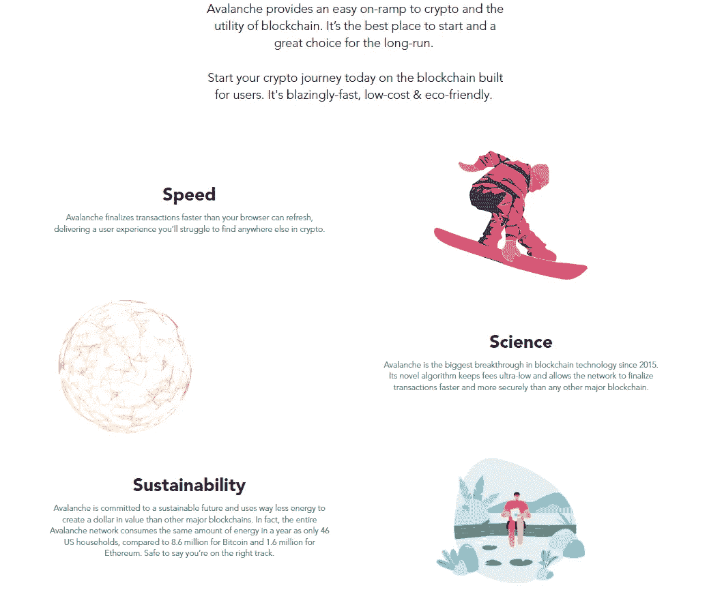

# 关于雪崩(AVAX)你需要知道的 6 件事

> 原文：<https://medium.com/coinmonks/6-things-you-need-to-know-about-avalanche-avax-cdce715b5d2?source=collection_archive---------4----------------------->

## 雪人共识，AVAX 令牌，C 链/P 链/X 链，等等！

Things you Need to Know About Avalanche (AVAX)

Avalanche 是基于第 1 层智能合约的区块链，试图解决该领域最具挑战性的问题，如交易费用和可扩展性。AVAX 令牌在平台中用于支付费用和保护平台。