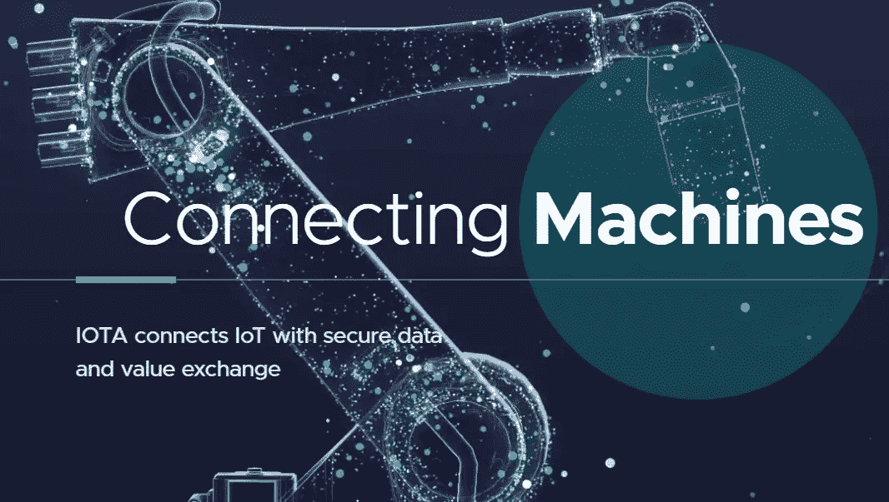

# 关于 IOTA (MIOTA)你需要知道的 6 件事

> 原文：<https://medium.com/coinmonks/6-things-you-need-to-know-about-iota-miota-be964c62bce5?source=collection_archive---------3----------------------->

纠结，协调节点，微光&装配网络，等等！

[iota.org](https://www.iota.org/)

IOTA 是由有向无环图(DAG)模型驱动的分布式分类帐平台。与比特币或以太坊等区块链不同，IOTA 没有任何矿商来管理交易或提议新区块。相反，IOTA 使用自己的技术，称为 Tangle。感谢 Tangle 的创新技术，IOTA 已经…