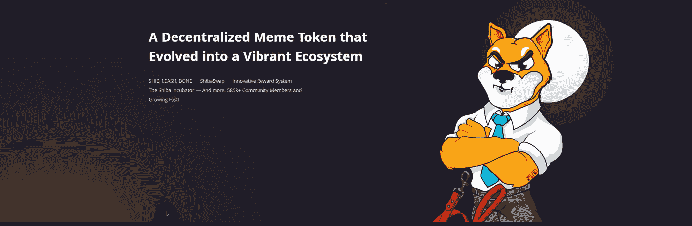

# 关于柴犬(SHIB)你需要知道的 6 件事

> 原文：<https://medium.com/coinmonks/6-things-you-need-to-know-about-shiba-inu-shib-27e6e08bebb4?source=collection_archive---------4----------------------->

## 良史，SHIB/皮带/骨头/治疗令牌，埋葬和挖掘机制，以及更多！

Shiba Inu (SHIB)

柴犬是一个迷因项目，诞生于 2020 年。项目的创建者和开发者是匿名的，令牌没有任何真实的用例。这个项目周围的社区正在把 SHIB 作为总督杀手的象征来宣传。