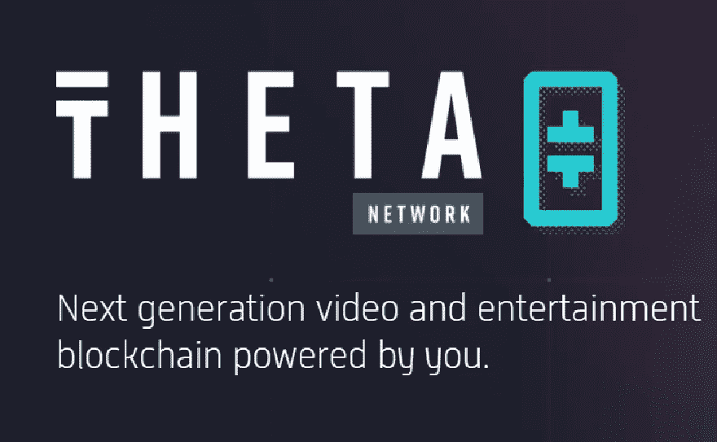

# 关于 THETA 网络(Theta)你需要知道的 6 件事

> 原文：<https://medium.com/coinmonks/6-things-you-need-to-know-about-theta-network-theta-83ddad9227bc?source=collection_archive---------5----------------------->

多层次的 BFT 共识模型，双重货币系统，离线小额支付池，图灵完整的智能合同，等等！

THETA Network (THETA)

Theta Network 是一个由区块链和加密技术支持的点对点视频流网络。Theta 网络有两个令牌:THETA 是治理令牌，TFUEL 令牌主要用于支付交易的燃气费。