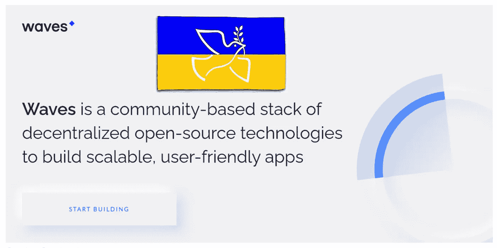

# 关于 Waves 你需要知道的 6 件事

> 原文：<https://medium.com/coinmonks/6-things-you-need-to-know-about-waves-waves-4d86f6d141e?source=collection_archive---------20----------------------->

Waves is a Ukrainian blockchain offering smart contracts and dApps compatibility. Using Waves, developers can develop scalable and secure applications. WAVES token is mainly used to get block rewards.

Waves 是乌克兰开发者开发的区块链。在这个故事中，我将解释关于 Waves 项目你需要知道的 6 件事。要了解更多信息，你也可以在这里查看该项目的官方文档。

# # 1–租赁和账户类型

Waves 区块链使用租赁股权证明(LPoS)共识模型。在租赁中…