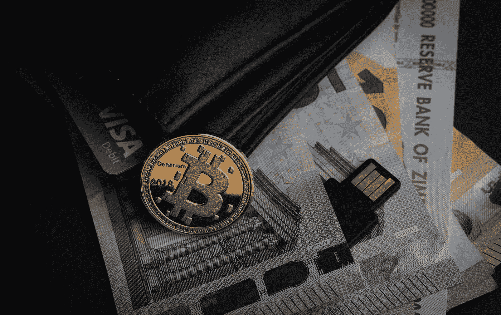
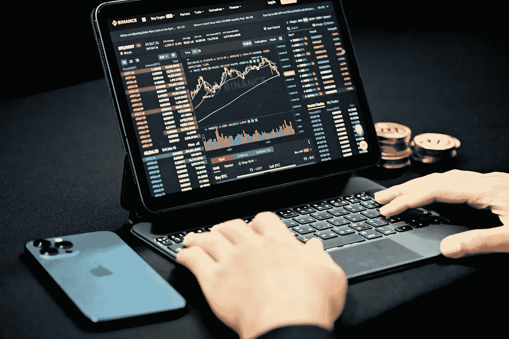

# 帮助您开始使用加密货币的 6 个技巧。

> 原文：<https://medium.com/coinmonks/6-tips-to-help-you-get-started-with-cryptocurrencies-10a886cbec0e?source=collection_archive---------39----------------------->

Source: Unsplash.com

就资产量和需求而言，加密货币正成为更受欢迎的资产类别。自比特币推出以来，加密货币市场的加密货币数量及其全球用户数量呈指数级增长。

这是由多种因素造成的，其中最显著的是其极端的波动性，这使其能够提供其他行业无法提供的回报。另一方面，波动性也会造成重大损失。

> **另见:** [**你应该知道的 16 个加密货币事实。**](/@bitxmiblog/16-cryptocurrency-facts-you-should-know-34b8f742d4be)

尽管比特币仍相对较新，但自 2009 年以来，其接受度已大幅提高。比特币的去中心化特性激起了千禧一代的兴趣，并帮助它成为今天的样子。交易加密货币似乎是新的趋势，麻烦更少，使用现代技术。财富的快速增长、财富的巨大损失、不可预测的交易和飙升的增长趋势都表明加密货币将成为下一个大事件。

然而，在您进行交易之前，您应该研究您想要交易的加密货币的种类，如何交易这些货币，以及如何选择一个可接受的交易平台。

**加密货币的种类**

Source: Unsplash.com

随着市场的不断扩大，存在超过 1000 种不同的加密货币。另一方面，比特币是迄今为止最古老、最受欢迎的加密货币(BTC)。你可能听说过比特币交易是如何引领数字时代的。其他一些加密货币如下:

以太坊(ETH)

比特币莱特币(LTC)

瑞波(XRP)

兹卡什(ZEC)

Monero(XMR)

系绳(USDT)

这个列表并不详尽。你可以在 Coinmarketcap 上找到其他货币的信息。

如果你是加密货币交易的新手，你应该专注于最活跃和最受欢迎的加密货币。最好是从知名品牌开始，一旦你获得了足够的市场知识，就扩展业务。

> **另见:** [**加密货币是如何工作的？加密货币初学者指南。**](/coinmonks/how-do-cryptocurrencies-work-beginners-guide-to-cryptocurrencies-b1915189fd4f)

**到底什么是加密货币交易？**

Source: Unsplash.com

交易加密货币需要在一个可信且知名的平台上买卖加密货币。要购买或出售加密货币，您必须首先在其中一个交易平台上开户。然后，将您的法定货币转换为平台上提供的加密货币，并完成交易。然后，这些货币可以存放在你的钱包里。

**我如何挑选最好的加密交易平台？**

在交易加密货币之前，一定要先选择信誉好的交易平台。虽然有许多选项可用，但您必须选择最符合您要求的选项。但是，在您决定之前，您应该考虑最基本的因素，包括:

**1)安全**

选择安全性高的平台。请注意他们使用的安全功能的数量。其中包括请求身份验证、两步电话验证等。

**2)品种**

该平台必须支持各种各样的硬币。查看汇率，并与其他平台进行比较。

**3)可信度**

通过阅读使用过其服务的用户的评论和评价来检验平台的可信度。你也可以看看他们的 Reddit、脸书、Twitter 和其他社交媒体平台。

如何开始交易？

一旦你决定了要交易的加密货币，你就需要选择一个合适的交易平台。在做出最终决定之前，你需要对选定的资产进行广泛的研究。您还必须在您选择的交易平台开户。你可以在完成验证和其他要求后开始交易。

例如，Bitxmi 是自 2018 年推出以来越来越受欢迎的交易平台之一。通过与 ChainUp 合作，该交易平台致力于将安全性和架构提高到最高标准。

*   Bitxmi 使用户能够通过信用卡使用法定货币获得加密货币。
*   冷钱包的安全性、私钥管理以及许多服务器的使用都被优先考虑。
*   Bitxmi 还采用了一系列技术来确保交易中不会发生欺诈活动。

**研究图表**

Source: Unsplash.com

如果你是加密货币交易的新手，那么技术分析和复杂的行话肯定会让你感到困惑。但是，了解与 crypto 的兴衰相关的各种图表是非常重要的。

乍一看，似乎连概念都无法把握。但是，当你学习并花足够的时间去理解各种图表时，你会发现相对容易些。

下面列出了一些你必须知道的图表、图形和术语。

道氏理论

日本烛台图表

RSI(相对强度指数)

技术分析

实力

阻力

*   加密货币市值

**交易加密货币时需要牢记的 6 个技巧**

**如果你确定要开始投资加密货币，这里有六点可以帮助你的旅程:**

**1。花时间学习和培训。**

关键是要了解我们将投资于什么，以了解我们所承担的利益和危险。你不一定要选择一种资产，因为它是时尚的，而是因为我们了解它，并认为它在实用性和性能方面将有一个光明的未来。

**2。开始投资，选择一个有信誉的平台。**

不要被承诺巨大利益或快速致富的“未知”交易或计划所左右。

**3。首先，使用比特币和以太坊。**

这两种资产是市场上最受欢迎的。建议这些加密货币构成您投资组合的主要部分，并通过其他替代加密货币实现多样化。

**4。只投资你能承受的损失。**

交易加密货币时，只使用近期或中期不需要的钱。此外，明智的做法是先投入少量资金来熟悉市场。随着时间的推移和足够的知识，你可以增加你的资本和投资组合。

**5。考虑长远。长期投资。**

不要一有下跌或恐慌的迹象就卖出。市场的历史表明，长期投资者永远是正确的，更有利可图。

**6。将您的加密货币安全地保存在冰冷的钱包中。**

这是储存它们的最安全的方法；你将免受潜在黑客或投资平台失败的影响。

**结论**

虽然加密货币行业仍处于起步阶段，但它已经站稳了脚跟，并拥有巨大的潜力。由于缺乏消费者保护立法，加密货币交易涉及的危险尤为严重。

加密货币交易创造了一大批意想不到的亿万富翁。然而，在花你的血汗钱之前，你应该通过进行广泛的研究来行使极度的谨慎。此外，在进行任何投资之前，请记住市场是相当不稳定的。

> 加入 Coinmonks [电报频道](https://t.me/coincodecap)和 [Youtube 频道](https://www.youtube.com/c/coinmonks/videos)了解加密交易和投资

# 另外，阅读

*   [如何购买 Monero](https://coincodecap.com/buy-monero) | [IDEX 评论](https://coincodecap.com/idex-review) | [BitKan 交易机器人](https://coincodecap.com/bitkan-trading-bot)
*   [CoinDCX 评论](/coinmonks/coindcx-review-8444db3621a2) | [加密保证金交易交易所](https://coincodecap.com/crypto-margin-trading-exchanges)
*   [红狗赌场评论](https://coincodecap.com/red-dog-casino-review) | [Swyftx 评论](https://coincodecap.com/swyftx-review) | [CoinGate 评论](https://coincodecap.com/coingate-review)
*   [Bookmap 评论](https://coincodecap.com/bookmap-review-2021-best-trading-software) | [美国 5 大最佳加密交易所](https://coincodecap.com/crypto-exchange-usa)
*   [如何在 FTX 交易所交易期货](https://coincodecap.com/ftx-futures-trading) | [OKEx vs 币安](https://coincodecap.com/okex-vs-binance)