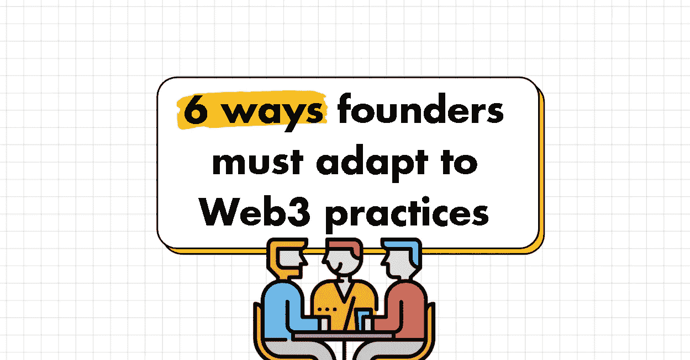
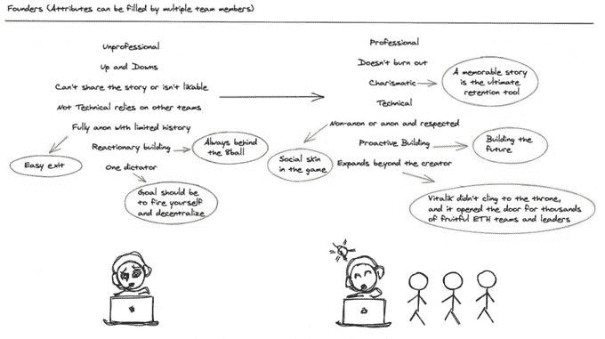
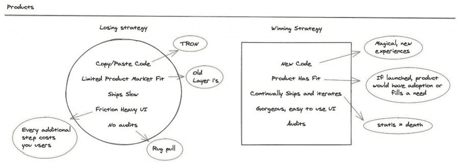
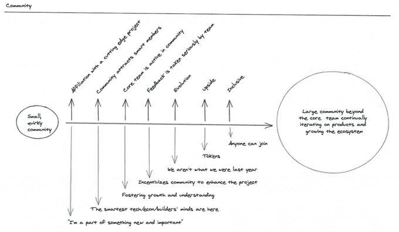
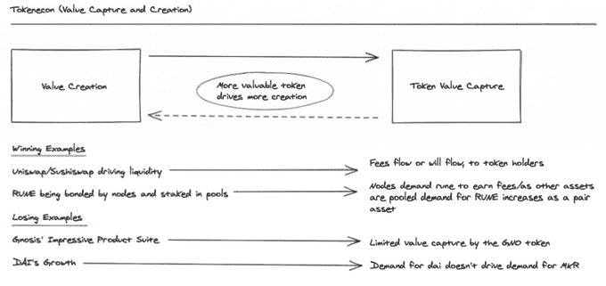
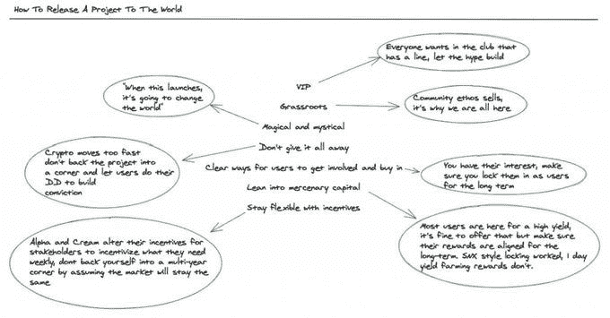
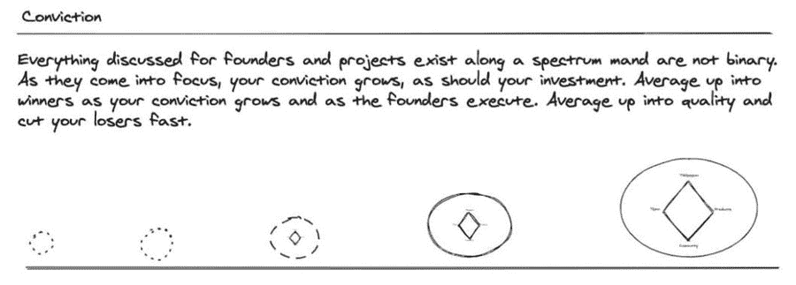

# 创始人必须适应 Web3 实践的 6 种方式

> 原文：<https://medium.com/coinmonks/6-ways-founders-must-adapt-to-web3-practices-b6cc29d42a60?source=collection_archive---------22----------------------->

## 增加更多的人情味

创始人需要:

*   讲一个难忘的故事
*   获得社区的信任
*   拥有超越竞争对手的技术专长。好消息是，Web3 还没有太多的竞争！
*   随着项目的发展，将责任交给社区
*   避开那些牢牢抓住权力不放的联合创始人。

> 网站 2 的创始人不是网站 3 的创始人
> 
> 思想领袖巴拉吉斯·斯里尼瓦桑

## 关注体验而不是产品

产品应该感觉像魔术一样。

*   专注于运输代码和提供你承诺的价值
*   Web3 中几乎所有的东西都是开源的，所以好好利用它吧
*   新的体验驱动价值，复制的体验驱动无聊。
*   你正在适应的 Web3 产品或实践比你或你的社区更大，确保你强调这一点。

> “这意味着所有创造的价值可以被更多的人分享，而不仅仅是所有者、投资者和员工，”
> 
> 推特的高级项目经理埃丝特·克劳福德。

## 与你的社区一起建设

创始人必须关注他们的社区。

*   会员需要知道他们的反馈会被认真对待。
*   他们想知道你什么时候失败了，或者你是否需要帮助。
*   记住，并不是你不和的每个人都是你社区的一部分。
*   每周召开一次 AMA 会议，与你的社区进行多次通话/会面，邀请他们参与你的过程

> 可能是人类历史上第一次，一群有着共同利益的个人拥有集体权力，可以透明地将一个特派团制度化并自主运作，而不管他们在哪里纳税或以什么为生。由 Rohit Malekar，Web3 作家

## 启动令牌并研究令牌组学

许多项目的成功取决于其象征性的价值。

*   令牌必须对一个项目至关重要，得到奖励和分发，以激励正确的行动。
*   不是每个项目都需要一个令牌才能成功。
*   当你需要一个令牌的时候，找一个合适的时间，有时是在发布之前，有时是在你构建和测试社区和系统的中途。
*   研究类似的令牌组学和白皮书，了解令牌是如何以及为什么这样分布的。

> 在区块链的世界中，发行公用事业代币来交换由订户给予区块链组织的某种其它形式的价值(加密货币、真实货币、商誉和其它类型的对价)。该组织可能正在创建一个将使用实用工具令牌来兑换服务的应用程序。
> 
> 作者杰森·英奇，独立经济学家

## 当你担心的时候释放你的产品

寻找早期发布——当你的产品不完整的时候。

*   尽早发布你的项目可以让你的社区参与进来，因为他们可以说从第一个蹩脚的版本开始他们就和你在一起了
*   你可以在早期得到反馈，因为你还没有建立一个完整的系统
*   您可以意识到您不知道存在的错误，并找到规避它们的方法
*   当你有了一个产品，感觉会更好——我个人有这种感觉，但总是害怕推出不好看的产品。

> 我们坚信，如果你把一些有益的东西放到世界上，在某个时刻会有更好的事情发生。你可能会得到一个新的顾客，一个新的朋友，或者一个合作伙伴。但更重要的是，你可能会激励某人对世界产生更大的积极影响。
> 
> 由[赵薇](https://medium.com/u/300c728e7d24?source=post_page-----b6cc29d42a60--------------------------------)

## 构建、测试、重建，直到成功

信念是赢得的，而不是授予的。

*   当一个项目和团队交付(或不交付)时，你将建立信念，并在赢家身上下更大的赌注。
*   它增加了创造改变生活的赢家和财富的机会。
*   创建 Web3 的 FAANG 比在 Web2 中要容易得多，所以要相信这个过程，并不断重复。
*   每天都有大量的 NFT/道/代币被发布，一个从未存在过的竞争对手可能会出现，它比你强 3 倍。不要让这阻止你。

> 我们在 Web3 中研究和计划一个伟大的想法，所以我们认为，我们认为没有人有这个想法。我记得那一周，我们每天都在分析我们发现的一个新竞争对手，这很令人难过，但也证实了我们做对了。

# 👇评论 Web2 的创始人应该从 Web3 中改编哪些其他的实践？

> 👋**关注我**上[中](/@pooriaarab)—[LinkedIn](https://www.instagram.com/pooria.arab/)—[Twitter](https://twitter.com/pooria_arab)—[insta gram](https://www.instagram.com/pooria.arab/)—[抖音](https://www.tiktok.com/@pooria.arab)
> 
> 更多关于 Web3，Crypto，NFTs，DeFi 等的好东西…
> 
> 点击获取 NFT 发布战略

> *加入 Coinmonks* [*电报频道*](https://t.me/coincodecap) *和* [*Youtube 频道*](https://www.youtube.com/c/coinmonks/videos) *了解加密交易和投资*

# 另外，阅读

*   [Bookmap 评论](https://coincodecap.com/bookmap-review-2021-best-trading-software) | [美国 5 大最佳加密交易所](https://coincodecap.com/crypto-exchange-usa)
*   最佳加密[硬件钱包](/coinmonks/hardware-wallets-dfa1211730c6) | [Bitbns 评论](/coinmonks/bitbns-review-38256a07e161)
*   [新加坡十大最佳密码交易所](https://coincodecap.com/crypto-exchange-in-singapore) | [收购 AXS](https://coincodecap.com/buy-axs-token)
*   [红狗赌场评论](https://coincodecap.com/red-dog-casino-review) | [Swyftx 评论](https://coincodecap.com/swyftx-review) | [CoinGate 评论](https://coincodecap.com/coingate-review)
*   [投资印度的最佳加密软件](https://coincodecap.com/best-crypto-to-invest-in-india-in-2021)|[WazirX P2P](https://coincodecap.com/wazirx-p2p)|[Hi Dollar Review](https://coincodecap.com/hi-dollar-review)
*   [加拿大最好的加密交易机器人](https://coincodecap.com/5-best-crypto-trading-bots-in-canada) | [库币评论](https://coincodecap.com/kucoin-review)
*   [用于 Huobi 的加密交易信号](https://coincodecap.com/huobi-crypto-trading-signals) | [HitBTC 审查](/coinmonks/hitbtc-review-c5143c5d53c2)