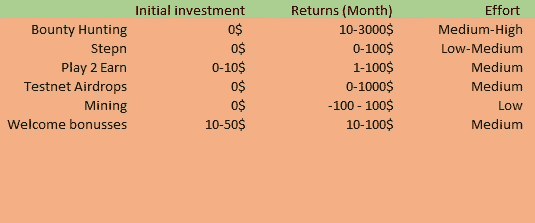
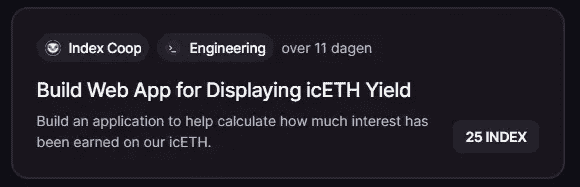
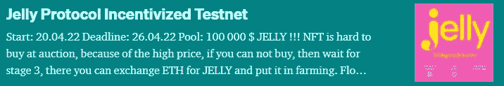
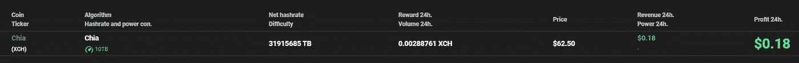

# 6 种无需投资就能在加密中赚钱的新方法！

> 原文：<https://medium.com/coinmonks/6-ways-to-create-a-sustainable-passive-income-stream-today-15aab0863fad?source=collection_archive---------4----------------------->

## 并在没有初始投资的情况下获得回报！

# 介绍

由于加密是一个不断发展的空间，DApps 和协议每天都在推出，机会每天都会出现，这可能会改变你的生活方式！许多项目的代币价值翻了好几倍，空投改变了人们的生活，投资者可以用他们的投资获得高额回报。遗憾的是，并不是每个人都有钱开始投资，而且由于与加密相关的高波动性和风险，回报没有保证，对一些人来说，从被动收入流开始很难。

> "取得成功的秘诀在于开始行动。"
> 
> -马克·吐温

这就是为什么我收集了不需要或只需要少量初始投资的被动收入策略，有了这些策略，每个人都应该能够在今天开始他们的第一个被动收入流！然而，这些策略确实需要一些技巧或时间，在实际产生被动收入流之前必须投入这些技巧或时间，所以请记住这一点。不管你的第一笔被动收入流有多小，多年来以复利计算，最终会产生惊人的回报！

# 低初始投资被动收入策略！

Alternative passive income approaches!

以下所有策略都可以在低初始投资或无初始投资的情况下执行。他们可能需要设置、完成任务、使用测试网或使用应用程序，但最重要的是；他们都赚你真金白银！

## 1.赏金猎人

**(初始投资:0 美元—回报:10–3000 美元)**DeFi 和 crypto 的世界不仅仅围绕着投资。除了价格变动和令牌分发之外，围绕协议和应用程序发生的事情要多得多。这就是为什么许多应用程序使用激励奖金来执行某些任务，这可以支付很多钱！有时候，必须审查代码，必须制作仪表板，必须撰写文章，必须建立网站。像 Near 这样的一些协议甚至激励他们的[开发者课程](https://learnnear.club/courses/near-certified-developer/)，在 NEAR 中，完全完成课程将获得 500 美元的奖金！

The first beta bounty, paying almost 300$

这些奖金在难度上有所不同，需要更多努力和技能的奖金会更多，反之亦然。有些要求写作技能，其他奖金侧重于编程或应用程序建设。这是一个赚外快的好方法，在将你的奖励再投资于被动下注期权后，这是开始你的第一笔被动收入的好方法！你可以在像 [beta.layer3.xyz](https://beta.layer3.xyz/contests) 这样的网站上找到这些奖金，但也存在其他选择！

## 2.stepn

**(初始投资:0 美元—回报:0-100 美元/月)**对于运动员和活跃人士来说，城里有了一个新概念:跑步赚钱！ [Stepn](http://Stepn.com) 是一款可以让你追踪你的慢跑和跑步并因此奖励你的应用。Stepn 将游戏机制与现实生活相结合，奖励应用程序的活跃用户。首先，你需要一双他们的[运动鞋](https://stepn.com/howToPlay)NFT，它将决定你跑步时的奖励上限和奖励速度。它不需要初始投资，因为你可以免费借用其他用户的运动鞋！[要开始](https://stepn.com/howToPlay)，你只需要一个应用程序和一个 Solana 钱包，以及一次越野跑步。

这是一个在做日常工作的同时赚取额外收入的好方法。如果设置正确，它可以为你带来一些固定的现金收入，否则你会错过，所以这是一个完美的应用程序，让你开始进入被动收入的第一步！

## 3.玩游戏赚取游戏

**(初始投资:0-10 美元—回报:1-100 美元)**开始赚取被动收入的一个更简单的方法是玩 P2E 游戏。最受欢迎的一款 [Axie Infinity](https://axieinfinity.com/) ，只需要 10$左右的初始投入，之后就可以通过完成任务和 quests 立即开始玩游戏。有太多的游戏可以在各种各样的链上获得，像 [DeFi 王国](https://defikingdoms.com/)和[沙盒](https://www.sandbox.game/en/)那里有 play 2 earn 游戏的集合。看看这个来自 [CoinMarketCap](https://coinmarketcap.com/alexandria/article/play2earn-best-blockchain-games-list) 的列表，了解更多可用选项！

如果你只是想开始一个小的投资，并有一些时间来玩这些游戏，做 P2E 可以是一个非常合法的方式开始赚取你的第一笔被动收入！许多游戏提供一些奖励或 NFTs 的赌注选项，所以玩这些游戏最终会导致被动收入流！有许多其他游戏要么免费开始，要么需要一些低金额的初始投资，但如果你有时间玩 P2E 游戏可以占一些不错的每日或每月收入。

## 4.测试网空投

**(初始投资:0 美元—回报:0–1000 美元)**我最近的一个发现是，许多 DApps 运行 airdrops 来帮助他们在上线之前测试他们的应用程序。在 DeFi 和 crypto 领域，许多应用每周都会推出。大多数 DApps 运行激励测试网，以保证不会有错误或其他不必要的行为，通过完成任务和返回反馈，你可以获得一些激励奖励！

A piece by [Cryptonific](https://medium.com/u/2a395b1451e3?source=post_page-----15aab0863fad--------------------------------) on the incentivised Jelly protocol Testnet

由于这些受激励的 DApps 在测试网上运行，它不需要**初始投资**，因为你将使用你从水龙头得到的资金。有了这些资金，您可以使用 DApp，测试其功能，并向开发人员报告任何错误。根据 DApp 在未来的表现，你被空投的代币的价值将会增加，所以做这些仍然需要一点运气。

## 5.利用未使用的采矿动力和储存

**(初始投资:0$ —回报:-100–100 $)**大多数人都有没用过的电脑，有时甚至有更多没用的存储。你可以利用这种剩余的采矿力量产生一些低层次的收入流。你可以用一台旧笔记本电脑或个人电脑开采 ETH 或 BTC，希望价格在未来大幅上涨，以支付电费。您可以对未使用的存储进行同样的操作，在将未使用的存储出租给网络时挖掘 CHIA。

Mining CHIA with 10TB of storage, resulting in 18c a day!

这可能是这个列表中利润最少的选择，甚至会让你赔钱，但这是最被动的选择！你基本上是在赌未来价格会上涨，所以你在开采这些硬币时不会亏损。如果你只有非常旧和缓慢的硬件可用，这个选项可能不值得，但如果你有很多硬件可以挖掘(如最新一代的笔记本电脑，GPU 或 CPU)，这仍然是一个伟大的选择，每月赚取一些额外的现金！

## 6.收集欢迎奖金

**(初始投资:10 美元—回报:10–100 美元)**最后，我们可以选择开始在不同的交易平台上收集欢迎奖金。这可能是这个列表中最不可持续的选择，但它仍然可以为你提供一些初始现金，你可以用它来开始下注。像 Crypto.com 这样的一些平台曾经有 50 美元的欢迎奖金，尽管他们取消了这个选项，但许多其他平台如 BlockFi 仍然在你注册时提供高达 250 美元的奖励！看看[这个](https://www.hustlermoneyblog.com/bitcoin-cryptocurrency-promotions/)博客页面，快速了解一些最常见的欢迎奖金。最常见的交易所给予 10-25 美元的奖金，因此很容易收回你的初始投资并获得利润！

# 结论

正如马克·吐温所说，入门的秘诀就是入门！所有这些选择都不需要甚至几乎不需要初始资本，它们能为你的第一笔被动收入流提供一个良好的起点。尤其是当你没钱投资的时候，投入你的时间、技能和知识，依然可以获得惊人的回报！这肯定比把你的钱扔进 DeFi 坑更难，但这样任何人都可以开始他们独立自由的生活之旅！

看看[我的其他文章](/@Igor.MD)，了解更多关于可持续被动收入流和投资选择的信息！你可以随时关注我关于投资和使用加密的被动收入的未来文章。如果您有任何问题，请随时评论或回复！

**其他链接**

*   为了让我的故事对每个人都免费，请给我买杯咖啡吧！【https://ko-fi.com/igormd 
*   如果你想开始交易，可以考虑用我推荐的库币！[https://www.kucoin.com/r/rf/1de5d](https://www.kucoin.com/r/rf/1de5d)

> [Learn 分发的内容。Block6.tech](https://learn.block6.tech)
> 
> [Meetup Group](https://www.meetup.com/london-cryptocurrency-meetup-group/)|[Telegram](https://t.me/block6_tech)|[Twitter](https://twitter.com/block6_tech)|[Linkedin](https://www.linkedin.com/in/wisdom-oparaocha/)
> 
> 加入 Coinmonks [电报频道](https://t.me/coincodecap)和 [Youtube 频道](https://www.youtube.com/c/coinmonks/videos)了解加密交易和投资

# 另外，阅读

 [## 2022 年 6 大最佳硬件钱包|顶级加密硬件钱包[更新]

### 最好的加密货币硬件钱包是绝对必要的。我们将在 NGRAVE、Ledger Nano X 和…

medium.com](/coinmonks/the-best-cryptocurrency-hardware-wallets-of-2020-e28b1c124069) 

*   [币安 vs FTX](https://coincodecap.com/binance-vs-ftx) | [最佳(SOL)索拉纳钱包](https://coincodecap.com/solana-wallets)
*   [如何在 Uniswap 上交换加密？](https://coincodecap.com/swap-crypto-on-uniswap) | [A-Ads 评论](https://coincodecap.com/a-ads-review)
*   [加密货币储蓄账户](/coinmonks/cryptocurrency-savings-accounts-be3bc0feffbf) | [YoBit 审核](/coinmonks/yobit-review-175464162c62)
*   [Botsfolio vs nap bots vs Mudrex](/coinmonks/botsfolio-vs-napbots-vs-mudrex-c81344970c02)|[gate . io 交流回顾](/coinmonks/gate-io-exchange-review-61bf87b7078f)
*   [CoinFLEX 评论](https://coincodecap.com/coinflex-review) | [AEX 交易所评论](https://coincodecap.com/aex-exchange-review) | [UPbit 评论](https://coincodecap.com/upbit-review)
*   [AscendEx 保证金交易](https://coincodecap.com/ascendex-margin-trading) | [Bitfinex 赌注](https://coincodecap.com/bitfinex-staking) | [bitFlyer 审核](https://coincodecap.com/bitflyer-review)
*   [Bitget 评论](https://coincodecap.com/bitget-review) | [双子星 vs BlockFi](https://coincodecap.com/gemini-vs-blockfi) cmd| [OKEx 期货交易](https://coincodecap.com/okex-futures-trading)