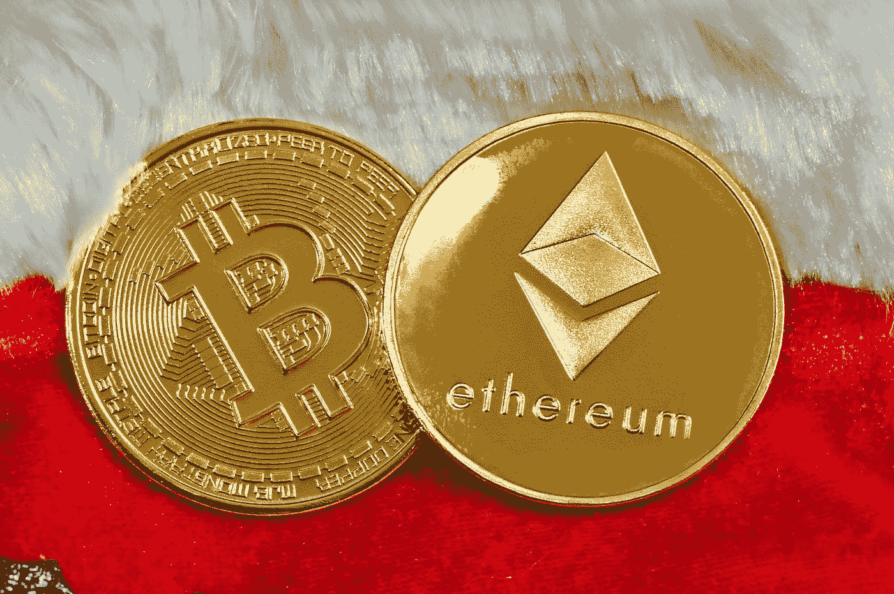
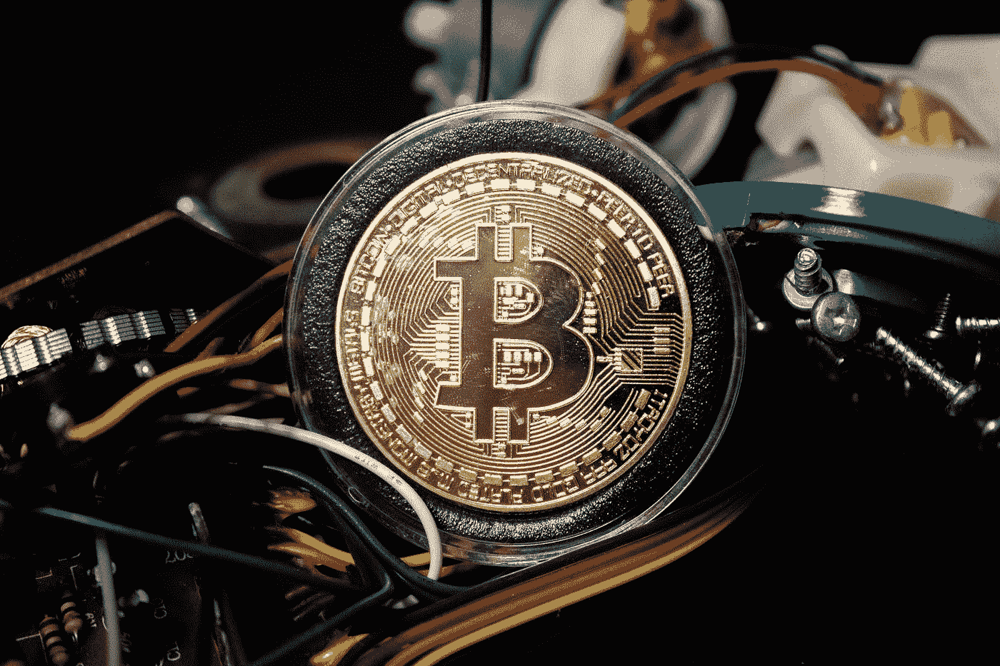
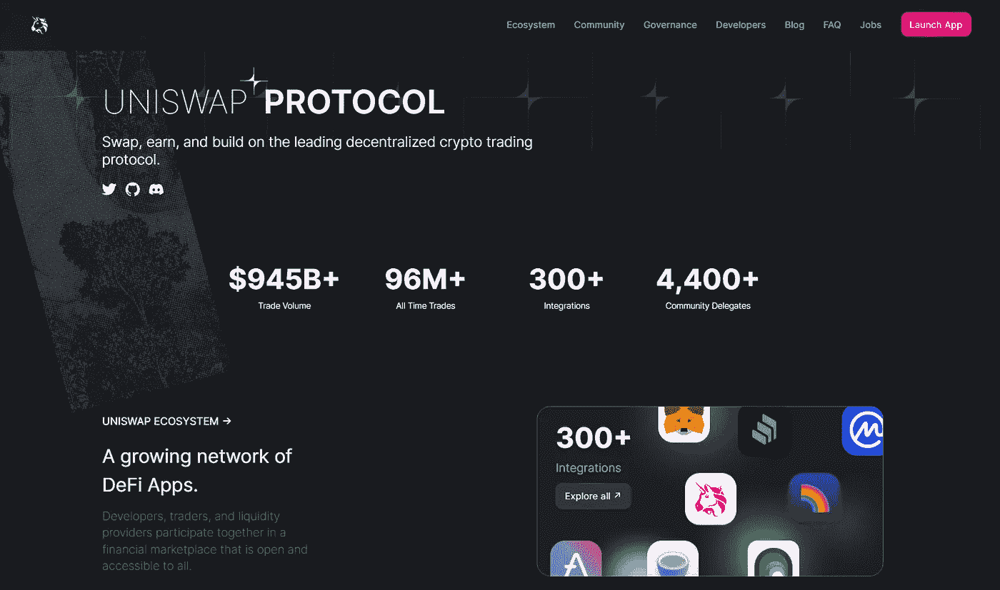
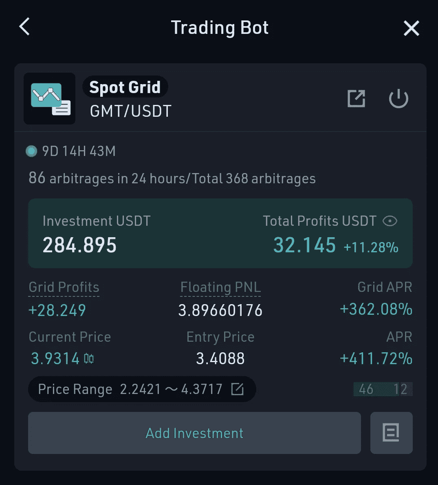
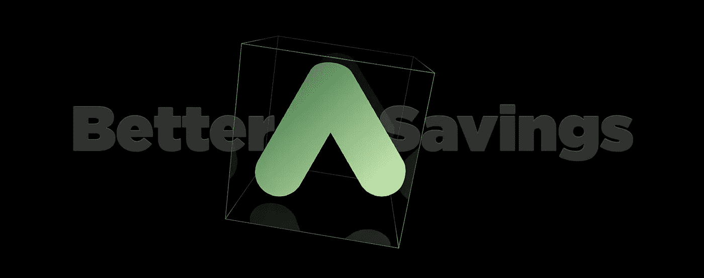

# 6 种利用密码获得被动收入的方法

> 原文：<https://medium.com/coinmonks/6-ways-to-make-passive-income-with-crypto-8654f02619fd?source=collection_archive---------14----------------------->

最近，有很多关于被动收入的讨论，也就是说，不用做太多就能赚到钱。虽然这听起来像是只有富人才能做的事情，但实际上你可以通过加密获得被动收入！

# 立桩标界

赌注是在加密货币钱包中持有资金以支持区块链网络运营的过程。本质上，它包括锁定加密货币以获得奖励。这与人们如何在银行账户中赚取利息非常相似。

Photo by [Quantitatives](https://unsplash.com/@quantitatives?utm_source=medium&utm_medium=referral) on [Unsplash](https://unsplash.com?utm_source=medium&utm_medium=referral)

赌注通常被称为“股份证明”或“委托股份证明”，通常比比特币和其他类似网络使用的“工作证明”方法耗电更少。

像 Polkadot 和 Cosmos 这样的项目寻找利益相关者，因为这允许它们绕过工作证明共识机制所需的大量能量消耗。事实上，在过去的几年里，许多人通过押注他们的密码已经赚了数千(甚至数百万)美元。

随着越来越多的用户接受区块链技术及其潜在用途，如供应链管理、令牌化房地产、分散金融(DeFi)、医疗保健数据跟踪等，Staking 变得越来越受欢迎。

# 云挖掘

Photo by [Brian Wangenheim](https://unsplash.com/@brianwangenheim?utm_source=medium&utm_medium=referral) on [Unsplash](https://unsplash.com?utm_source=medium&utm_medium=referral)

云采矿可以让你从已经投资了昂贵设备的公司那里租赁采矿软件和硬件。你向他们支付少量费用来使用他们的设备，他们将处理挖掘比特币或其他数字资产所需的所有工作。

服务提供商负责维护和设置所需的硬件、软件和其他物流需求，而您则可以坐享其成，赚取利润。

你只需购买一份合同——通常按 GH/s(每秒千兆哈希)定价——根据你选择的选项，有可能立即开始盈利。

# 流动性采矿/高产农业

[Uniswap — a popular liquidity mining protocol](https://uniswap.org/)

流动性挖掘是用加密货币获得被动收入的另一种方式。它已经存在了一段时间，但由于分散融资(DeFi)的大力推动，它越来越受欢迎。

它类似于赌注，但涉及通过提供用于交易目的的资金来为代币提供流动性。作为回报，你可以得到代币作为利息支付——这是一笔非常划算的交易，你不需要付出任何额外的努力！

大多数人使用第三方平台(有时称为分散交易所，或 dex ),该平台自动处理所有技术细节，并提供用户友好的界面。

# 放款

Photo by [Shane](https://unsplash.com/@theyshane?utm_source=medium&utm_medium=referral) on [Unsplash](https://unsplash.com?utm_source=medium&utm_medium=referral)

密码贷款是一个伟大的方式，使被动收入的密码。当你把你的密码借给别人时，他们会付给你利息。

他们支付利息的多少将取决于他们愿意向你借钱承担多大的风险。贷款人通常向借款人收取比他们从借款人那里得到的更高的利率，因为贷款人在贷款时比借款人承担更大的风险。

在一些平台上，你可以设置自动贷款，当一笔贷款被偿还后，贷款金额会自动被再次借出。这是让你的钱为你工作的好方法！

# 交易机器人

这些程序与交易所互动，根据你给它们的指令进行买卖。如果你想做日内交易，但不想花所有时间管理投资，它们会非常有用。

然而，使用交易机器人确实需要一些事前的研究和事后的大量实验。在错误的环境或市场条件下，你最终可能会赔钱！

Here’s my KuCoin Trading Bot

有许多平台提供交易机器人服务。我使用 KuCoin 的交易机器人，因为它是一个初学者友好的平台。根据你如何使用你的交易机器人，你可以获得超过 1000%的利润！

# 储蓄账户

[Anchor Protocol is one of the BEST savings protocol out there!](https://www.anchorprotocol.com/)

这是从 crypto 中获得被动收入的最简单的方法之一，而无需先做任何研究或实验。你只需在一个账户中留出一些硬币，无论是在一个集中还是分散的平台上，让你赚取利息。

基本上，该平台将你的资金借给需要资金进行交易的人，你可以像传统的储蓄账户一样获得利息。你可以从不同的硬币上赚取利息，从 1%的 APY 到高达 20%的 APY。

拥有一个加密储蓄账户是建立你的加密资产的一个好策略。它们提供相对安全、低波动性和体面的回报。我使用锚协议作为我的储蓄账户，因为它为储蓄账户提供了最高的 APY 之一——20%。

# 结论

加密货币变得越来越受欢迎，随之而来的是各种赚取被动收入的机会。在这篇文章中，我们探讨了一些不同的方法，使被动收入与加密。要了解关于这个话题的更多信息，请查看我们关于用 crypto 获得被动收入的不同方法的文章。关注我们，获取更多个人理财、副业和投资内容。

**我的更多信息**

*   [什么是卡多？—去 UST 最快的方法！](/coinmonks/what-is-kado-the-fastest-way-to-get-ust-9ed5d6388358)
*   [3 个月锚协议被动收入](/coinmonks/passive-income-with-anchor-protocol-for-3-months-28bc7097bfc3)
*   [如何在主播协议中用 Kado 赚钱(主播协议教程)——第三部分](/coinmonks/how-to-earn-in-anchor-protocol-using-kado-money-anchor-protocol-tutorial-part-3-6af2d7915964)
*   我的观察名单上有 5 个 NFT 游戏！

> 加入 Coinmonks [电报频道](https://t.me/coincodecap)和 [Youtube 频道](https://www.youtube.com/c/coinmonks/videos)了解加密交易和投资

# 另外，阅读

*   [5 款最佳加密交易终端](https://coincodecap.com/crypto-trading-terminals) | [最佳 DeFi 应用](https://coincodecap.com/best-defi-apps)
*   [比特币基地 vs 瓦济克斯](https://coincodecap.com/coinbase-vs-wazirx) | [比特鲁点评](https://coincodecap.com/bitrue-review) | [波洛涅克斯 vs 比特鲁](https://coincodecap.com/poloniex-vs-bittrex)
*   [德国最佳加密交易所](https://coincodecap.com/crypto-exchanges-in-germany) | [Arbitrum:第二层解决方案](https://coincodecap.com/arbitrum)
*   [币安交易机器人](/coinmonks/binance-trading-bots-d0d57bb62c4c) | [OKEx 评论](/coinmonks/okex-review-6b369304110f) | [阿塔尼评论](https://coincodecap.com/atani-review)
*   [最佳加密交易信号电报](/coinmonks/best-crypto-signals-telegram-5785cdbc4b2b) | [MoonXBT 评论](/coinmonks/moonxbt-review-6e4ab26d037)