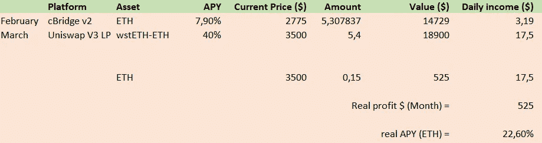
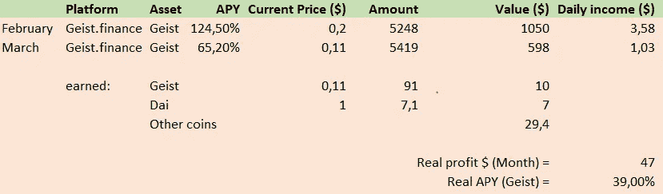
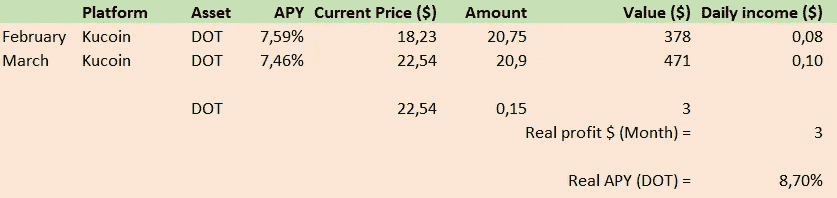
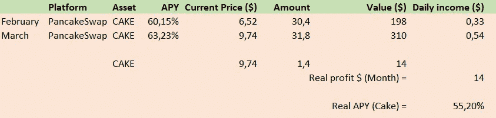
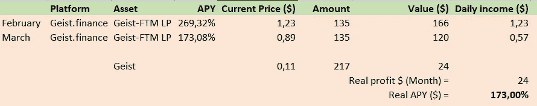
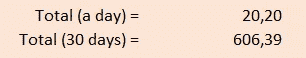

# 一个月 600 美元！我三月份的可持续被动收入流。

> 原文：<https://medium.com/coinmonks/600-a-month-my-sustainable-passive-income-streams-for-march-db3c55e2b770?source=collection_archive---------0----------------------->

**简介**

嘿密码爱好者！我很高兴你再次加入这个月的三月被动收入流！在这个每月系列中，我将评估我的被动收入流，并以一种非常不科学的方式来观察它们的表现。**我所有的头寸都是非庞氏骗局/诈骗/转贷代币！**所以没有滴滴，没有雷神，没有欧姆，没有大象钱。

经过一个动荡的月份，我的未平仓头寸、收入流和代币价格发生了很多变化。我将简要回顾一下我的所有头寸，并给出一些背景，也许还有一些值得一提的额外信息，当你想复制我的策略时，你必须知道这些信息！

**编辑:** [查看我的最新故事](/coinmonks/how-to-generate-sustainable-passive-income-using-crypto-e95e4f3277a8)，看看你如何创造自己的被动收入流！

## 结果

我目前参与了 4 个值得一提的项目/硬币，利率在 5%到 200%之间。我的投资组合主要集中在以太坊、波尔卡多特、艾斯特金融和蛋糕，我正试图获得尽可能多的可持续流量。在 crypto 中，你必须记住越高并不总是越好。一些网络(如以太坊和波尔卡多特)遭受了某种形式的*膨胀*，这使得你看起来像是在持续获得收益，但随着网络膨胀，它可能会比预期的少。

## 以太币

Providing liquidity on the stable wsteth-eth pair

我这个月的主要收入来源是我持有的 ETH 股票。更具体地说，是通过在 **wstETH-ETH (0.05%)** 对的 UniSwap V3 上提供流动性。当我早期进入新池时，TVL 相对较低，为 40 万，交易量峰值超过 1300 万美元，这在 1 个月内产生了近 3%的回报！由于这种以太网与以太网挂钩，短期损失的风险很小，对于那些不想赌以太网但仍想获得良好回报的人来说，这是一个很好的选择！这个资金池目前的 APY 约为 5%，所以大约相当于押上你的 eth。

## 艾斯特

Geist staking

艾斯特最近在价值和赌注回报方面遭遇重挫。自本月初以来，geist 值几乎减半，而且似乎还不止于此。由于 GEIST 是一种农业代币，将有大量代币推向市场，抑制价格。我已经开始把我在艾斯特赚的钱卖给 FTM，希望能减少因代币价格上涨而损失的钱。

## 波尔卡多特

My polkadot earnings on kucoin.com

波尔卡多特是这个名单上不太令人兴奋的硬币之一，但与良好的价格行为相比，持续的回报是一些可靠的回报。如果你想要一个低风险的投资选择，这是一个很好的选择！你也想在库科恩身上下注吗？使用[我的推荐](https://www.kucoin.com/ucenter/signup?rcode=1de5d)！

## 蛋糕

Cake staking on pancakeswap

蛋糕是高回报低风险的投资选择之一。60%是超级一致的，价格似乎没有受到任何方式或形状的影响。随着最近蛋糕价格的波动，它慢慢地收回了我最初的投资。目前的投资回报率几乎是 5.5 个蛋糕，仅 3 个月就价值近 50 美元！这里唯一值得注意的是蛋糕的 APY，它总是比预测值低 5-10%。如果你经历了同样的事情，请告诉我！

## 艾斯特-FTM LP

Geist FTM liquidity

艾斯特-FTM 流动性池是一个高风险高回报的农业选择，支付一个大的 APY。与 FTM 相结合，价格不会受到艾斯特令牌下跌的太大影响，但持有 FTM 或不同的加密技术可能仍然比 LPs 更有利可图。艾斯特确实收到了很多空投，享受 Valas 空投和 solidsex 空投，但直到现在他们还没有盈利。

## 结论

Total earnings of march

在过去的 30 天里，所有投资的总和几乎达到了 600 美元。这主要与我们在 wstETH-ETH 池上的早期胜利有关，在 APY 暴跌到更可持续的回报之前，我们在两周内几乎赢了 0.15ETH。如果您有任何问题或意见，请随时联系我！

点击这里阅读我上个月的故事，了解二月份发生了什么！

为了让我的故事公开，请考虑给我买杯咖啡:【https://ko-fi.com/igormd[！](https://ko-fi.com/igormd)

如果你想在库币上下注，使用[我的推荐](https://www.kucoin.com/ucenter/signup?rcode=1de5d)！

> 加入 Coinmonks [电报频道](https://t.me/coincodecap)和 [Youtube 频道](https://www.youtube.com/c/coinmonks/videos)了解加密交易和投资

# 另外，阅读

*   [如何在 FTX 交易所交易期货](https://coincodecap.com/ftx-futures-trading) | [OKEx vs 币安](https://coincodecap.com/okex-vs-binance)
*   [CoinLoan 审查](https://coincodecap.com/coinloan-review) | [YouHodler 审查](/coinmonks/youhodler-4-easy-ways-to-make-money-98969b9689f2) | [BlockFi 审查](https://coincodecap.com/blockfi-review)
*   [复制交易](/coinmonks/top-10-crypto-copy-trading-platforms-for-beginners-d0c37c7d698c) | [加密税务软件](/coinmonks/crypto-tax-software-ed4b4810e338)
*   [电网交易](https://coincodecap.com/grid-trading) | [加密硬件钱包](/coinmonks/the-best-cryptocurrency-hardware-wallets-of-2020-e28b1c124069)
*   [密码电报信号](http://Top 4 Telegram Channels for Crypto Traders) | [密码交易机器人](/coinmonks/crypto-trading-bot-c2ffce8acb2a)
*   [最佳加密交易所](/coinmonks/crypto-exchange-dd2f9d6f3769) | [印度最佳加密交易所](/coinmonks/bitcoin-exchange-in-india-7f1fe79715c9)
*   [面向开发人员的最佳加密 API](/coinmonks/best-crypto-apis-for-developers-5efe3a597a9f)
*   最佳[密码借贷平台](/coinmonks/top-5-crypto-lending-platforms-in-2020-that-you-need-to-know-a1b675cec3fa)
*   [免费加密信号](/coinmonks/free-crypto-signals-48b25e61a8da) | [加密交易机器人](/coinmonks/crypto-trading-bot-c2ffce8acb2a)
*   杠杆代币的终极指南
*   《XT.COM 评论》的[《币安评论》的](https://coincodecap.com/profittradingapp-for-binance)|
*   [SmithBot 评论](https://coincodecap.com/smithbot-review) | [4 款最佳免费开源交易机器人](https://coincodecap.com/free-open-source-trading-bots)
*   [比特币基地僵尸程序](/coinmonks/coinbase-bots-ac6359e897f3) | [AscendEX 审查](/coinmonks/ascendex-review-53e829cf75fa) | [OKEx 交易僵尸程序](/coinmonks/okex-trading-bots-234920f61e60)