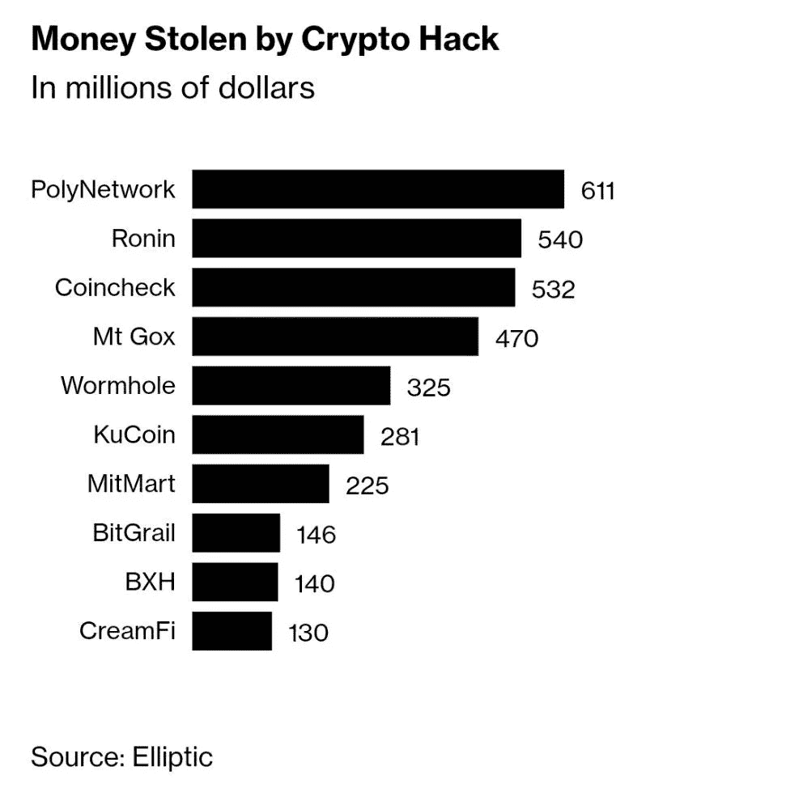
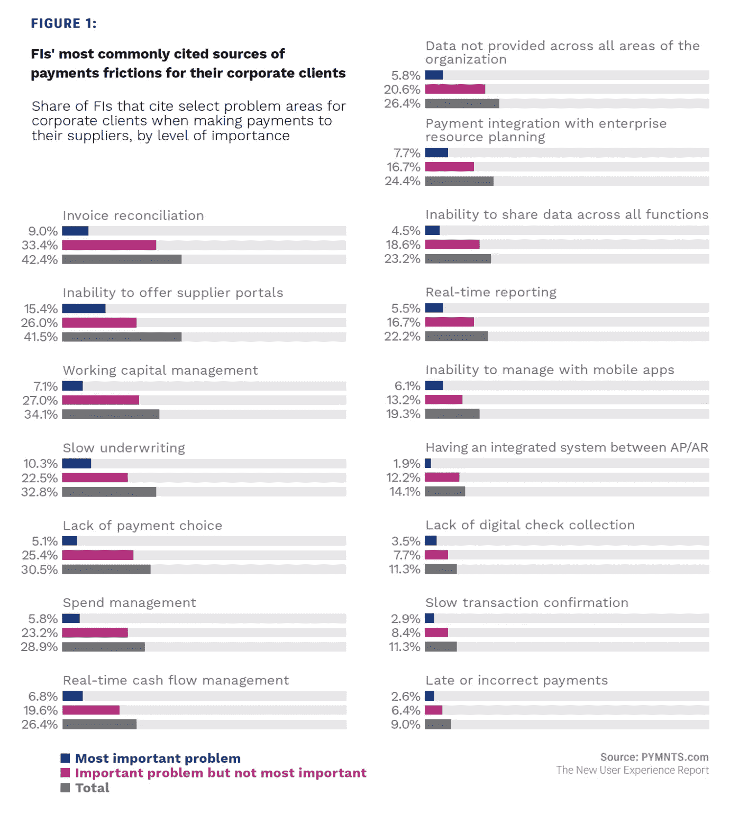
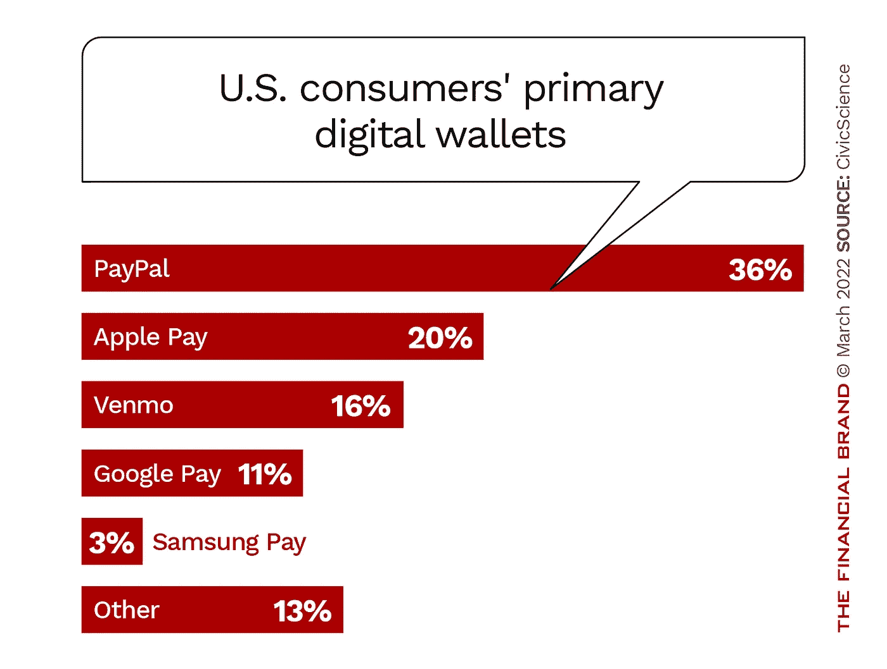

# 价值 6 亿美元的密码盗窃；Visa 推出 NFT 创客计划；为企业获取嵌入式财务优势；

> 原文：<https://medium.com/coinmonks/600-million-crypto-heists-visa-launches-nft-creator-program-capturing-the-embedded-finance-3c22d09d033?source=collection_archive---------47----------------------->

# 今天的展望:

1.  6 亿美元的密码盗窃
2.  抓住企业的嵌入式财务优势
3.  Visa 推出 NFT 创造者计划
4.  苹果金融生态系统的下一步是什么？
5.  替代付款:账户到账户(A2A)付款
6.  分散金融导论
7.  数字钱包交易的趋势
8.  英国希望成为加密的“全球中心”

# 6 亿美元的密码盗窃

黑客从与流行的 Axie Infinity 在线游戏相连的区块链网络窃取了约 6 亿美元，这是迄今为止最大的加密攻击之一。

Axie Infinity 制造商 Sky Mavis 和 Axie DAO 运营的名为 nodes 的计算机支持所谓的桥(一种让人们将代币转换成可以在另一个网络上使用的软件)受到了攻击，黑客在两次交易中消耗了 17.36 万以太币和 2550 万 USDC 代币的浪人桥。据支持 Axie Infinity 的区块链 Ronin 称，漏洞发生在 3 月 23 日，但直到周二才被发现。

这次袭击是表明桥梁经常充满问题的最新例证。许多人的计算机代码没有被审计，这使得黑客可以利用漏洞。通常不清楚是谁在运营它们，以及具体是如何运营的。应该在桥上命令交易的验证者的身份经常被神秘所笼罩。然而，那里有成千上万座桥梁，它们运送着价值数亿美元的密码。

Ronin 劫案凸显了困扰更广泛的分散金融(DeFi)协议市场的安全担忧。根据区块链研究公司 Chainalysis 周三的一条推文，2021 年约有 23 亿美元从 DeFi 平台被盗，比前一年增长了 1，330%。

黑客攻击被披露后，浪人区块链上使用的令牌罗恩的价格下跌了约 22%。根据 CoinMarketCap 的数据，Axie Infinity 中使用的代币 AXS 在收复部分失地之前下跌了 11%。

Ronin 在其博客中表示，它与主要的加密货币交易所和 Chainalysis 保持联系，以监控被盗资金的动向。Ronin 还表示正在与执法部门合作。Ronin 没有立即回复置评请求。

根据区块链取证公司 Elliptic 的说法，被盗资金进入了两家加密货币交易所。几家交易所承认遭到黑客攻击，但没有证实资金已被转移到那里。

[来源。](https://www.bloomberg.com/news/articles/2022-03-29/hackers-steal-590-million-from-ronin-in-latest-bridge-attack?utm_campaign=instagram-bio-link&utm_medium=social&utm_source=instagram&utm_content=business)

# 抓住企业的嵌入式财务优势

随着消费者的银行和支付习惯变得更加数字化，嵌入式金融对企业的吸引力越来越明显。面向消费者的用例为企业效仿铺平了道路，个人现在期望从寻找新的保险提供商到获得抵押贷款的一切零售体验的便利。

在疫情期间，许多消费者也首次尝试了远程医疗服务，将他们的医疗和财务数据托付给在线医疗服务提供商。2021 年 11 月底进行的最新 ConnectedEconomy 调查发现，大约 22%的消费者在调查前 30 天内使用在线或移动应用程序订购和支付处方。

因此，嵌入 B2B 金融对企业来说变得越来越有吸引力，因为它们希望将商业伙伴的体验与消费者的体验相匹配。PYMNTS 最近的数据发现，42%的受访公司报告缺乏供应商门户网站——通常是使他们能够与供应商或销售商在线联系的第三方平台——是他们 B2B 支付流程中的一个痛点，15%的公司将这一差距列为他们面临的最大挫折。

实施嵌入式金融可以让企业为其供应商提供简化、无摩擦的数字支付，而无需将它们发送到第三方门户或平台，以及融资和延长保修选项，从而提高 B2B 支付流程的效率，降低双方的成本。

考虑到降低成本、增加流动性和改善供应商关系的机会，嵌入式金融对中小型企业尤其有吸引力。

另一项最近的研究预测，到 2025 年，仅这些小型企业的全球嵌入式金融市场就将达到 1240 亿美元。

随着嵌入式金融解决方案越来越受消费者欢迎，B2B 对这些产品的需求无疑将会增长。找到合适的合作伙伴可以帮助企业轻松地将嵌入式金融引入 B2B 和内部支付流程，从而保持领先地位。

[出处。](https://bit.ly/375iJXj)

# Visa 推出 NFT 创造者计划

为期一年的沉浸式项目将汇集一批有兴趣与 NFTs 建立业务的全球创作者

目前，约有 5000 万艺术家、音乐家和各种类型的创作者发布内容，作为全职或兼职的收入来源 1。据估计，创造者经济的市场规模超过 1000 亿美元，是小型企业中增长最快的类别之一。

为了支持这种增长，今天，我们启动了 Visa Creator 计划，该计划旨在帮助数字优先的艺术家、音乐家、时装设计师和电影制作人通过不可替代的代币(NFT)加速他们的小企业。该计划的每个周期将支持一组选定的企业家，加深他们对支撑 NFT 商业的技术和平台的理解。

因为 NFT 可以建立数字商品和媒体(如图像、视频和音乐)的所有权和真实性，所以它们可以帮助创作者创收和发展业务。

Visa 加密部门的负责人 Cuy Sheffield 说:“NFT 有潜力成为创造者经济的强大加速器。“我们一直在研究 NFT 生态系统及其对商业、零售和社交媒体未来的潜在影响。通过 Visa Creator 计划，我们希望帮助这种新型的小型和微型企业进入数字商务的新媒介。”

被选中的创作者将加入一个由群体驱动的计划，旨在建立和深化他们在加密商务和传统支付方面的流畅性。该计划侧重于在五个关键领域支持创作者:

-技术和产品指导:与 Visa 的加密产品和战略领导者团队进行指导，涵盖的主题包括:评估基础区块链网络、智能合同和 NFT 市场之间的权衡。

-社区建设:在 NFT 旅程的不同阶段，与创作者社区交流思想和解决问题的机会。

-接触思想领袖:聆听在数字商务、web3、加密和支付领域工作的前沿思想家和研究人员的观点。

-接触 Visa 的客户和合作伙伴:有机会接触 Visa 客户和合作伙伴网络中的公司。

津贴:帮助创作者启动下一阶段发展的一次性津贴。

[程序。](https://usa.visa.com/partner-with-us/info-for-partners/visa-creator-program.html)

# 苹果金融生态系统的下一步是什么？

它可以在内部付款处理中

据报道，苹果正在开发自己的支付处理技术和基础设施，如贷款风险评估、欺诈分析、信用检查和争议处理。

这个项目的一部分在内部被称为“突破”，因为它将看到苹果公司脱离其目前使用的金融系统，此外，谣言指出，它还在开发计算利息、奖励、批准交易、向征信机构报告数据、提高信用限额等工具。

目前，苹果与高盛和 CoreCard 合作开发苹果卡，尽管它最近也购买了 T2 的信用卡，以期在英国市场推出苹果卡。

该公司根据来自英国开放银行框架的交易和贷款结果银行数据中提取的贷款申请提供见解和分数。

苹果还与绿点合作苹果现金，与[公民银行](https://www.linkedin.com/company/citizens-bank-ar/)合作 iPhone 升级项目，但是[彭博资讯](https://www.linkedin.com/company/bloomberg-lp/)称苹果在金融服务方面的工作将针对未来的产品，而不是目前的产品。

苹果已经有了 Apple Pay 和‌Apple Card‌，此外，它还在开发未来的硬件订阅服务和‌Apple Pay‌交易的“现在购买，以后支付”选项。

根据彭博的说法，苹果在构建其金融服务产品方面面临一些“障碍”，因此它有可能最终推迟其计划，或者继续与合作伙伴合作，尽管这是“非常不可能的情况”

苹果基因中的大量保密和信息偏执也将使内部银行、征信机构、股票经纪公司、汇款服务或零售贷款机构极难在除前沿市场或新兴市场以外的任何地方运营。

因此，我的猜测是，苹果正在努力减少对外部提供商的依赖，以完成一些支持任务，如向征信机构报告数据或预防损失，但我们不应该对完全由苹果拥有和运营的苹果银行抱太大希望。

[来源。](https://bit.ly/3qXiF2F)

# 替代付款:账户到账户(A2A)付款

账户到账户(A2A)支付将资金直接从一个账户转移到另一个账户，无需额外的中介或支付工具，如卡。

A2A 支付已经存在多年，使用案例包括常规账单支付和直接借记，但现在开放银行业务将它们推向了一个新的水平，从一种“替代”支付方式变成了主流支付方式。

对 A2A 付款的需求显而易见。例如，卡和钱包都是收取高额交易费的中介，尤其是在大额交易中。选择接受哪种支付方式，对商家来说，永远是触达、转化、成本之间的权衡。由于网络效应(最大范围)和更好的转化率，卡和钱包已经成为主要的支付形式。

A2A 支付通过国家清算系统处理，这种系统不需要中介，可以减少摩擦，效率更高，但成本却很低。

作为 A2A 在线支付的一种类型，在线银行电子支付在国家层面上非常成功，例如，iDEAL 在荷兰的在线支付市场上占有 71%的份额。

但是这些系统仅限于一个国家，因为它们依赖于国家铁路。

开放银行业务改变了 A2A 支付的游戏规则。开放银行 API 克服了清算轨道的碎片化，允许在购买点嵌入 A2A 支付。

就客户支付体验和交谈率而言，支付启动方式是 A2A 支付的一个重要组成部分。如果同意，可以通过 API 代表客户启动支付，而无需填写其他详细信息或采取进一步的行动。

A2A 支付的另一个优势是数据可用性。开放式银行允许评估客户的信用和对消费的洞察力。这改进了从欺诈检测到忠诚度奖励的用例。

总之，开放银行的 A2A 支付拥有巨大的覆盖范围(只需要一个银行账户)，巨大而快速提高的转换率，非常低的交易成本和更广泛的数据可用性。

[来源。](https://bit.ly/3NJhRZ6)

# ConsenSys Codefi 产品主管 Corbin Page 介绍分散式金融。

今天，DeFi 协议锁定了超过 430 亿美元。全球数百万人正在使用以太坊区块链来建立和参与一个新的经济系统，该系统由代码驱动，并为金融准入、机会和信任设定了新的标准。

然而，还有数百万人第一次听说分散融资。华尔街赌博 x[GameStop](https://www.linkedin.com/company/gamestop/)x[robin hood](https://www.linkedin.com/company/robinhood/)磨难等一系列事件，正迫使我们越来越多的人考虑传统金融系统的替代方案——但很难找到从哪里以及如何开始。

现在你在这里。

本次网络研讨会将涵盖以下主题:

🤔什么是 DeFi？

🗓快速加密历史

🚀DeFi 是杀手级应用

🏧再见，特拉菲

🔭展望未来

# 数字钱包交易的趋势

近年来，数字钱包的使用速度越来越快。Fiserv 的“期望与体验”消费者趋势调查发现，在 2021 年，几乎十分之七的消费者(68%)在过去 12 个月中使用过数字钱包，超过了 2020 年的 58%和 2019 年的 51%。

FIS 的一项全球研究发现，2021 年，数字钱包占电子商务交易额的 48.6%，略高于 2.5 万亿美元。该公司预计，这将在 2025 年继续增加到交易额的 52.5%。

该研究称:“数字钱包将推动增长，它提供卓越的结账解决方案、基础支付方法的灵活性、在电子商务市场生态系统中的锚定作用，以及本地钱包整合为区域和全球超级应用。”。

FIS 报告预测，数字钱包将在 2022 年超过实体信用卡，并将占美国电子商务支出的近三分之一。报告称，这将由[苹果](https://www.linkedin.com/company/apple/)支付、[亚马逊](https://www.linkedin.com/company/amazon/)支付、[谷歌支付](https://www.linkedin.com/company/google-pay/)和贝宝引领。

Gartner 预测，数字钱包是未来两年将对电子商务产生重大影响的五项技术之一。

Juniper Research 在一项先有鸡后有蛋的观察中指出，“移动商务的关键驱动因素之一是消费者对数字钱包的接受度不断提高，尽管具体的钱包和支付方式因国家而异。”

“贝宝已经垄断了数字支付市场，”CivicScience 说。“尽管有些人可能不会将贝宝作为他们的主要数字钱包，但总而言之，高达 46%的人使用贝宝进行在线交易。”

该公司报告称，便利性是选择的首要原因，其次是安全性。有趣的是，十分之一的 PayPal 用户告诉 CivicScience，使用 PayPal 的主要好处是 PayPal 信用，这是一种用户可以在参与商户处使用的信用额度。

你还有什么其他的趋势可以补充吗？

[来源。](https://thefinancialbrand.com/133635/digital-wallets-set-to-move-beyond-payments-become-super-wallets/)

# 英国希望成为加密的“全球中心”

英国推动加密之际，在英美等金融中心运营的公司正加大对政府、监管机构和立法者的压力，要求他们提供更清晰的数字资产规则和监管。

英国政府制定了成为加密行业“全球中心”的计划，提出了针对 stablecoins、皇家造币厂 NFT 的新监管规定，以及一系列吸引数字资产公司的其他措施。

城市大臣约翰·格兰在周一的一次讲话中表示，政府决心表明“英国对商业开放，对加密业务开放”。

这次讲话标志着政府迄今为止支持加密货币企业在英国开展业务的最强有力的信息，此前该行业批评英国严格的监管方法和政府的冷漠扼杀了创新。

“我们看到了加密的巨大潜力，”格伦说。“我们不会降低我们的标准，但我们将保持我们技术中立的方法。”

部长补充说，政府将研究利用分布式账本技术发行政府债券的可能性。他表示，总理里什·苏纳克(Rishi Sunak)已委托皇家铸币局(Royal Mint)在今年夏天之前发行一种被称为不可替代代币(NFT)的数字收藏品，作为“我们决心采取的前瞻性方法的象征”。

英国财政部还发布了期待已久的计划，以监管 stablecoins 的发行者。stable coins 是一种加密代币，旨在反映美元等其他资产的价值。

财政部的建议之一是修改现有的管理电子货币的法律，如存储在手机应用程序上的资金，以涵盖稳定的货币，将其纳入金融行为管理局的管辖范围。这将要求稳定的硬币发行者为发行的代币持有等量的英镑储备，这些代币不能用于借贷等目的。

在加密政策方面的举措出台之前，该行业与 FCA 围绕其洗钱控制许可制度发生了冲突，一些行业参与者表示，这正推动企业向海外转移。

政府还打算重新审视加密的税收规则，格伦暗示，将“有针对性地”改变对分散金融的处理，并消除英国基金经理在投资组合中持有加密的抑制因素。

除了鼓励本土的区块链创新，格伦还对离岸加密公司表示欢迎，称他希望英国对“还没有固定基地的公司”有吸引力

[来源。](https://www.ft.com/content/24c9b6de-9cc6-4413-8b6a-e60653a29ce0)

> *加入 Coinmonks* [*电报频道*](https://t.me/coincodecap) *和* [*Youtube 频道*](https://www.youtube.com/c/coinmonks/videos) *了解加密交易和投资*

# 另外，阅读

*   [Bookmap 评论](https://coincodecap.com/bookmap-review-2021-best-trading-software) | [美国 5 大最佳加密交易所](https://coincodecap.com/crypto-exchange-usa)
*   最佳加密[硬件钱包](/coinmonks/hardware-wallets-dfa1211730c6) | [Bitbns 评论](/coinmonks/bitbns-review-38256a07e161)
*   [新加坡十大最佳密码交易所](https://coincodecap.com/crypto-exchange-in-singapore) | [收购 AXS](https://coincodecap.com/buy-axs-token)
*   [红狗赌场评论](https://coincodecap.com/red-dog-casino-review) | [Swyftx 评论](https://coincodecap.com/swyftx-review) | [CoinGate 评论](https://coincodecap.com/coingate-review)
*   [投资印度的最佳加密软件](https://coincodecap.com/best-crypto-to-invest-in-india-in-2021)|[WazirX P2P](https://coincodecap.com/wazirx-p2p)|[Hi Dollar Review](https://coincodecap.com/hi-dollar-review)