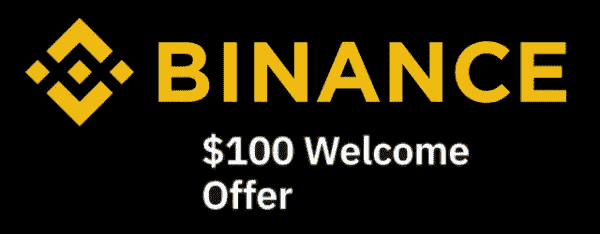
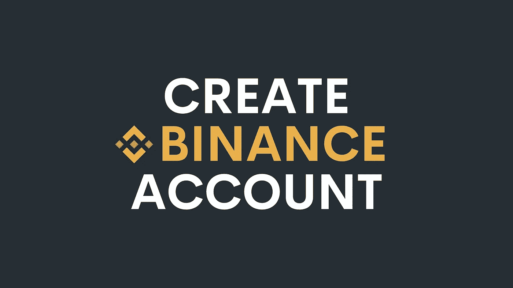
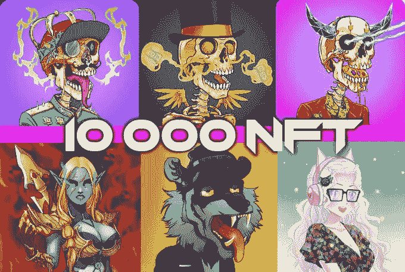

# 2022 年投资的 7 种最佳元宇宙加密硬币——列表 3

> 原文：<https://medium.com/coinmonks/7-best-metaverse-crypto-coins-to-invest-in-2022-list-3-9e077f5c87ab?source=collection_archive---------7----------------------->

**4 Best Metaverse Crypto Coins to Invest in 2022 — List 3**

目前有几十种元宇宙加密货币可供投资，这使得人们很难知道哪些是合法的，哪些不是。这就是为什么我决定写一篇关于这个话题的文章，这样你就可以知道哪些是值得投资的，哪些是你应该暂时避免的。因此，让我们来发现 2022 年投资的最佳元宇宙加密硬币。

# 2022 年投资的最佳元宇宙加密硬币:

# 1.茄属植物

SOL 是相对较新的区块链，于 2019 年首次推出。然而，直到 2020 年，它才被注册。从那以后，它的平台和生态系统不断发展，导致价格大幅上涨。

这使得它成为 2022 年投资的一枚优秀的元宇宙硬币，因为它的社区正在迅速扩张，其平台已经托管了几个成功的项目。这种加密货币现在的交易价格约为 90 美元，可以在大多数主要交易所购买。

# 👉[购买索拉纳(SOL)](https://www.gate.io/ref/8753407)

# 2.IoTeX (IOTX)

IOTX 是一个可扩展的、注重隐私的区块链，使用本地货币为其网络提供动力。它的生态系统继续繁荣，因此，我们预计它的价值今年将大幅上升。我把它加到清单上，因为我确实觉得这是一个赚钱的好机会，然而，目前一切都和 BTC 有关。IOTX 可以在几个顶级加密货币交易所购买。

# 👉[购买 Iotex (IOTX)](https://www.gate.io/ref/8753407)

# 3.蜡(WAXP)

WAXP 是世界上最环保的区块链之一。它可以用来购买视频游戏，非功能性食物和收藏品，也可以让你在他们的市场上交易。它被认为是 NFTS 之王，帮助了数百万人。由于 BTC 的下跌，我确实认为这是一个购买的好机会，但在不同的水平。

# 👉[买蜡(WAXP)](https://www.gate.io/ref/8753407)

# 4.分散土地(法力)

它自 2020 年初开始向公众开放，现在是元宇宙运行时间最长的加密货币项目。任何人都可以通过访问其官方网站来了解这种加密货币的更多信息；只要确保你的钱包连接到以太坊网络，你就可以走了。

这种加密货币现在的交易价格约为每单位 2.89 美元，可以从大多数主要的加密货币交易所购买。

# 👉[购买分散地(法力)](https://www.gate.io/ref/8753407)

# 🌟[在 USDT 创建一个币安帐户并获得 100 美元奖金](https://www.binance.com/en/activity/referral/offers/claim?ref=CPA_00M6XWFUN3)🌟

**🌟** [**Create a Binance account and get 100$ Bonus in USDT**](https://www.binance.com/en/activity/referral/offers/claim?ref=CPA_00M6XWFUN3)**🌟**

# 🌟我有一个伟大的奖金给你:100 美元在币安注册后🌟

[**一旦您通过此链接**](https://www.binance.com/en/activity/referral/offers/claim?ref=CPA_00M6XWFUN3) 创建了您的币安，存款超过 50 美元，然后在到期前兑换您的 100 USDT 优惠券。

# 5.中欧和东欧国家

Ceek 被视为未来的出版和音乐流媒体平台。它配有一个虚拟现实耳机，并且已经有像 Lady Gaga 这样的音乐家在船上。

它为用户提供了多种选择来赚取令牌，包括为标签和艺术家创建定制硬币的能力，以及生成数字项目的能力。他们的交易额约为 3000 万美元。

# 👉[买齐埃克(CEEK)](https://www.gate.io/ref/8753407)

# 6.伊鲁维姆(ILV)

Illuvium 是一款游戏，你可以在其中四处走动，探索广阔的景观。

在探索各种环境的过程中，你可以发现生物，完成任务，解开谜团。

好消息是，你不必使用本地令牌来玩他们的游戏，在许多情况下，游戏是免费的，有机会升级到高级订阅。

当然，游戏的结构以其原生令牌为中心，你可以通过达到特定的里程碑来赚取令牌。

# 👉[购买 Iluvium (ILV)](https://www.gate.io/ref/8753407)

# 7.Wemix (WEMIX)

Wemix 是一个位于区块链的游戏和其他应用平台。

您可以为 NFTs 制作产品，然后与其他用户以及他们的本机令牌进行交易。

这是一个去中心化的市场，你可以快速地将数字货币兑换成他们的本地令牌，这些令牌在主要的加密货币交易所上市，可以用比特币、以太坊和其他重要的加密货币购买。

# 👉[购买 Wemix (WEMIX)](https://www.gate.io/ref/8753407)

# 最终想法…

正如你所看到的，2022 年有很多元宇宙加密硬币可以投资，这意味着你现在可能会感到有点不知所措。

这就是为什么最好坚持这样的文章，你可以放心，我们已经做了功课，并选择了最好的元宇宙加密硬币。

最后，请做你自己的研究，这篇文章是我自己的观点，而不是投资建议。

[Open an account in Binance and get 50 dollars](https://www.binance.com/en/activity/referral/offers/claim?ref=CPA_00M6XWFUN3)

## 👉创建一个币安帐户，通过完成简单的任务获得报酬。

# 工作原理:

[**登录您的账户后，点击您的币安账户**](https://accounts.binance.com/en/register?ref=26723737) 图标，从下拉菜单或仪表板中选择“奖励中心”。

**请关注并订阅，并确保分享我的工作作为一个激励的姿态。点击这里查看我所有的文章:**[**https://medium.com/@s.hanz**](/@s.hanz)

# **🌟**如果你不是设计师，想推出自己的 NFT 系列**🌟**

[**1。Rafcreative 是一个疯狂的艺术家**](https://go.fiverr.com/visit/?bta=182994&brand=fiverrcpa&utm_campaign=freewaystopromote&landingPage=https%3A%2F%2Fwww.fiverr.com%2Frafcreative%2Fdraw-custom-character-for-nft-collection%3F) 提供了只花几美元就能得到自己的 NFT 收藏的可能性，这让他在竞争中脱颖而出。他提供了 20 个详细的物品附件的集合及其源文件。

**2。大面 3d5 是 NFT 顶级艺人** ，与**分野**“互联网软件&服务”**萨巴顿**等大牌合作。他提供 100，1K 和 10K NFT 的收藏。

# 更多文章:

[**2022 年元宇宙最佳 5 个好项目——榜单 1**](/@s.hanz/best-5-metaverse-crypto-coins-with-good-projects-in-2022-list-1-687fedbe668e)

[***2022 年最佳 5 个元宇宙加密币好项目—榜单二***](/@s.hanz/best-5-metaverse-crypto-coins-with-good-projects-in-2022-list-2-15af2f8f01d9)

[**需要钱的时候要做的事情快——新招**](/@s.hanz/things-to-do-when-i-need-money-fast-new-tricks-2b68ad24406b)

[**2022 年 NFT 项目 7 大免费推广方式**](/coinmonks/7-free-ways-to-promote-nft-projects-in-2022-ccefc7f249e7)

[**2022 年 7 款最佳赌注硬币**](/@s.hanz/7-best-staking-coins-in-2022-70dbc31adcae)

[**五月六日聘请 NFT 顶级艺人**](/coinmonks/6-top-nft-artists-to-hire-on-fiverr-62ae1643eedc)

> 加入 Coinmonks [电报频道](https://t.me/coincodecap)和 [Youtube 频道](https://www.youtube.com/c/coinmonks/videos)了解加密交易和投资

# 另外，阅读

*   [OKEx vs KuCoin](https://coincodecap.com/okex-kucoin) | [摄氏替代品](https://coincodecap.com/celsius-alternatives) | [如何购买 VeChain](https://coincodecap.com/buy-vechain)
*   [ProfitFarmers 点评](https://coincodecap.com/profitfarmers-review) | [如何使用 Cornix Trading Bot](https://coincodecap.com/cornix-trading-bot)
*   [如何匿名购买比特币](https://coincodecap.com/buy-bitcoin-anonymously) | [比特币现金钱包](https://coincodecap.com/bitcoin-cash-wallets)
*   [币安 vs FTX](https://coincodecap.com/binance-vs-ftx) | [最佳(SOL)索拉纳钱包](https://coincodecap.com/solana-wallets)
*   [如何在 Uniswap 上交换加密？](https://coincodecap.com/swap-crypto-on-uniswap) | [A-Ads 评论](https://coincodecap.com/a-ads-review)
*   [加密货币储蓄账户](/coinmonks/cryptocurrency-savings-accounts-be3bc0feffbf) | [YoBit 审核](/coinmonks/yobit-review-175464162c62)
*   [Botsfolio vs nap bots vs Mudrex](/coinmonks/botsfolio-vs-napbots-vs-mudrex-c81344970c02)|[gate . io 交流回顾](/coinmonks/gate-io-exchange-review-61bf87b7078f)
*   [CoinFLEX 评论](https://coincodecap.com/coinflex-review) | [AEX 交易所评论](https://coincodecap.com/aex-exchange-review) | [UPbit 评论](https://coincodecap.com/upbit-review)
*   [AscendEx 保证金交易](https://coincodecap.com/ascendex-margin-trading) | [Bitfinex 赌注](https://coincodecap.com/bitfinex-staking) | [bitFlyer 点评](https://coincodecap.com/bitflyer-review)
*   [Bitget 回顾](https://coincodecap.com/bitget-review)|[Gemini vs block fi](https://coincodecap.com/gemini-vs-blockfi)cmd |[OKEx 期货交易](https://coincodecap.com/okex-futures-trading)