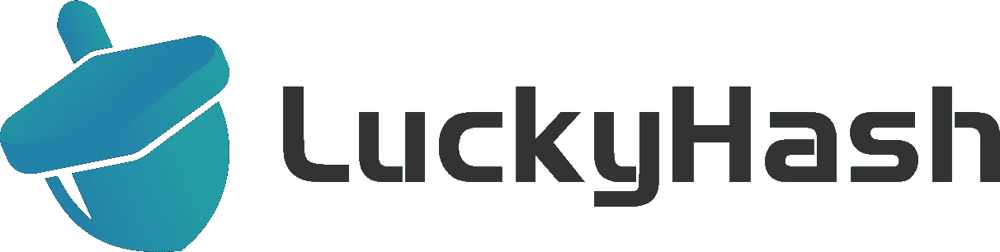
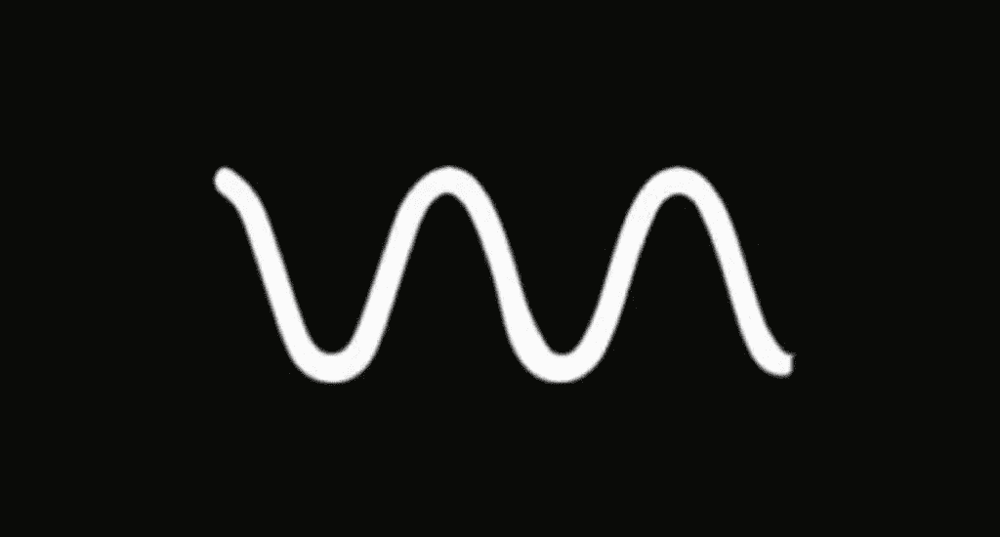
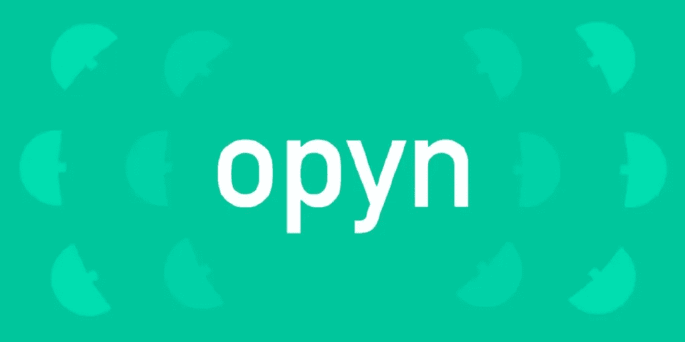
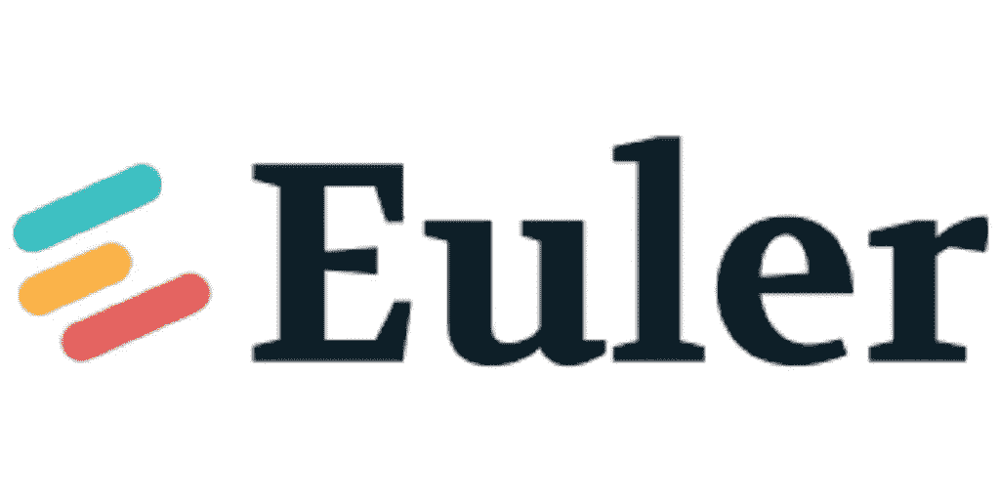
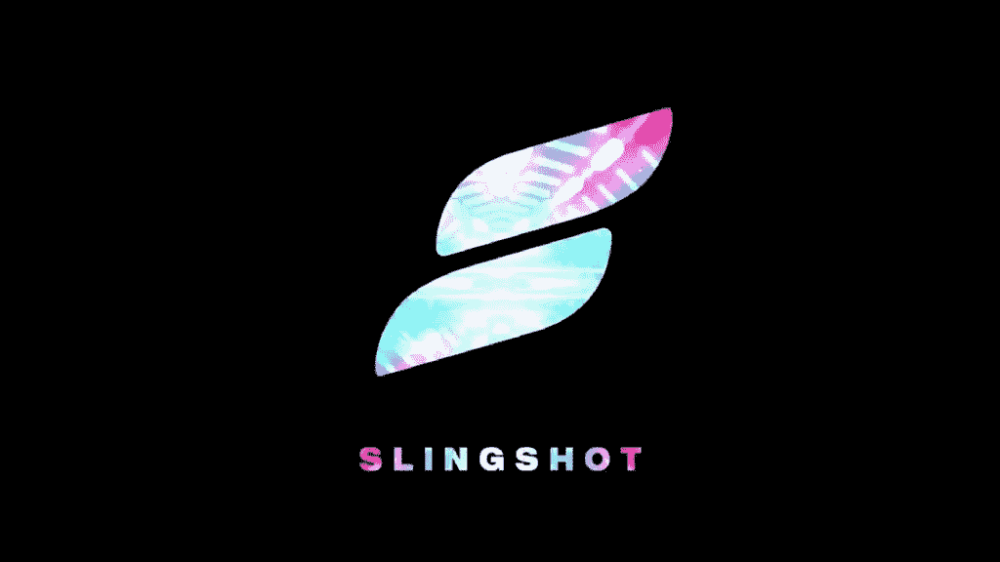

# 2022 年的 7 次最佳空投

> 原文：<https://medium.com/coinmonks/7-best-possible-airdrops-in-2022-6665865beeed?source=collection_archive---------4----------------------->

## 赚取免费加密货币！！

# 1.LuckyHash

LuckyHash 是一个专门的加密货币财富管理平台。目前，投资服务，如储蓄账户、hashrate 租赁产品和幸运彩票。LuckyHash 的业务覆盖美国、新加坡、马来西亚、印度、泰国、印度尼西亚、韩国、哈萨克斯坦等国家，受到全球超过 240 万用户的信赖。

**符合空投条件**

已经注册了一个账号。

**空投可能性 10/10**

LuckyHash 是最活跃的空投者之一。自 2021 年 11 月以来，它已经进行了 3 轮空投。最近 LuckyHash 推出了“[幸运蛋加密搜索](https://m.luckyhash.com/crackingegg?utm_source=english&utm_medium=official)”空投，你可以免费赢得各种代币。

# 2.薄膜

Membrane 是一个正在开发中的分散式 OTC 协议。虽然它不是 Tokemak 项目的完整副本，但两个协议之间似乎有开发人员和共享思想的重叠。

**符合空投条件**

获得空投的最佳方式是以尽可能多的不同方式与 Tokemak 生态系统互动。这包括参与 C.O.R.E 投票事件、将资产存入协议等。

**空投可能性 9/10**

膜令牌的存在几乎被证实了,“文膜”迷因在 Tokemak 社区被广泛引用。

# 3.仲裁

Arbitrum 是以太坊的广义乐观汇总。这种第 2 层扩展解决方案为用户提供了闪电般的交易确认和更便宜的交易费用，同时继承了以太坊 L1 的安全性。

**符合空投条件**

Arbitrum 是一个网络而不是一个应用程序，这使得这很棘手，但最安全的方法可能是“广撒网，祈祷”，因为用户应该以尽可能多的不同方式与链进行交互。这包括在网络上使用流行的应用程序和通过本地 Arbitrum 桥连接到链。

**空投可能性 9/10**

Arbitrum 团队尚未正式确认令牌发射或空投。然而，考虑到网络在用户、TVL 和部署的应用数量方面的稳定增长，结合 Polygon 和 Avalanche 采用的类似广泛流动性挖掘方案的令牌发布可能是正在考虑的策略。团队在快速成长。

# 4.翁多金融

Ondo Finance Ondo Finance 提供分散的结构性产品，允许加密投资者交易集合资产的风险和回报平衡。它与 Fei Protocol 合作，为寻求租赁流动性的 Dao 提供流动性即服务(LAAS)解决方案。

**符合空投条件**

将闲置资金存入 Ondo 金库

**空投可能性 6/10**

官方没有暗示任何未来的空投，目前也没有理由进行空投。然而，鉴于 Ondo 提议为 SushiSwap 建立一个“Poke Bowl”开发集体，他们可能会效仿目标，推出自己的令牌。

# 5.奥普恩

Opyn 是一种能够创建和交易期权的协议。Opyn 是 Ribbon 和 Stake DAO 等协议的基础设施。

**获得空投资格**

Opyn 是一个扩展协议。因此，空投可以通过各种方式获得，如铸造 otoken(看跌期权)，购买和持有 otoken，利用基于 Opyn 构建的协议，如前面提到的 Ribbon 和 StakeDAO，以及持有或铸造该协议的最新产品。

**空投可能性 6/10**

官方还没有表明任何未来的空投，目前也没有理由进行空投。

​

# 6.欧拉未婚夫

Euler 是下一代借出协议，支持无许可的资产列表。

**符合空投条件**

获得 Euler airdrop 最有可能的方式是通过协议租借。

**空投可能性 6/10**

目前没有理由进行空投。然而，为了与同行(如 Rari Capital 和 Silo Finance)争夺社区认知度，协议进行追溯空投是有意义的。

# 7.弹弓

Slingshot 是一个基于 Polygon、Arbitrum 和乐观主义的去中心化交易聚合器和交易平台。

**符合空投条件**

在弹弓部署的每个链条上进行交易。还有一个值得探索的 NFT 市场。为此，你也可以输入文本与交易者聊天。

**空投可能性 6/10**

作为一个 L2 本地的项目，Slingshot 似乎是驾驭采用浪潮的主要候选人，并且不可避免地在其家庭网络上发布令牌，也许会发布自己的本地令牌。虽然他们最近发布了一系列 NFT，但这可能会加速社区对平台治理发言权的需求。

如果你喜欢我的故事，请留下免费的掌声！

​