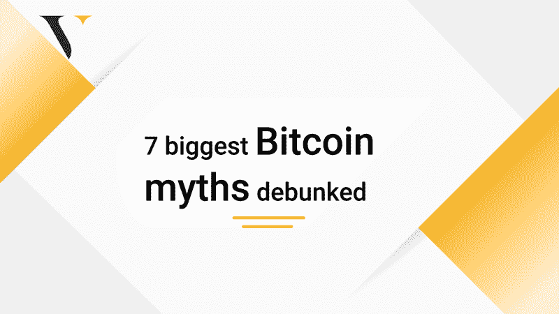

# 七大比特币神话被揭穿。

> 原文：<https://medium.com/coinmonks/7-biggest-bitcoin-myths-debunked-9e502c490aab?source=collection_archive---------52----------------------->

7 大比特币神话被揭穿。(改造)

关于加密货币有许多神话，比特币是其中许多神话的主题。这些故事中有些是真实的，但不幸的是，许多只是人们无知的看法的结果。

聪明的密码交易者花时间从小说中学习真理。在这篇文章中，我们将分享你应该避免的关于比特币的七个神话。

**比特币是骗局**

密码行业是不稳定的，这意味着一枚硬币早上可能要花 6 纳镑，晚上可能要花 17 纳镑。这就是密码市场的本质。

这并不意味着交易像比特币这样的[加密货币](https://valorexchange.com/blog/post?slug=what-is-a-cryptocurrency-a-beginners-guide)就是骗局。这只是意味着你应该在使用加密货币之前先了解它们。例如，你知道你可以使用比特币进行支付、转账等吗，或者你只是把它们放在钱包里？你可以在我们的 [Telegram 社区](https://t.me/valorexchangecommunity)了解更多关于如何让你的比特币、以太或 USDT 获得更多价值的信息。它是完全免费的，对所有人开放。

**比特币只用于投机**。

比特币每日交易超过 305，000 笔，总额超过 100 亿美元，远远不仅仅是一种投机投资选择。这些交易中的许多代表汇款、支付等。

根据世界经济论坛的数据，32%的尼日利亚人拥有用于个人对个人交易的比特币。比特币还被用于资助项目、买卖商品和服务等。2009 年比特币问世时，加密交易员几乎没有选择，因为它没有像现在这样被广泛采用。

**比特币是庞氏骗局**。

每个行业都有骗局和欺诈行为。顾名思义，庞氏骗局是一种欺诈形式，从新投资者那里拿钱来偿还老投资者。他们通常被用来宣传一个不存在的企业或产品。

比特币不是虚构的产品，在一些国家，它是一种合法的交换手段。比特币目前的市值超过 6000 亿美元，用户和密码交易商的数量还在继续增长。

**比特币帮你快速致富。**

这种说法不仅仅是针对比特币，而是针对许多加密货币。快速致富的口号已经导致许多人做出草率和欠考虑的投资决定。是的，市场是不稳定的，交易加密货币时高收益是可能的。

然而，除了 HODL 和祈祷，你还可以用加密货币做更多的事情。这完全取决于你想成为什么类型的密码交易员。

**政府将扼杀比特币**。

诚然，在某些国家，比特币以及所有其他加密货币都遭到了冷遇，但并非所有国家都是如此，例如萨尔瓦多等。世界各地的所有政府机构联合起来组成一个反对所有加密货币的仇恨团体的想法是值得商榷的。事实是，央行希望确保金融稳定高于一切。如果比特币符合这一目标，它将被视为一种资产。

**比特币将取代纸币。**

这也是一个有争议的问题。一些人认为，这是加密货币完全取代法定货币作为每个国家的交易手段的下一个前沿。这是否会发生，我们不得而知，但加密货币在全球范围内的采用已经取得了巨大进展。

**比特币没有实际价值**。

虽然比特币不是基于黄金等实物资产，但你可能会惊讶于大多数其他现代货币也不是。例如，直到 1971 年，美元都是由黄金支撑的。今天它是有价值的，因为人们相信它是有价值的。非美国公民通常信任它所代表的机构，并在账户中保留美元。对机构(即美国)的信任和对价值的认知赋予了这些货币价值。

密码市场每天都在增长。所以它不像其他法定货币那样容易受到通货膨胀的影响。

**总之**

不要听信第一个关于 crypto 的故事。加入一个致力于在 [Telegram 上为您提供最有价值的信息、资源和工具的社区，了解最新动态。](https://t.me/valorexchangecommunity)