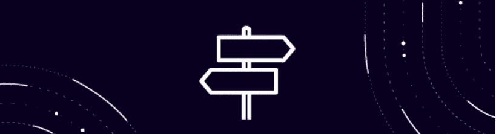
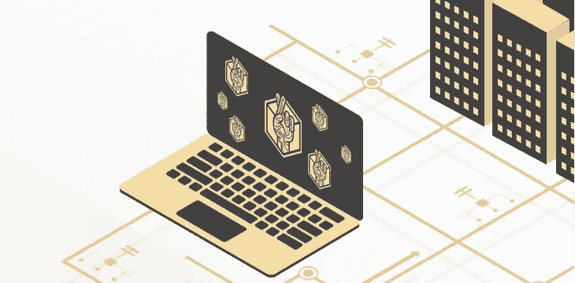
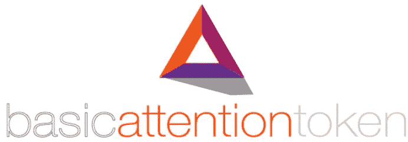
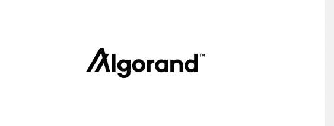

# 2022 年低收入者能买到的 7 种最便宜的加密货币

> 原文：<https://medium.com/coinmonks/7-cheapest-cryptocurrencies-low-income-earners-can-buy-in-2022-19de75e8d41e?source=collection_archive---------15----------------------->

[https://unsplash.com/s/photos/cryptocurrency](https://unsplash.com/s/photos/cryptocurrency)

加密货币并不像大多数人想象的那么贵；这些数字货币中的大多数甚至低于 1.00 美元。此外，比特币和以太坊  并不是唯一的加密货币。但大多数个人害怕投资这种资产，但根据你的预算，现在是投资加密货币的好时机。

不管你是低收入者还是高收入者，你需要的只是战略知识和工具，你可以注册一个像[币安](https://www.binance.com/en)、[货币库](https://www.coinbase.com/)或[双子座](https://www.gemini.com/)这样的交易所进行购买。

因此，每天，随着数字硬币越来越受欢迎，如果你有兴趣投资加密货币市场，产生高于平均水平的回报的一个极好的方法是寻找最便宜的加密货币来购买。

为了给你指明正确的方向，帮助你做出明智的决定，本指南将告诉你最便宜的加密资产投资

# 恒星(XLM)

*   [5 月 10 日硬币价格:0.1496 美元](https://coinmarketcap.com/currencies/stellar/)
*   市值 3，709，352，286 美元

[Stellar](https://www.stellar.org/?locale=en) 于 2014 年 7 月推出，作为一个开源支付网络，它在该网络上使用 stellar lumens 作为其货币。该平台每秒可以处理 1，000 到 5，000 笔交易。恒星流明的价格在过去的一年里波动很大，但分析师预计 XLM 的价格今年将大幅上涨。

继去年价格下跌后，XLM 又开始上涨，上个月增长超过 14%。该平台旨在为用户提供一种低成本、便捷的方式来进入全球经济，同时不排除发展中国家的用户。

# 幸运积木

*   [5 月硬币价格:](https://www.coingecko.com/en/coins/lucky-block) $0.001303
*   市值；$3,709,850,694

2022 年 1 月推出的 Lucky Block 是当今最值得购买的加密货币。幸运区块是一种新的加密资产，设想了一种全球彩票，玩家使用区块链协议，在币安智能链上运行。

此外，由于每日彩票对世界上任何人开放，这种廉价的加密货币将能够提供更频繁和更高的奖金支付。[幸运块](https://luckyblock.com/)两个月前创下 0.009061 美元的历史新高。在过去的一天里，Lucky Block 的透明交易量为 0%,并在 15 个活跃市场上交易，交易量最高。[不仅如此，幸运区块的](https://www.analyticsinsight.net/10-affordable-cryptocurrencies-that-will-make-you-rich-in-2022/)创造者还加入了几个功能，使拥有代币成为产生长期利润的绝佳选择。

# Xrp

*   截至 5 月 10 日的硬币价格:0.5146 美元
*   市值 24，864，138，956 美元

XRP 是一种加密货币，它使用一种叫做 XRP 账本的开源分布式账本。它是由区块链一家处理全球交易的企业公司 Ripple 开发的。

[XRP 机制](https://ripple.com/xrp/)能以低廉的成本和最少的能量在几秒钟内进行交易。如果一个人使用 XRP 作为过渡货币，就有可能在开源的 XRP 账本区块链上结算跨境交易。

它有可能取代低效和过时的传统国际汇款系统。

# 基本注意力标志

*   [截至 5 月 10 日的币价](https://coinmarketcap.com/currencies/basic-attention-token/markets/)；$0.4902
*   市值 726，915，545 美元

Basic Attention Token 于 2017 年 5 月推出，这是今年投资的最佳加密货币之一，但它也有值得投资的目的。基本注意力令牌是一个分散的金融硬币，旨在解决一个专门的和众所周知的需求。它也建立在[以太坊](https://ethereum.org/en/)区块链网络上。

[基本注意力令牌(BAT)](https://basicattentiontoken.org/) 是一种独特的加密技术，旨在改变数字广告行业。在 BAT 中， [Brave web 浏览器](https://brave.com/)上的用户可以仅仅因为观看广告而获得奖励，而广告商也可以因为创造吸引用户注意力的广告而获得奖励。

# Dogecoin (DOGE)

*   [5 月 10 日硬币价格](https://www.coindesk.com/price/dogecoin/):0.111014 美元
*   市值 149 亿美元

Dogecoin 是一个流行的迷因,起源于 2013 年创造的一个幻想，对于投资者和那些从中获利的人来说，它已经变得非常真实。这枚硬币肯定是“便宜”的，这使它成为这个名单上最被低估的密码之一。

> [马斯克](https://twitter.com/elonmusk)在 2021 年 4 月 dogecoin 交易价为 5 美分时发推文称，“SpaceX 将把一个真正的 Dogecoin 放在真正的月球上。

大约有 1326.7 亿枚金币在流通，而且这个数字还在增长。尽管 DOGE 起源于一个迷因，并面临公众的几次批评，但最终，在 2021 年展示出其真正的潜力后，它赢得了投资者的心。专家们确信，鉴于巨大且不断增长的需求，这种加密技术将很快达到投资者的期望。

# 创(TRX)

*   截至 5 月 10 日的币价；$0.07939
*   市值 7，801，856，971 美元

Tron 是世界上最受欢迎的加密资产，成立于 2017 年。如果你在寻求更稳定的收入，创是一个很好的选择，因为它的波动性较低。创拥有加密生态系统中最强大的社区之一。他们在几乎所有的社交媒体平台上发表意见，从 Reddit、Discord 到 [Twitter](https://mobile.twitter.com/tronfoundation?lang=en) 。Tron 的主要目的是将消费者和内容提供商聚集在一起进行点对点交易，他们可以在 tron(TRX)发送和接收数百万美元

[Tron(TRX)区块链](https://tron.network/)操作系统可以运行智能合约，这使得开发者能够创建分散式应用(dApps)并将文件、游戏和音乐传输到令牌开发。

# 阿尔格兰德

*   [截至 5 月 10 日的币价](https://www.coingecko.com/en/coins/algorand)；$0.602234
*   市值；$4,100,867,200

Algorand 是一个自给自足的分散式网络，位于区块链，支持多种应用。

事实上，[algrand](https://www.algorand.com/)在这个领域仍然年轻，但由于其可信度、可访问性和效率，自 2022 年初以来，它是值得购买和投资的加密资产之一。随着越来越多的开发者在 algrand 网络上开发应用程序，algrand 的价值今年可能会轻松翻两番甚至翻两番。

# 在你走之前…

*如果您觉得本文有帮助，请单击👏按钮，在脸书和 Linkedin 上评论或分享这篇文章，这样你的朋友也可以从中受益。*

*你可以在* [*Linkedin*](https://www.linkedin.com/in/frank-mawuli-akorlie-617b39153/) *和*[*Twitter*](https://twitter.com/jigarchills)*……..*

> 加入 Coinmonks [电报频道](https://t.me/coincodecap)和 [Youtube 频道](https://www.youtube.com/c/coinmonks/videos)了解加密交易和投资

# 另外，阅读

*   [氹欞侊贸易评论](https://coincodecap.com/anny-trade-review) | [火币保证金交易](/coinmonks/huobi-margin-trading-b3b06cdc1519)
*   [分散交易所](https://coincodecap.com/what-are-decentralized-exchanges) | [比特 FIP](https://coincodecap.com/bitbns-fip) | [Pionex 评论](https://coincodecap.com/pionex-review-exchange-with-crypto-trading-bot)
*   [用信用卡购买密码的 10 个最佳地点](https://coincodecap.com/buy-crypto-with-credit-card)
*   [最好的卡达诺钱包](https://coincodecap.com/best-cardano-wallets) | [冰棒副本交易](https://coincodecap.com/bingbon-copy-trading)
*   [印度最佳 P2P 加密交易所](https://coincodecap.com/p2p-crypto-exchanges-in-india) | [柴犬钱包](https://coincodecap.com/baby-shiba-inu-wallets)
*   [8 大加密附属计划](https://coincodecap.com/crypto-affiliate-programs) | [eToro vs 比特币基地](https://coincodecap.com/etoro-vs-coinbase)