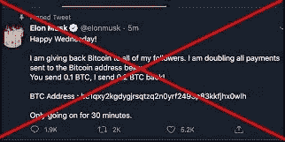
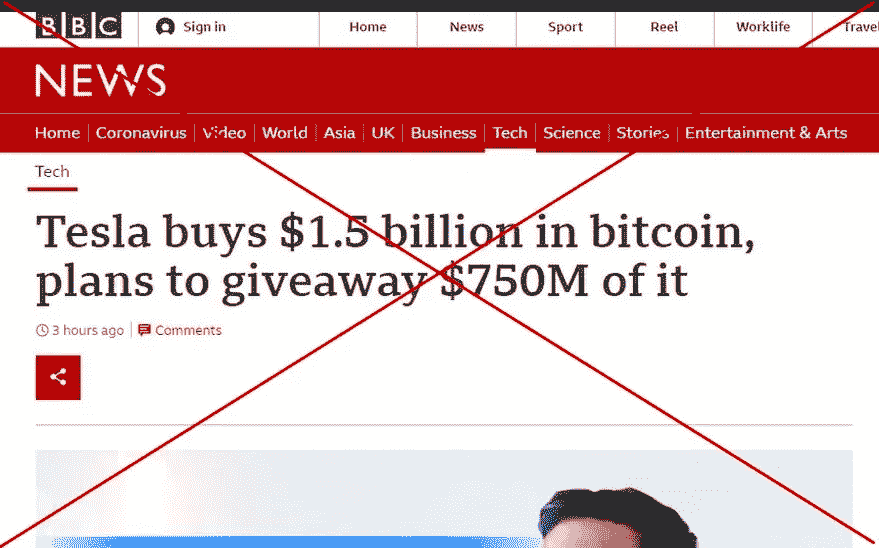
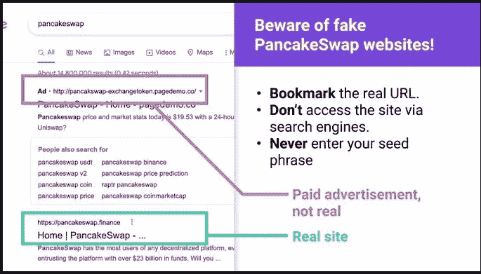
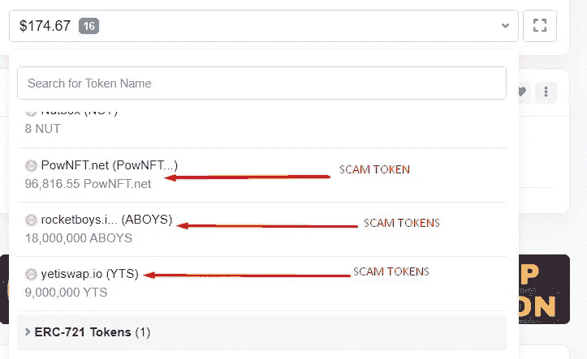
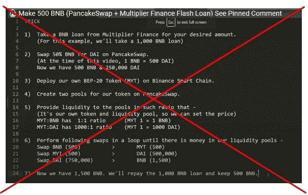

# 揭露 7 起伤害加密货币的骗局

> 原文：<https://medium.com/coinmonks/7-hurting-cryptocurrencies-scams-revealed-fb7310da885?source=collection_archive---------9----------------------->

阅读这篇文章来节省你辛苦赚来的钱

Elon Musk Scam

我中了其中一个骗局。

现在，作为一名加密社区管理员，我将通过揭露这些骗局来保护我如此热爱的社区。

2017 年买的第一个比特币就被骗走了。当我试图购买时，2020 年，我又被骗了。

从那以后，我意识到，在这个市场上，人们需要对无处不在的骗局保持高度警惕。

通过经验和研究，我整理了一份 2021 年让投资者和交易者损失了 140 亿美元的各种加密货币骗局的清单。

以下是各种骗局和如何不成为受害者的警告。

1.  **埃隆·马斯克骗局:**埃隆·马斯克骗局在 Telegram 的一个群上发布后，我立即开始写这篇文章。2020 年，一个朋友差点就中了这个骗局。这个骗局很大，有些版本甚至使用假冒的 BBC 网站，如果你不小心，你不会注意到。

Elon Musk Scam

**怎么做**

*   他们发布消息称，埃隆·马斯克提议给人们特定数量的比特币。使用一个埃隆·马斯克的假推特账号，外加一个临时拼凑的推特验证标志。他们还制作了一个假的媒体网站，看起来像埃隆·马斯克在 Medium (dot) com 上的帖子，另一个版本使用假的 BBC 网站欺骗粗心的观众。
*   帖子会要求你发送一定数量的比特币，以获得两倍的发送金额。
*   如果你发送了，你不会得到任何比特币作为回报。

**小心**

*   不要向任何承诺双倍奖励你的人发送比特币。
*   向 Twitter 举报该账户，这样其他人就不会上当受骗

2.假冒市场网站骗局:最猖獗的骗局之一是复制 Pancakeswap 这样的市场网站。通常，不警惕的用户会被提示将他们的加密钱包连接到虚假网站进行交易，而骗子则会擦除他们钱包中的令牌。

**如何完成**

*   他们为一个项目制作一个假网站。我见过很多山寨版的 PancakeSwap。
*   他们在虚假网站上发布广告。举个例子，我在谷歌上搜索 Pancakeswap，在搜索结果的最上面有一个虚假的 PancakeSwap 网站广告。
*   一旦你登录网站，连接你的钱包进行任何交易，他们就会清除你账户中的代币。

**注意事项**

*   仔细检查您将连接钱包的任何网站的 URL
*   如果您使用谷歌搜索或任何其他搜索引擎进入市场，请确认该网站是否是您打算访问的原始网站。
*   把你经常连接到钱包的任何平台的网址记下来或者标上书签是安全的。这样，当你下次需要使用这个平台时，你就可以得到原来的网址。

3.**空投骗局**:空投骗局的形式多种多样，我将讨论最常见的两种。他们中的一些人也使用虚假网站的骗局，但通过空投的诱惑。

**首次空投骗局**(是如何做到的)

他们把他们的令牌空投到你的钱包里

他们将自己的网站 URL 附加到这个令牌上，这样您就可以看到该 URL

如果您访问该网站并将您的钱包连接到他们的应用程序，他们会清除您的令牌

**小心**

如果你在钱包里发现代币，但不知道它们是怎么来的，不要试图出售或寄送代币。

如果你必须申请空投，用一个空的钱包。这将降低诈骗瞄准你钱包的几率。所有这些骗子都用代币搜索钱包，并清空钱包。

Scam Token Airdrop

4.**第二次空投骗局**(是如何做到的)

宣布有一个 XZY 平台空投

你可能会在受信任的影响者的社交媒体领域看到这个公告(他们克隆了影响者的社交媒体身份)

一旦你决定加入空投，访问他们的网站，连接你的钱包，他们就会把你的账户清空。

**注意事项**

*   每次空投时使用一个空钱包(如果组织者告诉你必须使用一个有交易记录的账户，离开空投)
*   仔细检查每个社交媒体影响者的推荐句柄有时会被黑客攻击或克隆，以延续骗局。

5.**即时通讯诈骗(telegram，Discord)** :很多诈骗发生在 Telegram 和 Discord 上。我将讨论即时通讯应用程序中最常见的三种骗局。去年我就中了其中一个骗局。

**第一个即时消息骗局(是如何做到的)**

*   他们组成了一个交易者社区或秘密投资团体。
*   如果是一个交易团体，他们显示成员之间的无摩擦交易(他们也是骗子)
*   当你认为它们是真的，并且你选择与发布出售或购买要约的人进行交易时，他们会要求你将菲亚特送到托管处。作为骗局一部分的托管将持有你的资金，但其他人不会资助你的钱包。
*   他们稍后会将你从群组中移除。这就是一个人如何失去辛苦赚来的钱

**注意事项**

*   不要在 Telegram group 或 Discord 上买卖密码。
*   当您发现自己被添加到某个组时，请立即离开。
*   做这个黑客，阻止任何人添加你到一个组(在电报上进入设置-隐私和安全-组-我的联系人)。它会保护你不被加入一个可疑的团体

**6。第二个即时消息骗局(是如何做到的)**

*   它通常发生在一个合法的团体中，并且经常发生在项目刚刚启动或者推出一个新特性的时候。
*   骗子会假装以管理员的身份帮你回答你在群里提出的问题。
*   一旦你中了他当管理员的诡计。他可能会要求你分享你的种子短语或发送一些密码到一个给定的钱包，甚至给你一个错误的合同地址。

**注意事项**

*   合法的密码管理员绝不会先私信你。

**第三个即时消息骗局(是如何做到的)**

*   骗子黑了一个项目组。
*   用各种错误信息骗人，比如错误的合同地址。如果你使用合同地址购买，你会得到不可出售的代币。

**小心**

*   跨平台检查，确认某个项目组是否被黑。举例来说，如果你认为某个小组有问题，检查一下这个项目的平台，比如 Twitter，你可能会得到这个小组被黑的信息。
*   使用 coinmarketcap 或 coingecko(如果项目已经列出)来验证您在平台上获得的地址。
*   如果你能更进一步，使用 ether scan 或 BnB smart chain scan 或项目所基于的区块链来验证地址。

7.**煎饼贷快闪骗局:**通过这种手段被骗的人，试图不劳而获。

这是如何做到的

*   他们给你一个程序脚本，你在你的系统上运行，从 PancakeSwap 获得贷款。当然，你必须允许这个脚本连接到你的钱包。
*   一旦你在你的系统上运行这个脚本，它就从你的钱包里抹去你的代币，而不是给你你想要的 PancakeSwap 的贷款闪付。

**注意事项**

*   不要试图不劳而获，因为这可能会严重伤害你
*   不要运行对账单上给你的任何程序脚本

PancakeSwap Flash Loan scam

这些是我认为常见的一些，对我们中的一些人来说可能不常见，在这个领域需要非常小心。

我们可以继续帮助加密社区，在评论中分享你的加密骗局经验，并让其他人从中学习。

> 加入 Coinmonks [电报频道](https://t.me/coincodecap)和 [Youtube 频道](https://www.youtube.com/c/coinmonks/videos)了解加密交易和投资

# 另外，阅读

*   [币安期货交易](https://coincodecap.com/binance-futures-trading)|[3 comas vs Mudrex vs eToro](https://coincodecap.com/mudrex-3commas-etoro)
*   [如何购买 Monero](https://coincodecap.com/buy-monero) | [IDEX 评论](https://coincodecap.com/idex-review) | [BitKan 交易机器人](https://coincodecap.com/bitkan-trading-bot)
*   [CoinDCX 评论](/coinmonks/coindcx-review-8444db3621a2) | [加密保证金交易交易所](https://coincodecap.com/crypto-margin-trading-exchanges)
*   [红狗赌场评论](https://coincodecap.com/red-dog-casino-review) | [Swyftx 评论](https://coincodecap.com/swyftx-review) | [CoinGate 评论](https://coincodecap.com/coingate-review)
*   [Bookmap 评论](https://coincodecap.com/bookmap-review-2021-best-trading-software) | [美国 5 大最佳加密交易所](https://coincodecap.com/crypto-exchange-usa)