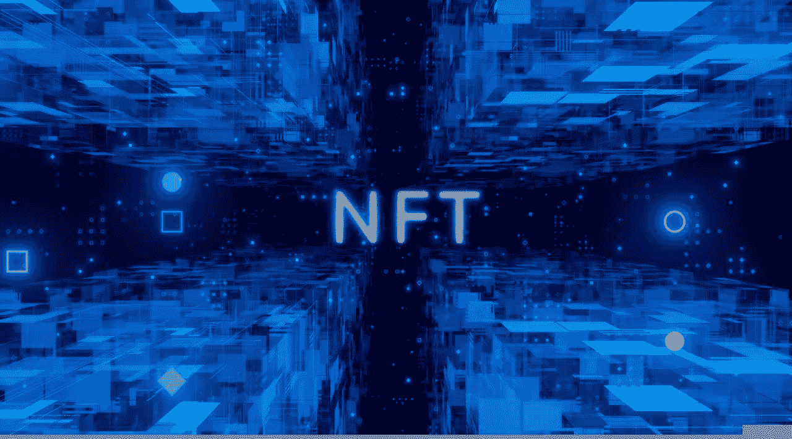
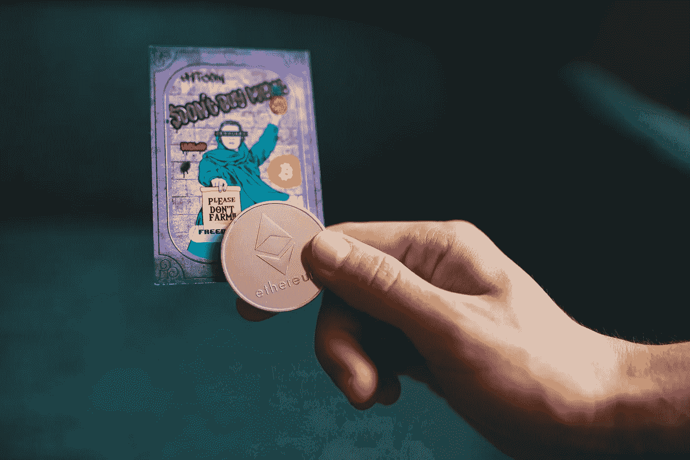

# 2022 年最常见的 7 种非正规金融工具。

> 原文：<https://medium.com/coinmonks/7-most-common-types-of-nfts-in-2022-7471dd71486a?source=collection_archive---------48----------------------->

Source: Pixabay.com

当推特的创始人杰克·多西以 290 万美元的价格卖出世界上第一条推特时，NFT 市场引起了很大的兴趣。自那以后，NFT 市场的交易活动大幅增加。

在 NFT 市场，似乎有大量的数字艺术，但还有哪些其他类型的非数字艺术呢？

> **另见:** [**分权财政(DeFi) vs 集权财政(CeFi)。**](/@ilekeairende/decentralized-finance-defi-vs-centralized-finance-cefi-ede87a0bde07)

**NFT 入门**

Source: Unsplash.com

数字代币在技术领域并不新奇。事实上，第一个 NFT 是在 2014 年发行的，仅仅 6 年后，NFTs 的市值已经达到近 20 亿美元。2020 年总销售价值接近 2.5 亿美元。

NFT 是用于表示唯一项目所有权的令牌。它们允许我们将艺术品、收藏品和房地产进行标记。它们只能有一个官方的所有者，并且受到以太坊区块链的保护，所以没有人能够改变所有权记录，创造一个新的 NFT。

任何事都可能成为 NFT，这离事实不远了。有资格成为 NFT 的人没有限制。

**以下是 2022 年最常见的 NFT 类型；**

**1。NFT 收藏品**

随着 Cryptokitties 的出现，NFT 被视为收藏品的第一个例子发生在 2017 年，crypto kitties 是一种在收藏家中广受欢迎的数字小猫。这也被认为是 NFT 的首次应用。

2017 年，Cryptokitties 如此受欢迎，以至于堵塞了以太坊网络。Cryptokitties 是数字收藏品不可替代令牌列表中最值得注意的新增内容之一。他们是数码小猫，具有独特的特征，使他们比其他人更受欢迎，更受欢迎。

**2。数字交易卡。**

NFT 可以比作虚拟交易卡。我们都很熟悉一些限量版棒球卡在二级市场上可以卖到数万美元的价格，NFT 市场也不例外。可以在市场上购买和交易虚拟交易卡，并保存它们，就像它们是你拥有的真实交易卡一样。似乎这还不够，一些复制品的价格超过了 100 万美元。

> **另见:** [**为什么加密市场这么野？推动密码市场的因素。**](/geekculture/why-is-the-crypto-market-so-wild-factors-that-move-the-crypto-market-10f9267e3d1c)

**3。NFT 艺术**

今天，绝大多数不可替代的代币是可编程艺术品，占所有非功能性交易的 99%。这是因为艺术家们很快利用了 NFTs 的发展。

虚拟艺术品，如数码照片、gif 和短视频，现在正以与当今时代实体商品相同的方式在网上出售。这些也是最贵的 NFT，通常售价高达数百万美元。

**4。音乐和其他媒体形式**

NFTs 也在音乐和媒体中进行实验，创造了一个新的 NFTs 类别。音乐和电影等媒体文件可以链接到 NFTs，允许拥有合法所有权的人访问这些文件。Rarible 和 Mintbase 是两个最受艺术家欢迎的平台，他们希望将自己的歌曲制作成 NFT。

听众获得优质的体验，而艺术家有机会直接与他们的粉丝联系并吸引新的粉丝。将 NFTs 整合到音乐中的一个主要原因是购买它所带来的独特感。增加不可替代令牌列表上的音乐不可替代令牌(NFT)的数量可能为打击音乐盗版和中介提供有希望的前景。

音乐人喜欢 NFT，因为这让他们可以保留更大一部分收入，因为他们不必与唱片公司或流媒体平台分享这些收入。

**5。游戏 NFTs**

NFT 激起了许多游戏开发者的兴趣，他们现在正在广泛使用它。在线游戏平台使用 NFT 作为游戏中的物品。通过游戏中物品不可改变的所有权记录，不可替代的代币有助于推动游戏经济的发展。

仅游戏内内容，如角色、皮肤等。，而不是整个游戏，作为非功能性游戏出售。NFT 的另一个应用是将 DLC 资产的限量版出售给希望利用 NFT 资产的排他性的玩家。然而，这并不妨碍该公司出售其标准的 DLC。

> 加入 Coinmonks [电报集团](https://t.me/joinchat/Trz8jaxd6xEsBI4p)，了解加密交易和投资

**7。令牌化资产**

有很多传言说 NFT 将来会在现实世界中作为代币使用。NFT 领域的进展正朝着这一目标前进，而且实现的可能性很大。

NFT 提供的所有权的加密证明使它们能够代表真实世界的资产。许多 NFT 项目目前正专注于奢侈品和房地产的符号化。与 NFT 契约，你有更多的选择时，购买房屋或车辆。

现实世界资产和艺术品的令牌化可以促进不可替代令牌的采用。结合区块链和物联网可以为扫描资产上的条形码或标签提供有趣的机会。艺术品中的 NFT 字体有助于在区块链网络上注册真实世界的艺术品所有权。随后，用户可以发现一件艺术品的完整历史，包括以前的所有者和它过去的销售价格。

**8。迷因**

就 NFT 的销售而言，迷因是近年来最重要的因素。尽管非功能性翻译在互联网和流行文化中广受欢迎，但它还是与模因联系在一起。模因作为非功能性食物出售表明，模因创造者准备建立一个不断扩大的未来生态系统。