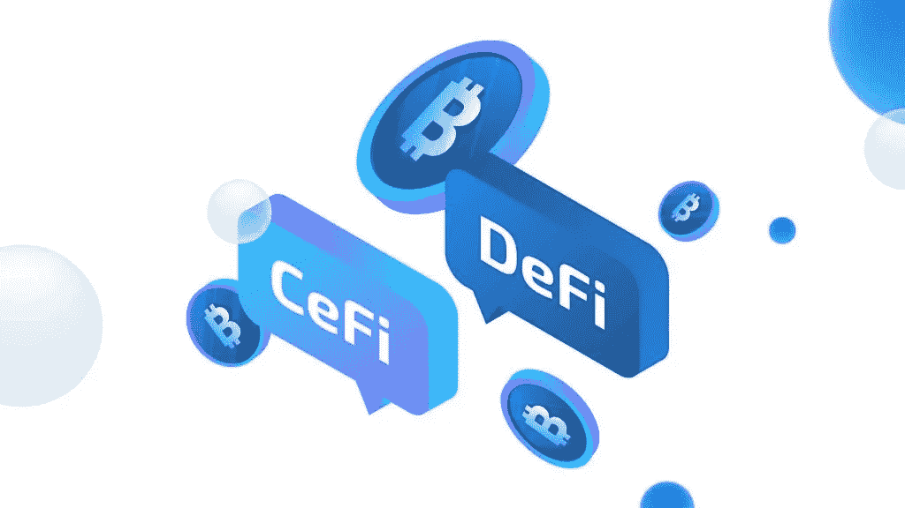

# 2030 年区块链创新的 7 个预测

> 原文：<https://medium.com/coinmonks/7-predictions-on-blockchain-innovation-for-2030-5b5b7f5c0879?source=collection_archive---------46----------------------->

# 区块链创新

故事最初发表于[https://koop 360 . com/blog/7-2030 年区块链创新预测/](https://koop360.com/blog/7-predictions-on-blockchain-innovation-for-2030/)

> *最近几年，区块链创新得到了很多预测。然而，开始是 2017 年比特币成本的突然溢出，这给世界带来了一场旋风。从这一点来看，区块链正在发生的事件，公共和私人舞台，以及区块链的能力都在快速增长。*

此外，比特币是一种数字货币，区块链是一种公共记录，是迄今为止讨论最多的主题，这揭示了它们隐藏的一些方面。因此，研究人员和企业培育了许多区块链相关和加密的货币预测，这些预测可能在 2030 年成为现实。然而，基本上与货币行业有关，其他一些人，如人工智能(AI)，正在另外研究利用 [**区块链技术**](https://koop360.com/blog/what-is-blockchain/) 的令人兴奋的方式。

# 1.区块链和物联网将联手(物联网)

根据一份统计报告，到 2022 年，市场上将有超过 200 亿件物联网设备。无论是智能小工具、机器，还是智能芯片，物联网的利用都将不可避免。这些数量庞大的物联网设备将始终与网络联系在一起，这意味着巨大的数据传输。

不仅如此，我们还想收集和存储这些信息。区块链将为这些小工具提供一个可靠、安全和专业的机制，以便彼此进行交易。区块链将保留所有通信的固定记录，并将授权快速分期付款结算。

这将有助于

–在人群和小工具之间建立信任；

–减少改动的风险；

–通过消除局外人来降低费用；

加快交流。

# 2.区块链将是游戏业务的新研究领域

基于区块链的加密货币是非标准的数字货币，游戏业务确实可以接受。随着数字货币和区块链的领先普及，游戏业务也将执行和采用它。通过这种方式，[游戏业务](https://koop360.com/blog/play-to-earn-business-model-in-gaming/)将成为新区块链功能的理想试验场。

# 3.政府将采用该系统

我们可以预计，到 2030 年，应该会有更多的政府和组织实施区块链技术。直到现在，还没有任何法规或指导方针来控制它。尽管如此，传送记录和智能合同带来了大量的法律问题。

因此，很明显，随着 resting，区块链的合法性和重要性将发生变化，并传达了创纪录的进展安排。此外，它属于企业社会责任(CSR)、一致性和道德行为方式。

# 4.所有人的区块链身份

基于区块链的身份系统分散了信息收集。此外，利用协议系统交叉检查收集的信息，并将这些数据存储在分散的永久记录中。此外，它减少了安全破坏的风险，总体上更高的可靠性，效率，最重要的是，自我摇摆。

此外，基于区块链的设备将有效地获取并跟上合法文件。此外，由于它作为一个传达的记录框架，它将比声称一个焦点权力更安全和更可靠。此外，这样的身份系统将保持个人安全。在这种独特的情况下，人们将有权透露身份信息。

# 5.“零知识”证据的利用将是重要的

还有，区块链是至少两个群体或社区之间交流的强大舞台。“零知识”是一种使用数字活动的加密设备，允许一个聚会/团体向另一个进行演示。我们可能知道，有两种密钥:公钥和私钥。这里的优点是检查不需要额外的数据，如私钥公开密钥加密。

因此，在“零知识证明”的思想中，不同的群体只是意识到发生了合法的交换。然而，他们对聚会的细节一无所知。因此，在没有不变性和公开重复性的情况下，区块链可以跟上安全和保护。

# 6.利益证明(PoS)将继续主导区块链共识游戏

自从以太坊从工作证明转变为利益相关协议分析证明后，许多人发现了利用它的巨大好处。在像工作证明这样的传送协议中，挖掘者需要大量的能量，而利益证明(PoS)可以完全减少巨大的电力使用。此外，它还降低了设备成本。因此，为了在未来几年获得更便宜的转让类型的协议，区块链人员小组将不断利用股权协议系统的证据。

# 7.分散财政的进展

为了跟上创新领域的快速变化，投资和基金领域也应该向前发展。尽管这个想法有许多怀疑者，但所有目前的金融系统都将在 2030 年前数字化，因为区块链技术现在可以完成什么。例如，去中心化金融(Defi)打破了世界各地的个人比其他早期金融流程更快地考虑现金的方式。此外，Defi 开始给出一个前景，可以重塑经济场景和民主化的金融准入。

**结论**

到 2030 年，数字世界将毫无疑问地发展到预测它会是什么样子几乎是不可能的。然而，有一吨期待，从访问不同的星球，创造飞行机器人，开采太空岩石，反对成熟的药物，飞行汽车，地下道路，对机器人的假一般洞察力，先进的货币跃进。该行业在不久的将来拥有辉煌的所有特征。

正如我们最近提到的， [**KOOP360**](https://koop360.com/) 是世界上最初翻新的、开源的、无政府状态的机器人改进条件，在这里，NFTs 和元宇宙环境可以利用 AI/ML 创新立即构建或创建。创建、建造或培养 NFT 高级工艺，然后在 KOOP360 商业中心使用基本的安装和播放方法进行销售。

由于人类的接触，自创代码提供了一个将虚拟/扩展现实与自然相结合的元宇宙。然而，和过去一样，进步可以在同等程度上展现我们最好的和最糟糕的一面——事实是，任何发展在 2030 年都存在，我们如何利用它将对我们产生价值，不管我们是否完成了此时概述的所有事情。

> 交易新手？尝试[加密交易机器人](/coinmonks/crypto-trading-bot-c2ffce8acb2a)或[复制交易](/coinmonks/top-10-crypto-copy-trading-platforms-for-beginners-d0c37c7d698c)