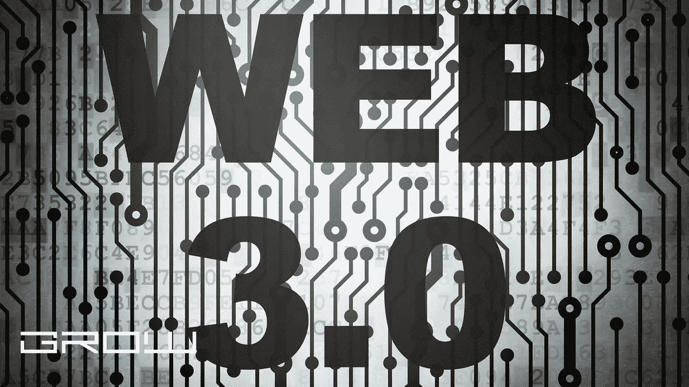

# 你的老板想知道的关于 Web3 的 7 件事

> 原文：<https://medium.com/coinmonks/7-things-about-web3-your-boss-wants-to-know-efa81075aee4?source=collection_archive---------33----------------------->

WEB3

与任何新兴市场一样，区块链面临着几个可能限制其潜力的障碍。然而，乐观情绪仍然存在。确实如此——高盛的一项研究预测，Web3 技术每年将为银行节省 200 亿美元的基础设施成本。

如果你正在管理一个组织，并且希望了解更多关于 Web3 的知识，以便更好地做出商业决策，那么这篇文章就是为你准备的！在这里，我们列出了你应该知道的关于 Web 3.0 的 7 件事。

# 1.Web 3.0 是下一代网络

网络是一项惊人的创新，它让我们能够获取信息、资源，以及在哪里可以立即找到它们，从而让我们的生活变得更加轻松。网络的最初概念在今天我们生活的许多方面仍然非常重要——它现在被称为 Web 1.0。然而，随着手机和社交媒体平台等新技术的出现，网络的最初目的正在变得过时。因此，现有消费者不再使用它，而是在其他领域(如社交媒体)花费更多时间。因此，这些领域的新应用正在以我们尚未相应开发的速度发展(见下文)。

Web 3.0 是 Web 的下一次迭代，也就是说，它将是对其前辈的重大改进。它将为用户提供更强大、更具互动性的体验，让他们可以做以前无法做的事情(比如用一种简单的方式互相支付)。

# 2.Web 3.0 是下一代技术

Web 3.0 可以被认为是下一代技术，它将根据新应用程序以及当前应用程序的新用例来定义。这是建立一个更加无缝的互联网的下一步，也是一种与互联网互动的方式，在这种方式下，用户会感到联系更加紧密，能力更强。

例如，想象一下能够无缝地将钱汇给某人，而不必经过重重关卡，或者不必为每一笔小交易去另一个网站。或者想象一个让客户生活更轻松的系统。想想你在确认屏幕上花了多少时间才能完成一件事:你能想象没有任何形式的确认或授权的生活吗？

# 3.Web 3.0 比您想象的更近，而且这一切正在发生！

这篇文章的灵感来自于许多人问我什么是 Web 3.0，所以让我们来看几个例子，看看这是如何出现的。

博物馆和画廊使用区块链通过跟踪记录和根据需要转移所有权来保护他们的艺术品免受欺诈交易。Web 3.0 技术可能很快会促进加密货币的交易。面向移动设备的应用程序，比我们现在拥有的(如 Signal)更加用户友好、直观和通用。尝试完全取消密码——例如，在基于区块链的应用程序 Keychain 中使用你的指纹来访问你在不同平台上的个人信息。很可能会有更多关于数字身份及其未来应用的指导方针。

# 4.区块链(和 Web 3.0)很难理解

如果你想知道 Web 3.0 与区块链有何不同，你并不孤单。虽然它们看起来是相同的技术，但它们是两种不同的东西，它们之间有重叠，如下图所示:

Web 3.0 技术包含“区块链”及其环境或生态系统(有时称为 Web 或 Internet 3.0)。请这样想:当我们谈论“web 技术”时，我们指的是由许多代码组成的系统——因此可以涉及多种技术——因此有了“Web”这个概念。这与区块链非常不同，后者只是称为“区块链”的技术的架构或框架。“例如，没有我们可以称之为‘JavaScript’的 Web 3.0 技术——这只是指许多特性被编码的语言。

# 5.主页将很快看起来更像移动应用

如果 Web 3.0 是如此的酷和必要，为什么不是所有的网站都在利用它呢？为什么每一篇关于区块链的文章我们都要提？嗯，这是因为开发人员不愿意相信他们的用户会像以前一样继续使用主页。相反，大多数人会跳到能让他们尽快完成他们想做的任务的系统上。因此，网络开发公司正在创建看起来更像本地应用程序的网站。

这意味着浏览网页的时间更少，但不要气馁！我们还需要一段时间才能看到这成为一种普遍的做法，我们中的许多人仍然喜欢我们的传统主页。但这迟早会发生——看看 Snapchat 就是一个例子。它已经成为一个几乎只被千禧一代使用的应用。事实上，一些公司现在更喜欢通过 ICOs(首次发行硬币)出售代币(加密货币)来筹集资金。

# 6.Web 3.0 是一个需要考虑的问题

在本文中，我们只提到了 Web 3.0 的一些方面。但重要的是要注意，还有很多其他因素使这个系统与众不同，不同于最初的网络概念。这里有几个例子:

它的构建支持多种标准，使用了一些新的方法和工具，代码是开源的，允许其他人在必要时对其进行改进，没有任何限制，该技术在移动设备上运行良好， 它在分散的网络中运行得很好，它使用分布式分类帐等区块链概念，我们何时能看到 Web 3.0 技术被广泛采用还没有明确的开始日期，因为它已经在使用中，并在继续发展，它将被构建为具有可挖掘的价值令牌，它使用一种高级形式的加密技术来保护交易，如 zk-Snarks(私有和公共验证)。

# 7.怎样才能涉足 Web 3.0？

如果你有兴趣成为新互联网的一部分，但不知道从哪里开始，这里有你可以参与并做出贡献的方法。首先，看看这篇来自 Crypto Briefing 的关于在投资区块链技术之前应该寻找什么的文章:在投资之前应该在区块链项目中寻找什么。那么，这里有一些最好的贡献方式:

成为致力于 Web 3.0 技术的开源项目的一员，如 ARK(新平台)或 Decred(去中心化治理)。挖掘加密货币。把采矿看作是在这个新系统中创造新区块的过程的一部分。这是一种通过加密来验证交易的方式。投资那些从事 Web 3.0 项目的公司，就像我们刚刚看到的那样。你还可以找到许多 ico(首次发行硬币)的良好评论，以做出明智的投资决定。

请记住，这仍然是 Web 3.0 的早期阶段，但它将改变你对互联网以及围绕它的行业和商业模式的看法。随着 Web 3.0 和分散自治组织等令人兴奋的发展，现在参与进来并有所作为并不为时过早。

你觉得怎么样？Web 3.0 与区块链有何不同？

本文由 Crypto Briefing 的团队提供，Crypto Briefing 是世界领先的加密货币新闻和信息来源，致力于为您带来关于区块链技术的有意义的故事。你可以关注脸书或 Twitter 上的 Crypto Briefing，了解区块链技术的所有最新更新。

> 加入 Coinmonks [电报频道](https://t.me/coincodecap)和 [Youtube 频道](https://www.youtube.com/c/coinmonks/videos)了解加密交易和投资

# 另外，阅读

*   [最佳期货交易信号](https://coincodecap.com/futures-trading-signals) | [流动性交易回顾](https://coincodecap.com/liquid-exchange-review)
*   [火币的加密交易信号](https://coincodecap.com/huobi-crypto-trading-signals) | [Swapzone 审查](/coinmonks/swapzone-review-crypto-exchange-data-aggregator-e0ad78e55ed7)
*   最佳[密码交易机器人](https://coincodecap.com/best-crypto-trading-bots) | [购买索拉纳](https://coincodecap.com/buy-solana) | [矩阵导出评论](https://coincodecap.com/matrixport-review)
*   [Coldcard 评论](https://coincodecap.com/coldcard-review) | [BOXtradEX 评论](https://coincodecap.com/boxtradex-review)|[uni swap 指南](https://coincodecap.com/uniswap)
*   [比特币基地评论](/coinmonks/coinbase-review-6ef4e0f56064) | [德里比特评论](/coinmonks/deribit-review-options-fees-apis-and-testnet-2ca16c4bbdb2) | [FTX 评论](/coinmonks/ftx-crypto-exchange-review-53664ac1198f)