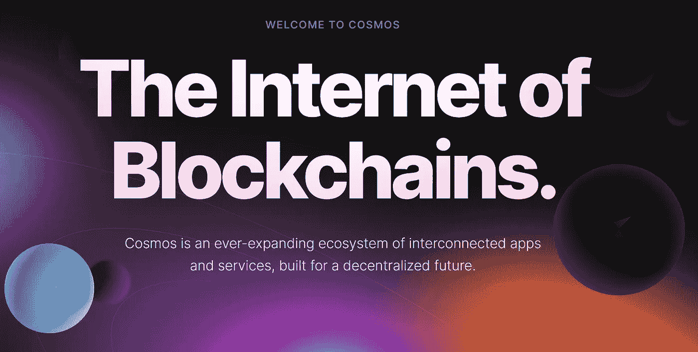

# 关于宇宙(原子)你需要知道的 7 件事

> 原文：<https://medium.com/coinmonks/7-things-you-need-to-know-about-cosmos-atom-bb16f52cfdb0?source=collection_archive---------1----------------------->

Tendermint 共识模型、Hubs & Zones、区块链间通信、ATOM token 等等！

Cosmos: The Internet of Blockchains

Cosmos 是“区块链 3.0”运动的领导者之一。实现可扩展和可持续的“块间链通信协议”是该项目的主要焦点。

在这个故事中，我将解释关于这个项目你需要知道的 7 件事…