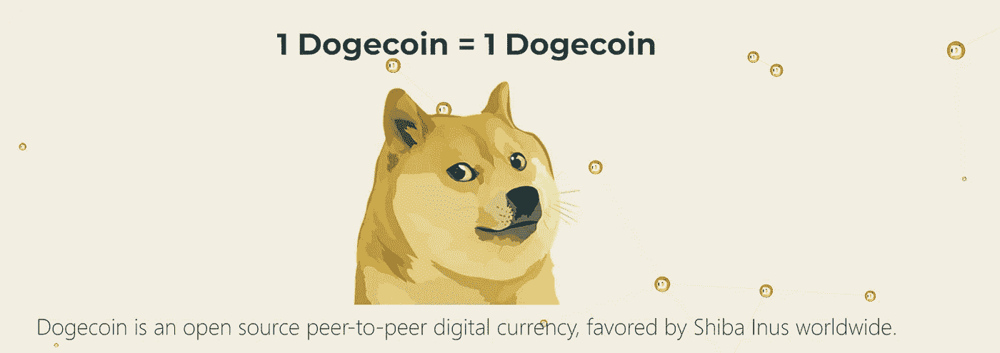

# 关于 Dogecoin (DOGE)你需要知道的 7 件事

> 原文：<https://medium.com/coinmonks/7-things-you-need-to-know-about-dogecoin-doge-d492065fd63f?source=collection_archive---------16----------------------->

## 创始人，节点，钱包，最大供应，等等！

Dogecoin 是一个 MEME token，最初是在 2013 年作为 Litecoin 的一个分支创建的。该项目的编码人员把 Dogecoin 开发成了一个笑话。后来，围绕硬币和埃隆·马斯克(特斯拉首席执行官)的社区帮助 DOGE 获得了知名度。