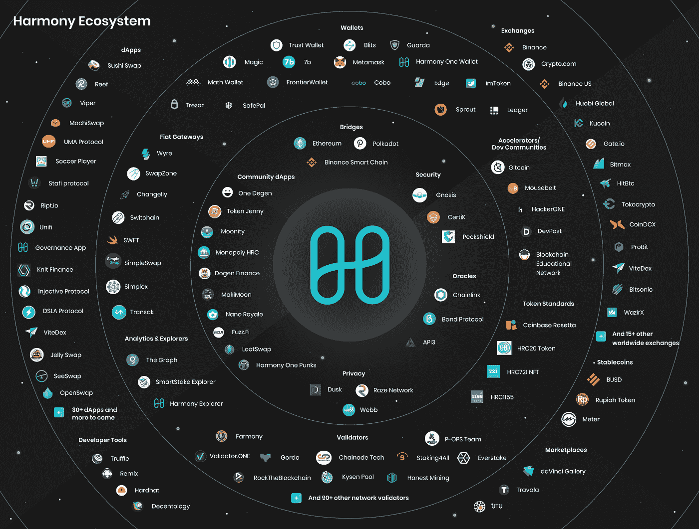

# 关于和谐你需要知道的 7 件事(一)

> 原文：<https://medium.com/coinmonks/7-things-you-need-to-know-about-harmony-one-804e997726a1?source=collection_archive---------10----------------------->

## 分片、最终交易和费用、有效的股权证明、一个令牌等等！

Harmony 是一个智能合约平台，成立于 2017 年。该平台的主要创新是在几秒钟内创建块的“随机状态分片”。这大大减少了验证时间。此外，由于以下特性，例如…