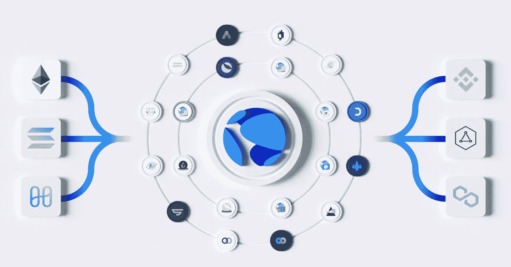

# 关于 Terra (LUNA)你需要知道的 7 件事

> 原文：<https://medium.com/coinmonks/7-things-you-need-to-know-about-terra-luna-dd41e2f522c6?source=collection_archive---------4----------------------->

算法稳定币模型，授权/验证赌注奖励，bLuna 代币，等等！

source: [terra](https://www.terra.money/)

Terra 是一个创新的区块链平台，支持各种算法 stablecoins，如 TerraUSD(与美元挂钩)和 TerraKRW(与韩元挂钩)。它还向用户提供 LUNA 令牌，作为赢取奖励的可兑现令牌。