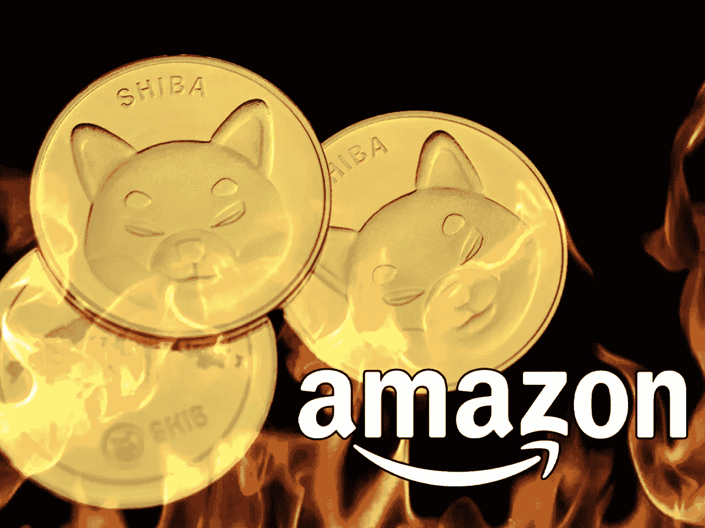

# 7000 万 SHIB 被烧毁

> 原文：<https://medium.com/coinmonks/70-million-shib-burned-1875c5a23e1b?source=collection_archive---------64----------------------->

世界上最大的加密货币交易所将于 6 月 23 日开始对 Tron 钱包进行维护。维护程序将持续一个小时，在此期间，所有存款和取款都将暂停。

但是，Tron 交易操作在钱包维护期间不会受到影响，并将继续。币安不打算就技术程序的开始或结束作任何进一步的宣布。一周前，币安突然暂停比特币的存款和取款，称该问题是由链上交易停滞引起的。

游戏开发商兼网店店主在推特上发布消息称，在周日的例行焚烧中，他销毁了超过 7000 万枚迷因币。他在网店出售自己的手机游戏和 SHIB 品牌商品。

大约一个月前，这家商店被亚马逊联盟计划选中，该计划还允许购买 SHIB，使用佣金，然后将这些代币添加到通用燃烧罐中。柴犬是用智能手机游戏中的广告以及出售上述商品的部分利润购买的。

没有一种加密货币或与加密相关的项目能够免于批评，Cardano 也是如此，它经常被比作一条幽灵链。作为对这样一条谩骂推文的回应，Cardano 的创始人查尔斯·霍斯金森(Charles Hoskinson)站起来为他的创意辩护，称他和 ADA 社区需要得到这样的信息，即 Cardano 不是一条幽灵链，智能合同就在这里。

在另一篇文章中，Hoskinson 写道，Cardano 需要一支军队来改变世界，但仅仅通过与无辜和纯洁的人交谈是无法做到这一点的。

目前，根据 CoinMarketCap 的数据，按市值计算，Cardano 是第七大加密货币。其原生资产 ADA 以 0.5 美元的价格易手，在过去 24 小时内上涨了 3.4%。

一位著名的比特币最大化专家预测，今年，比特币将飙升至 22 万美元的水平，这表明了发生这种情况的一个坚实的原因。这个原因是中本聪严格限制比特币的供应量。

此外，每四年就会出现所谓的减半现象。已经开采了超过 1800 万个比特币，生产剩下的 300 万个需要很多年。上一次 BTC 减半发生在 2020 年 5 月初，因此下一次预计在 2024 年。今年早些时候，凯瑟分享了类似的预测，称 BTC 价格的高增长将先于比特币散列率的大幅增长。

点击这里关注我们了解更多故事[。](http://t.me/etell)

> 加入 Coinmonks [电报频道](https://t.me/coincodecap)和 [Youtube 频道](https://www.youtube.com/c/coinmonks/videos)了解加密交易和投资

# 另外，阅读

*   [如何在 FTX 交易所交易期货](https://coincodecap.com/ftx-futures-trading) | [OKEx vs 币安](https://coincodecap.com/okex-vs-binance)
*   [CoinLoan 评论](https://coincodecap.com/coinloan-review) | [YouHodler 评论](/coinmonks/youhodler-4-easy-ways-to-make-money-98969b9689f2) | [BlockFi 评论](https://coincodecap.com/blockfi-review)
*   [XT.COM 评论](https://coincodecap.com/profittradingapp-for-binance)币安评论 |
*   [SmithBot 评论](https://coincodecap.com/smithbot-review) | [4 款最佳免费开源交易机器人](https://coincodecap.com/free-open-source-trading-bots)
*   [比特币基地僵尸程序](/coinmonks/coinbase-bots-ac6359e897f3) | [AscendEX 审查](/coinmonks/ascendex-review-53e829cf75fa) | [OKEx 交易僵尸程序](/coinmonks/okex-trading-bots-234920f61e60)
*   [如何在印度购买比特币？](/coinmonks/buy-bitcoin-in-india-feb50ddfef94) | [瓦济克斯审查](/coinmonks/wazirx-review-5c811b074f5b)