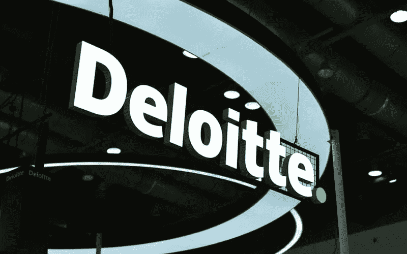
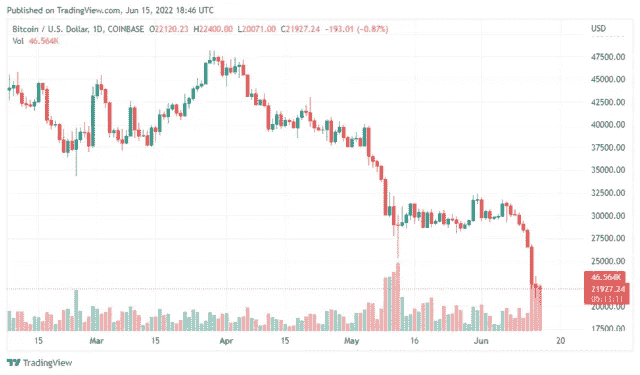

# 美国 75%的零售商在两年内添加了加密技术

> 原文：<https://medium.com/coinmonks/75-of-retailers-in-u-s-adding-crypto-in-two-years-aeae0c8d0339?source=collection_archive---------69----------------------->

尽管加密市场的现状看起来非常可怕，但数字资产自诞生以来一直在不断扩大其影响范围。同样，美国在过去一年中也大量采用了加密技术，并将在未来继续采用区块链技术。

由专业公司德勤(Deloitte)与支付巨头贝宝(PayPal)合作进行的一项调查得出结论，美国四分之三的零售组织计划在未来两年内支持数字转移。去年 12 月，名为“商家准备好加密”的活动汇集了美国零售组织的 2000 名高管，以了解商家如何对待加密支付。

> 大多数商家认为客户的兴趣将在明年增加，近 75%的商家表示计划在未来 24 个月内接受 stablecoin 支付，几乎相同的商家表示计划接受加密货币支付。

参与的零售商高管对数字货币表现出很高的利率。他们中的大多数人预计虚拟货币将成为日常用品，因为他们看到未来几年将会大规模采用。

> 几乎所有的受访者都认为，未来几年，数字货币在日常购物中的使用将会增加。

根据调查报告，87%的受访者肯定，在传统业务中纳入数字传输为他们提供了“竞争优势”。同样，83%的零售商认为数字资产将在近十年内获得法定货币。而 85%的受访者表示，他们认为数字货币将在未来五年内在各自行业中呈指数级增长。

# 商户构建基础设施以集成加密支付

理所应当的是，来自多个行业的众多高管参与了调查。它包括化妆品、数码产品、时尚、休闲、酒店、电子、交通、食品和饮料以及其他零售行业。

德勤表示，由于商家已经渴望采用数字支付服务，超过一半的收入超过 5 亿美元的大型零售商正在花费 100 万美元或更多的资金来建立基础设施，以便在未来注册数字支付。

不仅大型卖家投资开发必要的基础设施，小型企业也进行了大量投资，以支持未来的数字交易。根据该报告，收入在 1000 万至 1 亿美元之间的小公司正在投资 1 万至 100 万美元来集成加密支付服务。

关注我们了解更多故事[点击这里](http://t.me/etellworld)

> 加入 Coinmonks [电报频道](https://t.me/coincodecap)和 [Youtube 频道](https://www.youtube.com/c/coinmonks/videos)了解加密交易和投资

# 另外，阅读

*   [拥护卡审核](https://coincodecap.com/uphold-card-review) | [信任钱包 vs MetaMask](https://coincodecap.com/trust-wallet-vs-metamask)
*   [Exness 评测](https://coincodecap.com/exness-review)|[moon xbt Vs bit get Vs Bingbon](https://coincodecap.com/bingbon-vs-bitget-vs-moonxbt)
*   [如何开始通过加密贷款赚取被动收入](https://coincodecap.com/passive-income-crypto-lending)
*   [BigONE 交易所评论](/coinmonks/bigone-exchange-review-64705d85a1d4) | [电网交易机器人](https://coincodecap.com/grid-trading)
*   [氹欞侊贸易评论](https://coincodecap.com/anny-trade-review) | [CoinSpot 评论](https://coincodecap.com/coinspot-review)
*   [新加坡十大最佳加密交易所](https://coincodecap.com/crypto-exchange-in-singapore) | [购买 AXS](https://coincodecap.com/buy-axs-token)