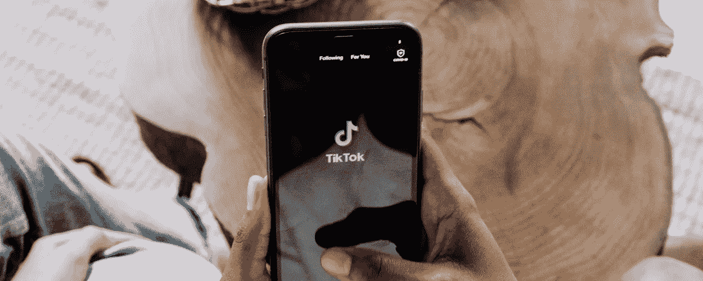
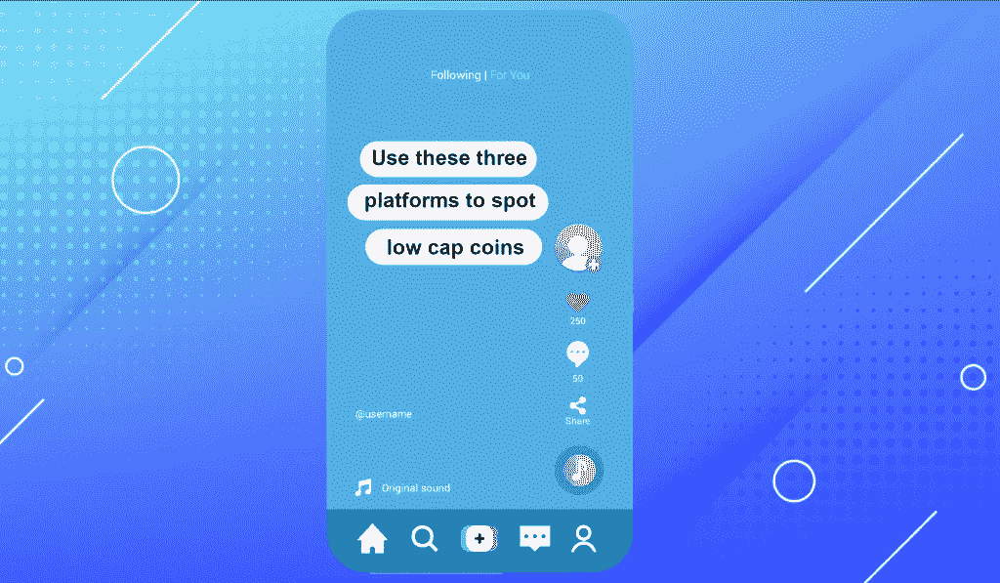
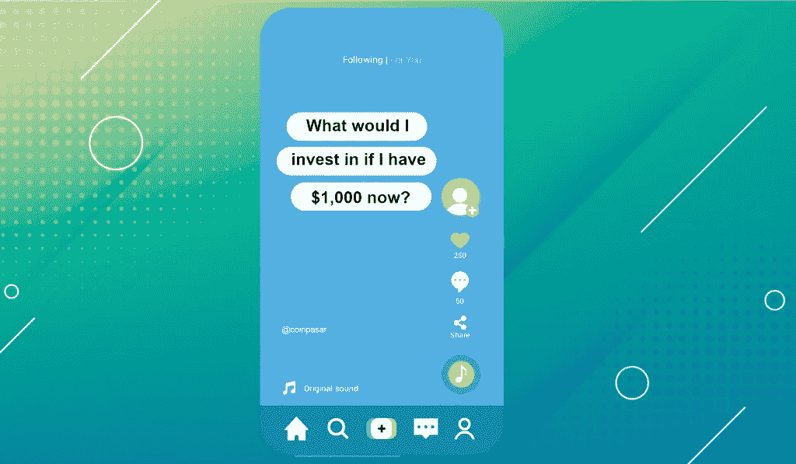
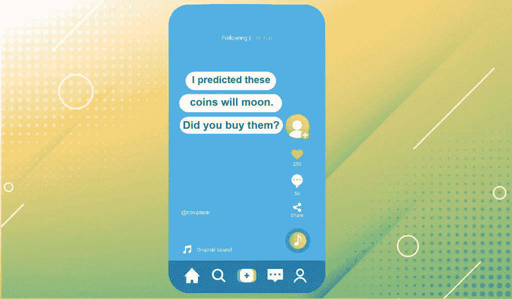
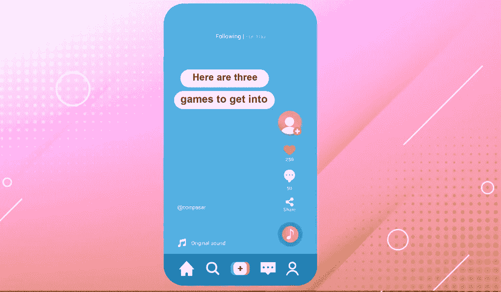
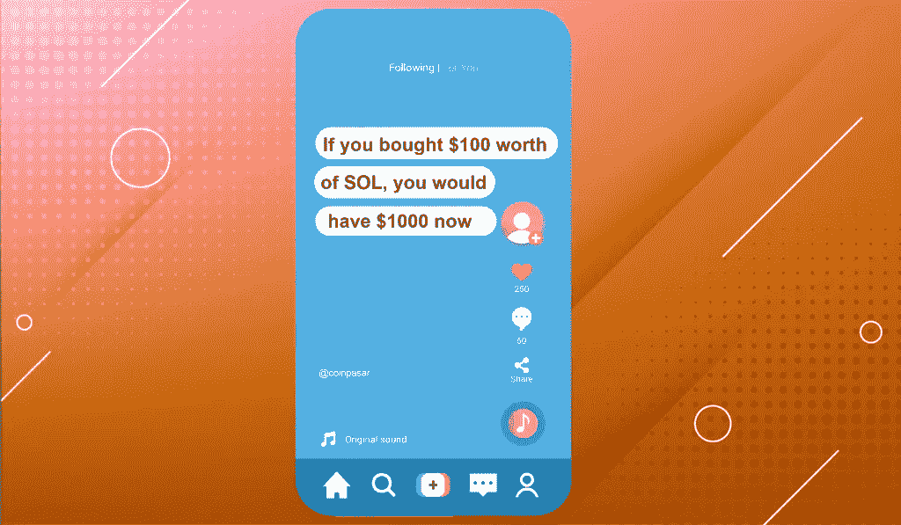
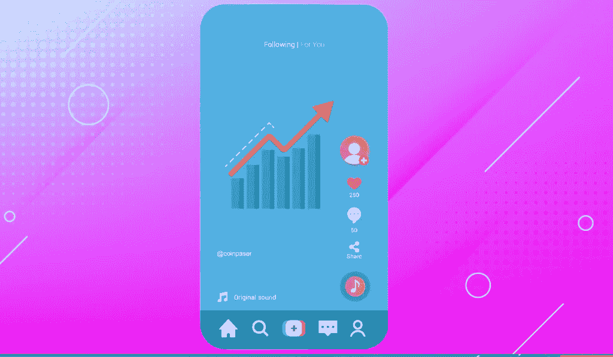
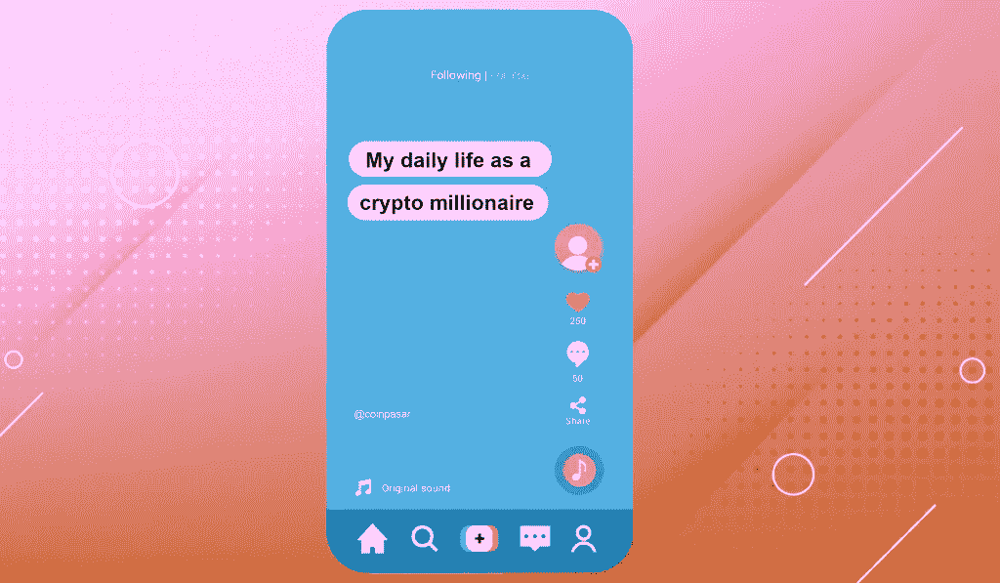

# 你会在平台上看到抖音的 8 个加密内容

> 原文：<https://medium.com/coinmonks/8-crypto-content-on-tiktok-youll-come-across-on-the-platform-471e95ef0b7?source=collection_archive---------77----------------------->

如果你从社交媒体上获得秘密新闻，除了 Twitter 和 Discord，Tiktok 很可能也是其中之一。以下是你在使用 Tiktok 平台时会遇到的 8 种加密内容。

Twitter——毫无疑问，它是加密空间最新更新的顶级社交媒体平台。但是，如果 Twitter 是严肃的加密交易者，抖音无疑是它有趣的加密表亲。

有时我们想在短视频拍摄中了解加密。有时候我们只是想浏览下一个低帽币的空间。这时，我们转向 Tiktok 寻求灵感。

也就是说，抖音的加密内容需要持保留态度。这有助于了解跟踪代币排名的平台，并很好地衡量代币的社交参与度，但你需要筛选噪音和技巧才能做到这一点。以下是你在使用 Tiktok 平台时会遇到的 8 种加密内容。

# 平台布道者

这种类型的 Tiktok 加密内容旨在向您介绍各种流行的网站，跟踪加密市场。他们最常说的一句话是“利用这三个平台 ________”，往往是用“点低帽币/追踪鲸鱼动向/衡量它们的社交参与度”来完成。

常见的福音网站包括 Messari、LunarCrush 和 DeFi Pulse。过一段时间后，内容会变得重复，但推荐的网站对了解一般的加密市场是有用的。

内容评分:4/5

# 水晶球基里希多

在抖音上发布这种加密内容的人通常会以“这些硬币要去月球了”或“如果我现在有 X 美元，我会投资什么加密”开始，然后他们会指向屏幕上的令牌列表。

可悲的是，这些代币通常已经处于价格上涨之中，或者已经在几天前达到峰值。代币可能会在市场上经历第二次风，并进一步上涨，但上述代币不太可能上涨到令人难以置信的 20 倍或 50 倍。

内容评分:2/5

# 专业交易者

抖音上的这类加密内容总是旨在突显票贩子高超的交易技巧。他们的内容以“我预测这些硬币会掉下来”开始。你买了吗？其次是他们持有的一些已经升值的代币。然后他们会向你兜售他们的交易课程，让你注册。

不幸的是，这样的内容只是描绘了他们技能的美好前景，因为他们可能有失败的交易，但没有显示在内容中。我说公布你的结果，让潜在客户自己决定他们是否想报名参加你的课程。

内容评分:1/5

# 游戏专家

在抖音上拥有所述加密内容的用户关注“游戏赚钱”空间，获取关于即将到来的区块链游戏的最新消息和更新。

此类内容通常以标题“这里有 3 个游戏可以提前进入”或“即将到来的 NFT 游戏，你不会想错过”开始，然后是已经推出或即将推出的游戏列表。

虽然像 Axie Infinity 和 DeFi Kingdoms 这样的流行游戏经常重复，但你也可以找到这些 TikTokers 列出的一些可靠的游戏项目。但是和往常一样，在你自己参与这些游戏之前做好你的研究。

内容评分:4/5

# 事实陈述者

事实陈述器之所以如此命名，是因为它们滔滔不绝地讲述关于秘密价格的事实，以及如果你投资了它，你的投资将值多少钱。

他们的口号是“如果你在这个月买了 X 美元的密码，你现在就有 X 美元了”。不幸的是，他们的帖子除了让你本能地翻白眼之外，没有任何额外的目的或价值，因为没有他们的投入，你自己也可以得到结论。

这种内容类型可能与水晶球基里希多或专业交易者的个性密切相关。

内容分级:0/5

# 硬币贩子

硬币贩子有时可能和事实陈述者、水晶球基里希多或专业交易者是同一个人。

他们通常以“本月购买 5 种密码致富”开始，然后是一系列正在上涨的代币，或者一堆市值较低的未知代币，这些代币经历价格大幅上涨的可能性很小。

虽然这是一个了解你以前从未听说过的新 altcoin 项目的好机会，但如果你真的计划投资这种骗人的项目，请始终对团队和令牌组学进行自己的研究。

内容评分:1/5

# 讲师

你会看到的另一个普通人是讲师。这是因为他们在 Tiktok 的加密内容主要集中在指向事物，就像一个讲师用他们的指点杆或激光笔指向棋盘的不同部分。

所说的内容通常，如果不总是，看到它们指向交易图的一端。然后，他们摇动摄像机，指向图表中令牌达到峰值的另一部分。如果他们在图表上画了各种各样的线来展示他们的交易技巧，就会得到加分。

最终，讲师不会像事实核对者一样起作用，因为如果有人打开一个交易视图图表并做一些基本的技术分析，数据是可以确定的。

内容评分:1/5

# 演员

你会在抖音上看到的另一个有秘密内容的人是演员。之所以这样命名，是因为在拍摄内容之前，他们会准备必要的拍摄道具，如兰博基尼、豪宅和一大笔道具钱。

演员将装扮成一个通过加密一夜暴富的百万富翁，并参与表演方法，如大摇大摆地走路，扔一些现金，或通常在蓝宝开车离开。视频最后号召大家今天加入他们的交易课程，就像专业交易者一样。

我们不纵容任何形式的骗局，急于报名的参与者在报名任何课程前都应做好尽职调查。

内容分级:0/5

这是我们在抖音看到的 8 种不同类型的加密内容。你在抖音上见过这些内容创作者吗，或者我们在这个列表中遗漏了任何其他类型的内容？请在评论中告诉我们。

> 加入 Coinmonks [电报频道](https://t.me/coincodecap)和 [Youtube 频道](https://www.youtube.com/c/coinmonks/videos)了解加密交易和投资

# 另外，阅读

*   [如何在 FTX 交易所交易期货](https://coincodecap.com/ftx-futures-trading) | [OKEx vs 币安](https://coincodecap.com/okex-vs-binance)
*   [CoinLoan 评论](https://coincodecap.com/coinloan-review) | [YouHodler 评论](/coinmonks/youhodler-4-easy-ways-to-make-money-98969b9689f2) | [BlockFi 评论](https://coincodecap.com/blockfi-review)
*   [XT.COM 评论](https://coincodecap.com/profittradingapp-for-binance)币安评论 |
*   [SmithBot 评论](https://coincodecap.com/smithbot-review) | [4 款最佳免费开源交易机器人](https://coincodecap.com/free-open-source-trading-bots)
*   [比特币基地僵尸程序](/coinmonks/coinbase-bots-ac6359e897f3) | [AscendEX 审查](/coinmonks/ascendex-review-53e829cf75fa) | [OKEx 交易僵尸程序](/coinmonks/okex-trading-bots-234920f61e60)