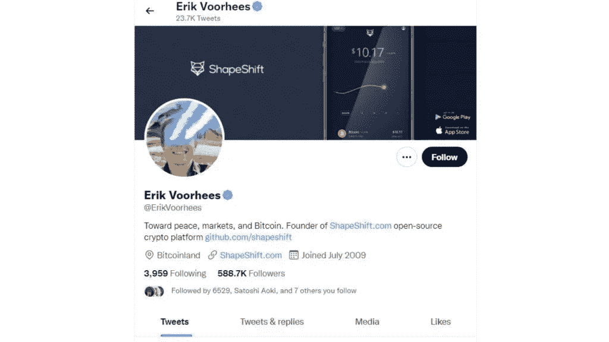
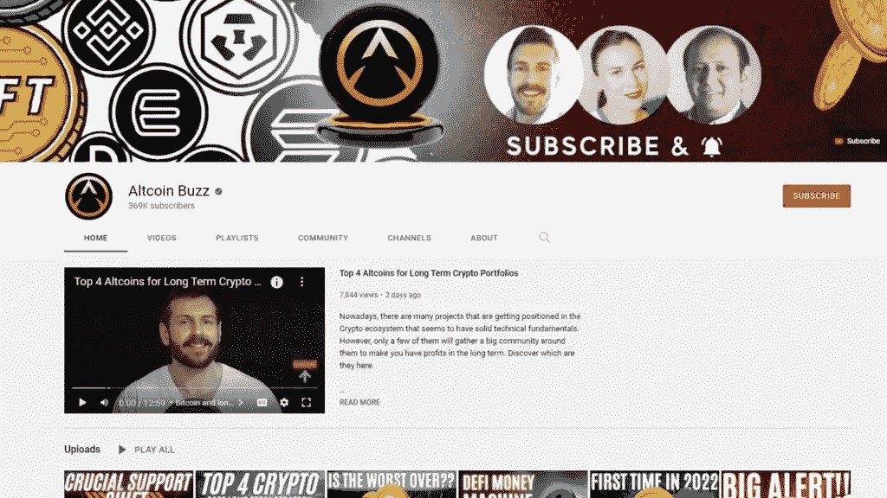

# 您需要与之合作的 8 位加密影响者

> 原文：<https://medium.com/coinmonks/8-crypto-influencers-you-need-to-collaborate-with-dc65e5beaa4f?source=collection_archive---------27----------------------->

加密影响者对您的加密产品公司的成功至关重要。他们代表了一群对加密空间充满热情的人。当人们说你的项目棒极了时，他们会注意的。你需要 [**影响者**](https://blog.atisfyre.com/25-secrets-to-become-a-viral-twitter-influencer-bet-you-had-no-clue-about-18/) 将你的秘密想法带到下一个层次。它们现在已经成为品牌的一个组成部分。他们不只是购买你的产品，还可以与它互动，让其他人参与进来。

最近，加密技术开始崭露头角。也许有些人认为这是一种风险投资，加密受众在做出选择之前会 [**仰视一位有影响力的人**](https://blog.atisfyreach.com/smart-guide-to-nft-influencer-marketing/) 。秘密品牌应该关注最有影响力的人，跟随他们的见解，加入秘密社交媒体的潮流。

# 社交媒体上的 8 大秘密影响者

# 1.安东尼·蓬皮亚诺

Antony Pompliano 是最活跃的加密货币和金融影响者之一。Pompliano 在 Twitter 上有超过 100 万名粉丝，专门从事金融和技术研究，每天都制作详尽的播客、采访和见解。他还有一个 YouTube 频道，Anthony Pompliano，讨论比特币和其他加密货币的趋势。Pompliano 还出版了一份名为 Pomp Letter 的每日简讯，其中他讨论了他对各种话题的想法，包括金钱和技术。

# 2.音调值

托尼·维斯(Tone Vays)自称是通过加密实现经济自由的倡导者，是一名区块链和金融大师，他在 Instagram、YouTube 和他的网站[ToneVays.com](https://tonevays.com/)上有频道。还有，在他的个人 YouTube 频道上，有几个关于比特币的视频，比如比特币交易、比特币法律、比特币新闻等。如果你想学习如何交易，观看比特币交易系列，或者了解区块链技术，他就是你要找的人。

# 3.埃里克·沃尔赫斯

埃里克是一名“加密创业者”，早在比特币流行之前就投资了它。他是几个秘密组织的成员。除了是世界上最大的加密交易平台之一 ShapeShift 的创始人兼首席执行官之外，他还是比特币钱包 Coinapult 的联合创始人。在 Twitter 上有 58.67 万名粉丝，他在平台上积极表达自己的想法。在他的 [Medium](https://erikvoorhees.medium.com/) 账户上，埃里克写了比特币和变形。

图 1:加密影响者 Erik Voorhees。来源:[推特](https://twitter.com/ErikVoorhees)

# 4.维塔利克·布特林

如果没有以太坊的联合创始人、世界上最年轻的加密亿万富翁之一维塔利克·布特林，任何加密影响者名单都是不完整的。以太坊的创造者是 Twitter 的加密影响者网络的领跑者。维塔利克经常更新他的推特账户，丰富了他超过 340 万粉丝的生活。

Vitalik 是以太坊和其他区块链技术的铁杆粉丝。关注他，获取深入、发人深省的加密评论、评论、文章和其他资源。

# 5.伊万谈技术

Ivan Liljeqvist 是著名的 YouTube 频道“ [Ivan on Tech](https://www.youtube.com/channel/UCrYmtJBtLdtm2ov84ulV-yg) ”的负责人。从技术角度来看，他的频道专门从事比特币业务。他们发布经过充分研究的信息，并以简单易懂的方式解释事情。这让他登上了 YouTube 最佳加密影响者的榜首。他有 37.7 万名 Twitter[粉丝，他经常与他们分享关于加密货币的机智想法以及比特币和以太坊的最新消息。](https://twitter.com/IvanOnTech)

# 6.Altcoin 日报

[Altcoins Buzz](https://www.youtube.com/c/AltcoinBuzz/featured) 是一个团队运营的 YouTube 频道。他们将自己描述为一个“社区领导的组织”，“由对加密技术充满热情并对区块链技术的未来感到兴奋的人驱动”

它们涵盖了比特币、以太坊、Ripple 等主题。以及所有顶级加密货币的每日加密新闻和每周技术分析。该团队致力于生产信息加密内容。他们的工作吸引了许多人，包括区块链的业余爱好者和专家。

图 2: Altcoin Buzz Youtube 频道。来源: [Youtube](https://www.youtube.com/c/AltcoinBuzz/featured)

# 7.道格·波克

波尔克是 YouTube 上一个受欢迎的有影响力的人，他最近开办了道格·波尔克加密频道。最棒的是，他为富有洞察力的秘密对话带来了才华横溢的演讲者。Doug 在他的扑克生涯中对加密产生了兴趣。他需要一种简单的方法在世界各地转移资金，同时在不同国家之间旅行玩扑克。所以当他第一次了解加密货币时，他很快意识到它可能会如何帮助他和世界各地像他一样的人。

# 8.加密密钥

布雷克·冯·比特币(Brekkie von Bitcoin)是来自加州洛杉矶的比特币支持者和艺术家。他在 Swan Bitcoin 担任创意总监，最著名的作品是独一无二的实验性加密艺术品。他还有一个 [YouTube 账户](https://www.youtube.com/c/BrekkievonBitcoin)，在那里他用视频记录自己的比特币作品。你还可以发现他也在他的[媒体](/@bvbtc)上热情地写比特币和艺术。

# 奖金！2022 年将使用的顶级加密货币标签

在 Twitter 上，标签被用来组织群组和对话。有许多与加密货币相关的标签。除了#crypto，还有很多与加密相关的标签。无论你谈论的是一般的区块链还是个别货币，都有一个标签可以使用。

**推特上十大加密标签**

1.  #比特币和#BTC
2.  #以太坊
3.  # BinanceSmartChain
4.  #Dogecoin
5.  #空投
6.  #DeFi
7.  #与硬币标签一起交易，如#xrp、#ltc、#xmr、#ripple
8.  #Altcoin
9.  #社区
10.  #卡尔达诺

如果你想研究一种加密货币的轨迹， [**Twitter**](https://blog.atisfyreach.com/getting-started-on-twitter-for-business-do-these-9-things-first/) 扮演了一个突出的角色。它有助于衡量围绕加密项目的兴趣和情绪水平，以预测其发展势头和未来潜力。寻求在这一领域发展的公司也受益于影响者与其受众的联系。倡导您的加密计划的影响者提高了品牌认知度，并增强了社区对该品牌的兴趣。

[**寻找合适的影响者**](https://blog.atisfyreach.com/how-to-choose-the-best-influencer-for-your-business/) 、接触并招募他们是一个漫长而乏味的过程。但是，如果您可以自动化它，并获得多种选择呢？Atisfyreach 是我们的人工智能驱动平台，它通过提供人工智能驱动的解决方案来自动化整个影响者营销工作流程，重新定义了影响者营销空间。

创新的影响者解决方案即将推出。[现在就向 atisfyreach 注册](https://atisfyreach.com/)！

> 加入 Coinmonks [电报频道](https://t.me/coincodecap)和 [Youtube 频道](https://www.youtube.com/c/coinmonks/videos)了解加密交易和投资

# 另外，阅读

*   [Unocoin 评论](https://coincodecap.com/unocoin-review) | [最佳加密赌注硬币](https://coincodecap.com/best-crypto-staking-coins)
*   [如何使用 MetaMask Wallet 获取 KCC 地址？](https://coincodecap.com/kcc-address-metamask)
*   [如何获得自己的。XYZ 领域？](https://coincodecap.com/xyz-domain)
*   [最佳加密交换平台](https://coincodecap.com/best-crypto-swap-platforms) | [最佳加密交易所](https://coincodecap.com/crypto-exchange)
*   [购买比特币印度](/coinmonks/buy-bitcoin-in-india-feb50ddfef94) | [Pionex 评论](/coinmonks/pionex-review-exchange-with-crypto-trading-bot-1e459d0191ea) | [加密交易机器人](/coinmonks/crypto-trading-bot-c2ffce8acb2a)