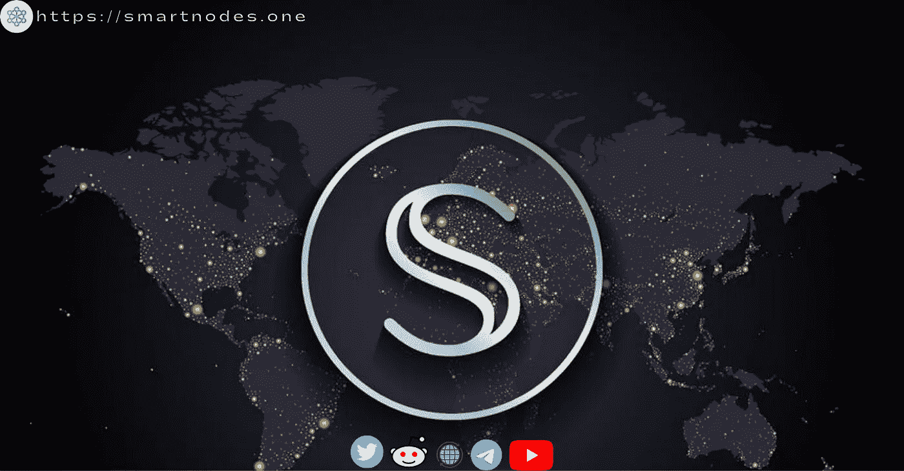
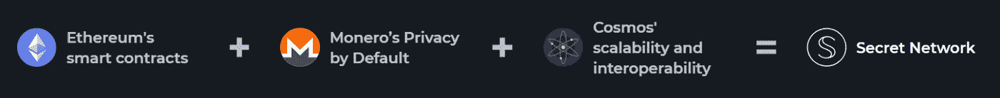
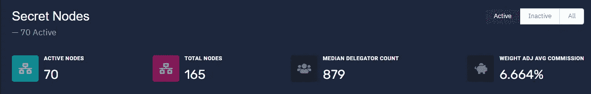
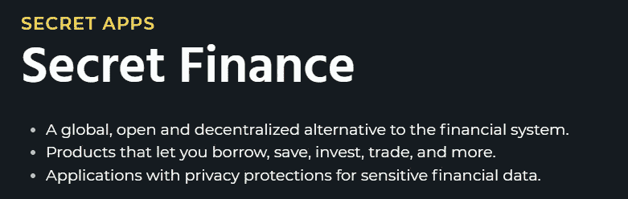
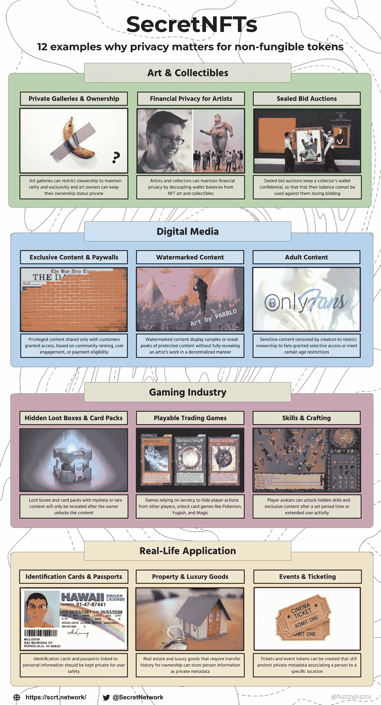
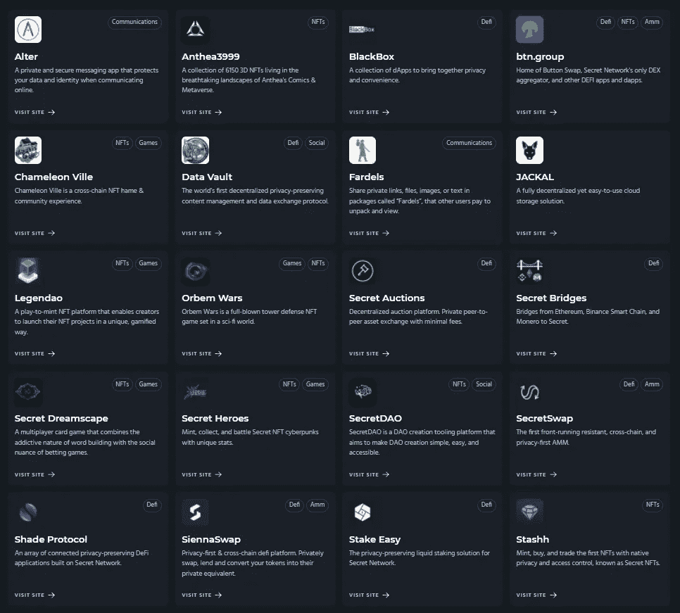
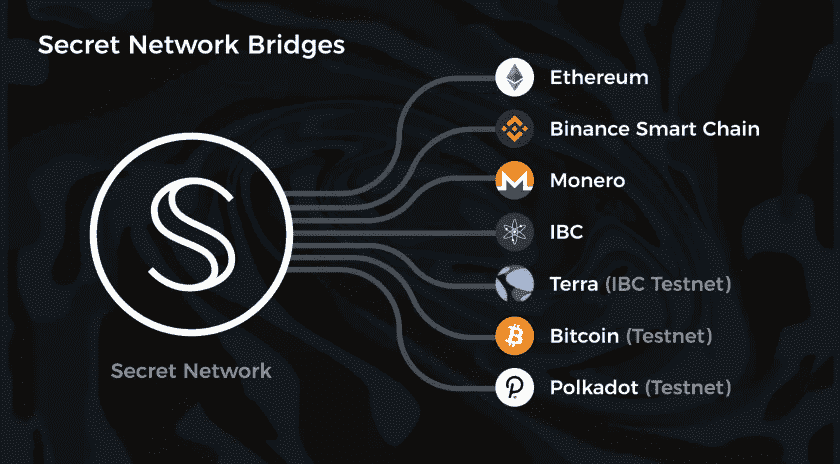

# 关于秘密网络你应该知道的 8 大事实

> 原文：<https://medium.com/coinmonks/8-major-facts-you-should-know-about-secret-network-bd61ae61d5c0?source=collection_archive---------5----------------------->

[Secret Network](https://scrt.network/)

秘密网络是第一个默认包含数据隐私的区块链，允许你创建和使用无权限和隐私保护的应用程序。这个独一无二的特性保护了用户和程序，并开发了数百个新的 Web 3 应用程序。

Secret Network 的原生硬币 Secret (SCRT)由这个符号表示， **S** ，被圈在一个圆圈内。字母 **S** 让人联想到流动的网络以及秘密的双重性:隔离和透明。

秘密(SCRT)是一个基于宇宙的隐私为重点的区块链。秘密合同是它的智能合同，它们允许 DApps 使用秘密的私人数据，就像其他区块链的智能合同一样。另一方面，秘密合同在不泄露数据的情况下将加密的输入转换为加密的输出。

秘密网络的原币是 SCRT。SCRT 类似于以太坊，用于支付所有网络交易费用。默认情况下，SCRT 是开放的，但是有一个私有的 SNIP-20 版本— sSCRT —用于私有事务。

个人可以将他们的 SCRT 放在验证器上，以换取一定比例的通货膨胀。目前的年赌注率约为 23%。此外，秘密网络的治理提案的投票权由 SCRT 授予。

阅读关于购买和赌注 SCRT 代币([此处](https://smartnodes.medium.com/a-brief-guide-on-how-to-stake-secret-network-scrt-token-f8c7e42833dc))。

Introduction secret network

# **1-可编程隐私**

从一开始，秘密网络系统就是围绕加密建立的。它被秘密基金会的创始人 Tor Bair 称为“可编程隐私”，它超越了 Monero 等以隐私为中心的硬币所提供的交易隐私。

Privacy=Secret Networks

# **2-秘密节点**

它通过使用被称为“秘密节点”的计算机网络来保护平台上产生的智能合同。这些节点使用可信的执行环境来提供安全和私有的处理(TEE)。TEE 技术已经被用于安全地处理许多设备上的数据，包括智能手机和游戏控制台，数据隐私在默认情况下得到保证。这是手机处理敏感生物数据的方式，比如你的指纹。

Secret Nodes

# **3-秘密合同**

因为 Secret Network 的智能合同在默认情况下是在考虑加密和数据隐私的情况下构建的，所以它们被称为“秘密合同”用 Rust 编程语言编写的秘密合同允许 DApps 使用加密数据，而不会向公众透露——甚至是执行运行应用程序所需劳动的秘密节点。用户可以完全控制他们披露的信息以及与谁分享这些信息。他们可以创建“查看密钥”，允许第三方检查他们的敏感信息。

# **4-可配置隐私**

秘密网络的可定制隐私确保匿名性和保密性。SCRT 持有者必须生成一个查看密钥，以便向第三方显示他们的余额。
SCRT 除了充当货币之外，还被用来支付与使用秘密网络应用程序和链上管理相关的费用。为了成为隐藏节点，并有助于网络的安全，用户必须“赌注”SCRT 令牌。网络治理和对塑造网络未来的想法进行投票也需要令牌。

# **5-DeFi(秘密金融)的显著增长**

Secret Apps

在 DeFi，该项目正在取得重大进展。SecretSwap 是一个去中心化的交易所，成立于 2021 年 2 月。SecretSwap 是一个 SCRT 和其他网络代币自动做市商(AMM)(像西耶娜)。在交易所购买的令牌可以私下转移到网络上的其他 DApps，或者使用网桥在区块链网络之间传送。
Secret Finance 是所有由 Secret Network smart contracts 支持的分散式金融(DeFi)应用的总称。默认情况下，秘密财务应用程序是私有的，因为秘密网络上的智能合同是安全加密的，这意味着您的敏感财务数据将是安全的，不会受到窥探、不道德行为者甚至是抢先运行的机器人的攻击！

从一开始，Secret Finance 就为客户的财务数据提供隐私保护。然而，你信任的人，审计员和合规官，以及第三方钱包和探索者，可能会访问你的财务数据。用户可以选择如何将他们的敏感财务数据用于 Secret Finance，同时仍然可以获得分散网络的好处。

# **6-秘密 NFTs**

传统 NFT 和秘密 NFT 的主要区别是再次强调匿名性。这包括私有元数据，如解锁隐藏元素以增加 NFT 的唯一性(可能还有稀有性)，不希望整个世界都通过其钱包地址知道他们拥有什么的个人的私有性，以及访问控制，允许创作者在购买前创建带有水印或缩略图的 NFT 的只读版本，而不是在购买后接收完整版本。

这种安全级别可能正是鼓励昆汀·塔伦蒂诺使用秘密网络来启动他的低俗小说 NFT 项目的原因。这部电影多年来积累了足够多的追随者，推高了 NFT 的价格，特别是因为 NFT 的内容只能由 NFT 所有者观看。这就像拥有一个神秘盒子的钥匙，并且是唯一一个能看到里面东西的人。考虑购买一件公共艺术品，让每个人都知道它。这些秘密的 NFT 是给那些真心珍惜自己隐私的人看的，而不是给那些寻求炫耀权利的人看的。

Secret Network NFT’s

# **7-秘密 Dapps**

隐藏网络提供了许多分散的应用程序，能够保护和加密用户的敏感数据。

在整个 2021 年，隐藏网络开发者生态系统开始从头开始开发秘密合同和应用程序的关键工作。这些开发人员中的许多人开发出了突破性的标准(SNIP-20s、SNIP-721s ),这些标准为越来越多的 dApps 和工具奠定了基础。

Secret Dapps

# **8 桥**

秘密桥允许令牌从以太坊、币安智能链、IBC 兼容的宇宙链和 Monero 转移到秘密网络，创建它们的秘密令牌等价物。通过秘密令牌，你可以给以太坊，BNB，和其他几十个令牌的隐私功能。

通往其他生态系统的桥梁，包括比特币、Terra 和 Polkadot，正在开发中。这些桥梁将允许更多的代币和流动性进入秘密网络。

[Secret bridges](https://scrt.network/about/about-secret-network/)

# 关于 Smartnodes 验证程序

1.  [Smartnodes](http://smartnodes.one/) 验证器提供 100%全额退款斜线和双符号保护。
2.  我们在宇宙中非常活跃，尽我们所能给予支持。我们是社区驱动的。Smartnodes validator 积极地对提案进行投票，以帮助确保适当的治理。
3.  [Smartnodes](https://smartnodes.one/#choose) 使用的基础设施是最好的，有 10 层安全措施来保护您的资产。
4.  我们目前正在 28 个连锁店进行验证，并且还在增长，请查看我们的验证节点网站。( [Smartnodes.one](https://smartnodes.one/dashboard/)
5.  如有任何其他问题，请随时在我们的社交媒体上联系团队成员，或发邮件至 hello@smartnodes.one

socials |[*Reddit*](https://www.reddit.com/r/smart_nodes/)|[|*Twitter*](https://twitter.com/nodes_smart)|[|*网站*](http://smartnodes.one/)|[|*电报*|](https://t.me/smartnodesvalidators)[|*insta gram*|](https://www.instagram.com/smartnodes_validator/)|[不和](https://discord.gg/TA3UVPwn6D)

> *加入 Coinmonks* [*电报频道*](https://t.me/coincodecap) *和* [*Youtube 频道*](https://www.youtube.com/c/coinmonks/videos) *了解加密交易和投资*

# 另外，阅读

*   [3 商业评论](/coinmonks/3commas-review-an-excellent-crypto-trading-bot-2020-1313a58bec92) | [Pionex 评论](https://coincodecap.com/pionex-review-exchange-with-crypto-trading-bot) | [Coinrule 评论](/coinmonks/coinrule-review-2021-a-beginner-friendly-crypto-trading-bot-daf0504848ba)
*   [莱杰 vs n 格拉夫](/coinmonks/ledger-vs-ngrave-zero-7e40f0c1d694) | [莱杰纳诺 s vs x](/coinmonks/ledger-nano-s-vs-x-battery-hardware-price-storage-59a6663fe3b0) | [币安评论](/coinmonks/binance-review-ee10d3bf3b6e)
*   [Bybit Exchange 审查](/coinmonks/bybit-exchange-review-dbd570019b71) | [Bityard 审查](https://coincodecap.com/bityard-reivew) | [Jet-Bot 审查](https://coincodecap.com/jet-bot-review)
*   [3 commas vs crypto hopper](/coinmonks/3commas-vs-pionex-vs-cryptohopper-best-crypto-bot-6a98d2baa203)|[赚取加密利息](/coinmonks/earn-crypto-interest-b10b810fdda3)
*   最好的比特币[硬件钱包](/coinmonks/hardware-wallets-dfa1211730c6) | [BitBox02 回顾](/coinmonks/bitbox02-review-your-swiss-bitcoin-hardware-wallet-c36c88fff29)
*   [BlockFi vs Celsius](/coinmonks/blockfi-vs-celsius-vs-hodlnaut-8a1cc8c26630)|[Hodlnaut 点评](/coinmonks/hodlnaut-review-best-way-to-hodl-is-to-earn-interest-on-your-bitcoin-6658a8c19edf) | [KuCoin 点评](https://coincodecap.com/kucoin-review)