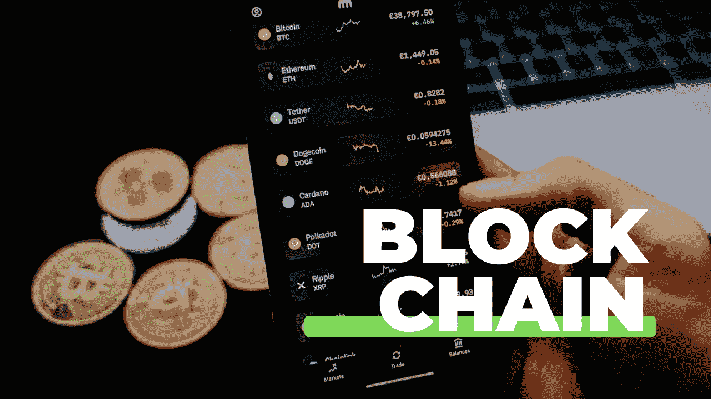

# 关于区块链的 8 个必须知道的重要事实| 2022

> 原文：<https://medium.com/coinmonks/8-must-know-crucial-facts-on-blockchain-b01550810fac?source=collection_archive---------37----------------------->

你知道吗？Stuart Haber 和 W.Scott Stornetta 两位科学家在 1991 年提出了加密块的概念。奇怪的是，对防篡改文件和账簿的需求激发了区块链的概念。

虽然这个概念已经存在很长时间了，但区块链(也称为区块链)的实际实现在 2008 年才首次展示。比特币时隔一年成为第一种加密货币。虽然区块链不是一个新概念，但它仍在不断发展，在开发和实施方面比以往任何时候都更受欢迎。

区块链是一个开放分类账的概念，可以以透明和不可变的方式存储任何类型的交易数据。从技术上讲，这是一种分散的想法，消除了交易中对中介的需求。在许多情况下，账本技术会派上用场，它还会跟踪比特币交易。

以下是每个人都应该知道的一些关于区块链技术的有趣事实:

**1。没有人知道谁创造了比特币**

比特币和区块链技术都是由中本聪创造的。另一方面，中本聪的身份是个谜。然而，一些人推测比特币之父是道林·中本聪，一个来自洛杉矶坦普尔城的美国西部人。

有趣的是，住在中本聪隔壁的计算机科学家哈尔·芬尼是第一个兑换比特币的人。另一方面，多里安·中本聪当时否认了这一点。因此，我们尚未得知这位比特币发明者的真实身份。

**2。前 3 名加密友好和区块链国家**

瑞士、直布罗陀和马耳他是世界上最受欢迎的区块链和加密货币友好国家。就瑞士而言，它拥有世界上最稳定的市场，并且接受区块链和加密货币。直布罗陀是第一个推动和促进加密货币交易以建立财政服务委员会的国家。

**3。加密货币不能被物理禁止**

许多国家已经实施禁止使用加密货币；但是，尽管有他们的规则和条例，这在物理上是不可能的。为什么？因为任何人都可以拿到加密货币钱包。国家可以制定法律，但比特币市场不能被取缔。Alergia、柬埔寨、玻利维亚、Educator、孟加拉国和尼泊尔等国家已经放松了对加密货币使用的限制。

**4。区块链使用增加**

区块链将是这个时代最受欢迎的技术之一。根据一项行业调查，4000 万人已经开始了解这项技术，其中许多人将它用于商业目的。在未来十年，这一数字将上升到 80%。

许多企业和公司正在使用数字货币作为支付方式，因为它们允许它们绕过传统金融交易的困难，同时还允许它们方便地访问世界各地的现金交易。

**5。食品供应链行业的区块链**

区块链在食品供应中可能听起来很奇怪，不是吗？在食品供应链中实施区块链技术的主要动机是检测食品污染。许多大公司，如雀巢和沃尔玛，已经采用区块链技术来追踪受污染的食品。

**6。区块链技术在全球市场的增长**

尽管区块链的发展仍处于早期阶段，但正在取得进展。大多数企业已经开始使用这种技术对遗留系统进行变更。根据行业调查和检查，到 2024 年，区块链市场将增长到大约 6000 万美元。

**7。它们是应税的**

当然，取决于你国家的法律。但由于加密货币已经渗透到主流市场，世界各地的税务机构都在试图确保他们能分到一杯羹。今天，许多国家希望对你的加密货币利润征税。

**8。中国是最大的加密货币开采国**

谁会想到呢。加密货币挖掘是在交易被记录在区块链的账本上之前验证交易的过程。这是该公司非常有利可图的部分，中国目前拥有大约 75%的矿业网络。

> 加入 Coinmonks [电报频道](https://t.me/coincodecap)和 [Youtube 频道](https://www.youtube.com/c/coinmonks/videos)了解加密交易和投资

# 另外，阅读

*   [Bookmap 评论](https://coincodecap.com/bookmap-review-2021-best-trading-software) | [美国 5 大最佳加密交易所](https://coincodecap.com/crypto-exchange-usa)
*   最佳加密[硬件钱包](/coinmonks/hardware-wallets-dfa1211730c6) | [Bitbns 评论](/coinmonks/bitbns-review-38256a07e161)
*   [新加坡十大最佳加密交易所](https://coincodecap.com/crypto-exchange-in-singapore) | [购买 AXS](https://coincodecap.com/buy-axs-token)
*   [红狗赌场评论](https://coincodecap.com/red-dog-casino-review) | [Swyftx 评论](https://coincodecap.com/swyftx-review) | [造币厂评论](https://coincodecap.com/coingate-review)
*   [投资印度的最佳密码](https://coincodecap.com/best-crypto-to-invest-in-india-in-2021)|[WazirX P2P](https://coincodecap.com/wazirx-p2p)|[Hi Dollar Review](https://coincodecap.com/hi-dollar-review)